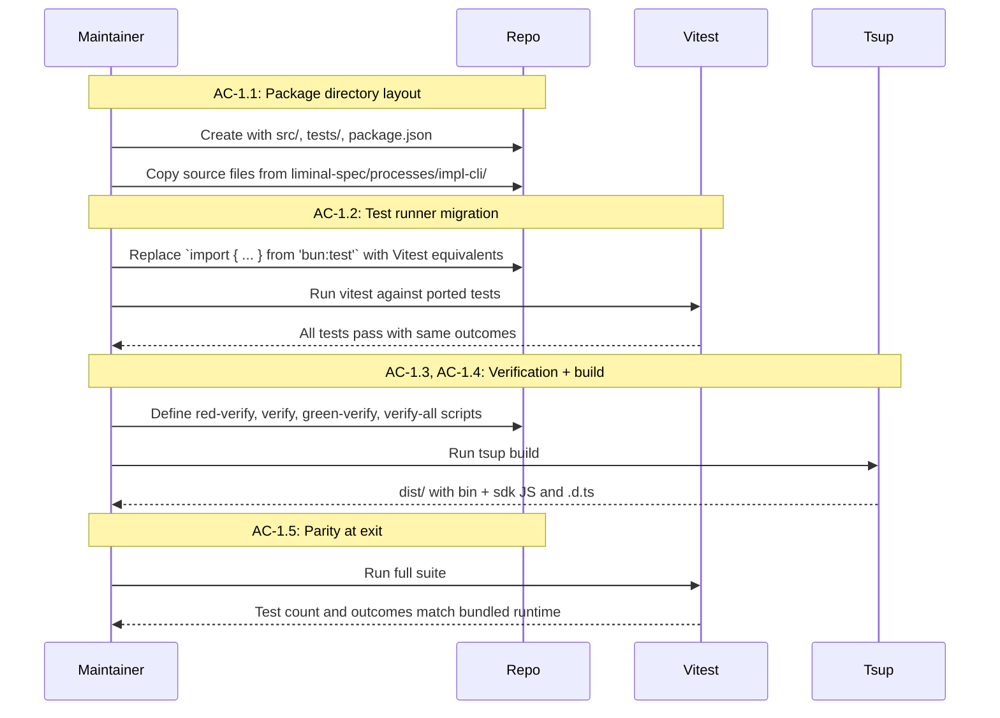
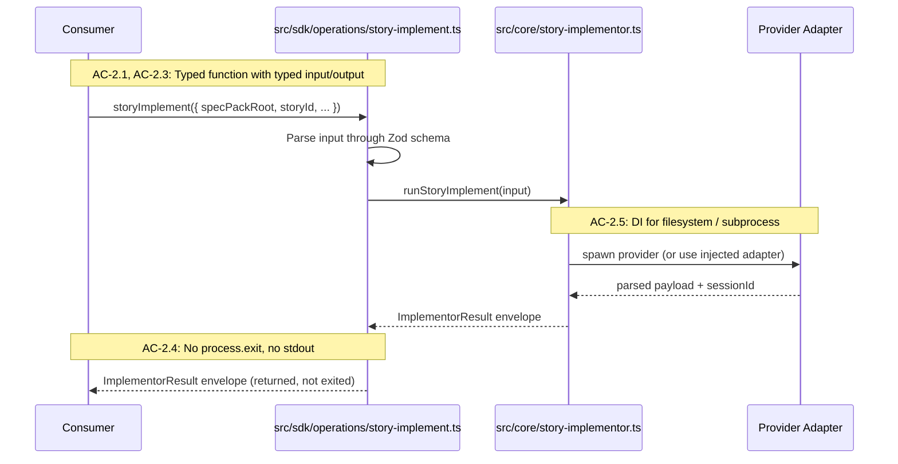
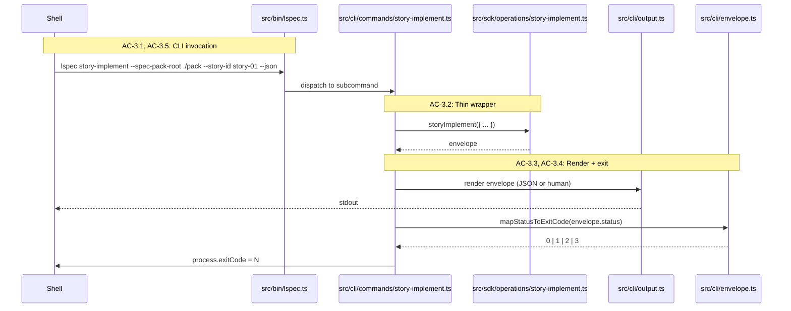
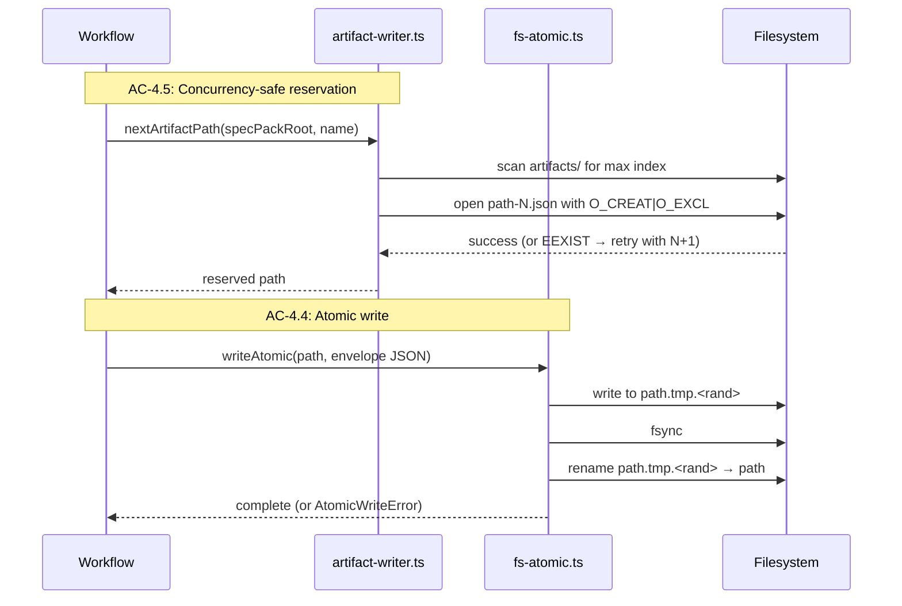
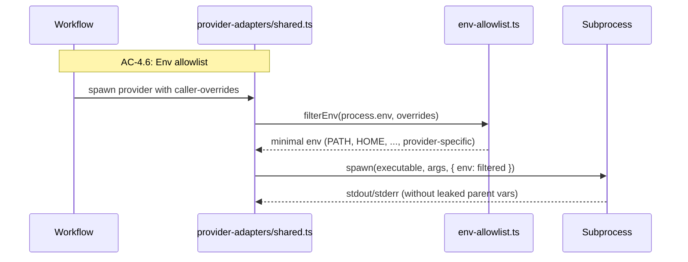
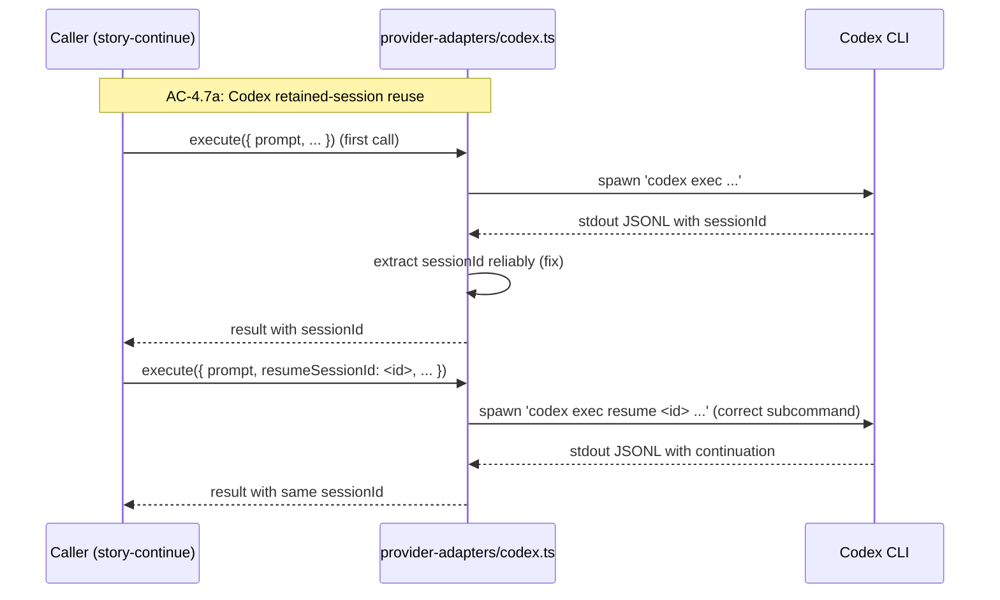
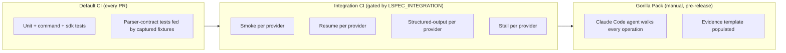
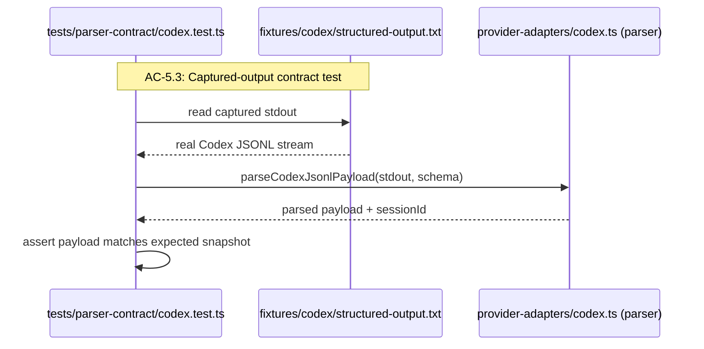
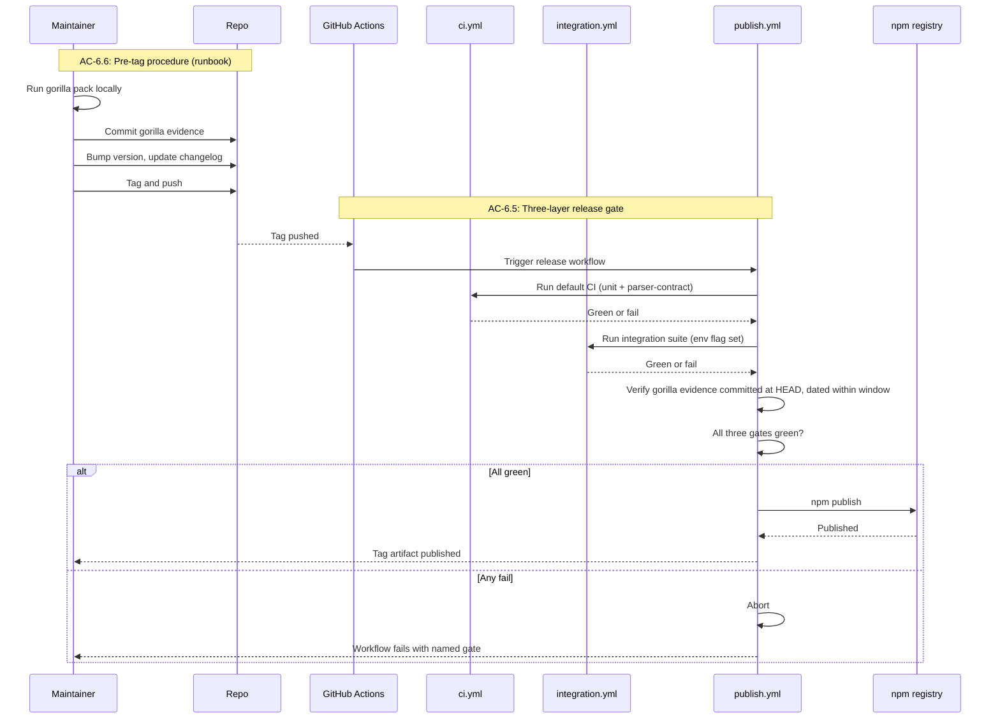

# Technical Design: @lspec/core Standalone Package

## Purpose

This document translates Epic 02 into implementable architecture for `@lspec/core`, the standalone npm package that extracts the implementation runtime currently bundled in `liminal-spec/processes/impl-cli/`. It serves three audiences:

| Audience | Value |
|----------|-------|
| Reviewers | Validate design before code is written |
| Developers | Clear blueprint for implementation |
| Story Tech Sections | Source of implementation targets, interfaces, and test mappings |

**Prerequisite:** Epic 02 is complete with 40 ACs across six flows, eight recommended stories, and ten Tech Design Questions awaiting answers in this document.

---

## Spec Validation

The Epic 02 spec was validated before design from a tech-designer perspective. All ACs map to clear implementation work, data contracts cover the package's external surface, and the recommended story breakdown decomposes cleanly into chunks. No blocking issues were found. The Issues Found table below captures clarifications the design will make concrete and a small number of wording inconsistencies the design will resolve uniformly.

**Validation Checklist:**
- [x] Every AC maps to clear implementation work
- [x] Data contracts are complete and realistic (CLI envelope, exit codes, distribution surface)
- [x] Edge cases have TCs, not just happy path
- [x] No technical constraints the BA missed
- [x] Flows make sense from implementation perspective

**Issues Found:**

| Issue | Spec Location | Resolution | Status |
|-------|---------------|------------|--------|
| Per-operation SDK input/output shapes are not enumerated; the Operation Inventory lists names and continuation flags only | AC-2.1, AC-2.3 | Operations behave the same after this epic as today (Out of Scope). Design enumerates input shapes in Interface Definitions and derives result types as aliases over the canonical schemas in `src/core/result-contracts.ts` (`z.infer<typeof inspectResultSchema>` etc.) wrapped in `CliResultEnvelope<T>`. The SDK does not redeclare payload shapes — AC-4.3 is the structural defense against drift. QuickFix's payload is currently declared in the workflow file rather than `result-contracts.ts`; Story 3 promotes it to a canonical `quickFixResultSchema` so all ten operations have one single source of truth at handoff. | Resolved — clarified |
| `QuickFixResult` payload is currently in the workflow file (`src/core/quick-fix.ts`) rather than the canonical schemas, breaking the AC-4.3 single-source-of-truth rule for one operation | AC-4.3 | Story 3 adds `quickFixResultSchema` to `src/core/result-contracts.ts`, infers the TypeScript type, and updates the workflow to import from canonical. The SDK aliases the canonical type like the other nine. End state at Story 3 exit: zero workflow-local payload types, all ten payloads declared in `result-contracts.ts`. | Resolved — clarified |
| Continuation handle structure not specified | AC-2.3, AC-3.4, TDQ #9 | Opaque `{ provider, sessionId, storyId }` tuple. No durable state in the package between calls. See TDQ #9 for rationale. | Resolved — clarified |
| AC-4.1 treats persisted-state version markers as new work, but `liminal-spec/processes/impl-cli/core/config-schema.ts` already declares `version: z.literal(1)` for run-config | AC-4.1 | Design notes parity. AC-4.1 is satisfied for run-config by inheriting the existing marker; the new work is adding markers to progress snapshot, status file, and the CLI envelope itself. | Resolved — clarified |
| Build tooling not picked. Epic says "tsup, tsc + rollup, or equivalent" | AC-1.4 | Design picks `tsup`. Documented in Stack Additions with rejected alternatives. | Resolved — clarified |
| "Release window" for gorilla evidence freshness is undefined | AC-6.5d | Design defines as evidence file dated within seven days of the release tag, configurable via workflow input. | Resolved — clarified |
| "test-immutability guard" composition undefined | AC-1.3b | Design defines a captured-baseline approach: at `red-verify` exit, a `capture-test-baseline` script records SHA-256 hashes of every `tests/**/*.test.ts` file to `.test-tmp/green-verify/test-file-baseline.json`. At `green-verify`, the `guard-no-test-changes` script rehashes the working tree and fails if any test file's hash differs from the captured baseline, or if any tracked test file is missing or added. The git-diff approach was considered first but rejected — it only inspects committed history, so uncommitted edits during the current Green cycle would slip past the gate. The hash-baseline approach catches working-tree mutation regardless of commit state. Pattern is mirrored from `scripts/guard-no-test-changes.ts` in the existing repo. | Resolved — clarified |
| AC-3.2 "thin command wrapper" is a principle without a measurable test | AC-3.2 | Design specifies the structural rule — command body composed of: arg parse, SDK call, render envelope, map exit code, exit. Reviewable by inspection; no automated assertion. | Resolved — clarified |
| Real-provider binary installation in CI not specified for AC-5.1 | AC-5.1, AC-5.2 | Design enumerates per-provider install path in the integration workflow: Claude Code via npm, Codex CLI via download script, Copilot via `gh extension install`. | Resolved — clarified |
| AC-4.6 env allowlist contents not specified | AC-4.6 | Design enumerates the allowlist with rationale: `PATH`, `HOME`, `USER`, `TERM`, `SHELL`, `LANG`, `LC_*`, plus provider-specific variables (`CLAUDE_*`, `CODEX_*`, `GH_*`, `GITHUB_*`) and any caller-provided overrides. | Resolved — clarified |
| TC-4.4a wording — "killing the process between the temp write and the final rename" is the principle, not a runnable test approach | TC-4.4a | Design specifies the test approach: stub `fs.rename` to throw, assert no partial file exists at the destination path. Plus an inspection-based check that the implementation always calls `fs.rename` last after the temp file is fully written and synced. | Resolved — clarified |
| AC-3.5b says "install globally" while AC-6.2a says "install into a fresh sandbox project" | AC-3.5b vs AC-6.2a | Design uses the sandbox approach uniformly — `npm install` into a temp project rather than `npm install -g`. Both ACs are satisfied. | Resolved — clarified |
| Story 6 (packaging metadata) lands after Story 2 (CLI surface), but AC-3.5b in Story 2 requires `npm pack` + install + `npx` to work | Sequence between Story 2 and Story 6 | Design splits packaging into a "minimum viable" subset (Story 0/2: `bin` field, main entry, package name, basic `files` field) and a "release-ready" subset (Story 6: full exports map, files allowlist refinement, types subpath, scoped subpath exports). Story 6 hardens what Story 0 establishes. | Resolved — clarified |

### Tech Design Questions — Answer Locations

The epic raised 10 questions for the Tech Lead. Each is answered inline in the next section, with the location of the design decision noted where it recurs:

| Question | Answer Location |
|----------|-----------------|
| Q1: Single package vs minimal monorepo | §Tech Design Questions — Q1; §Module Architecture |
| Q2: Captured-output sample coverage | §Tech Design Questions — Q2; §Testing Strategy |
| Q3: Gorilla agent runtime | §Tech Design Questions — Q3; §Flow 5 |
| Q4: Verification gate composition | §Tech Design Questions — Q4; §Verification Scripts |
| Q5: Real-harness CI shape | §Tech Design Questions — Q5; §Verification Scripts |
| Q6: Atomic-write implementation | §Tech Design Questions — Q6; §Interface Definitions — fs-atomic |
| Q7: Concurrency safety implementation | §Tech Design Questions — Q7; §Interface Definitions — artifact-writer |
| Q8: Error taxonomy boundaries | §Tech Design Questions — Q8; §Interface Definitions — Error Classes |
| Q9: Continuation handle persistence | §Tech Design Questions — Q9; §Interface Definitions — Continuation Handle |
| Q10: Type emission strategy | §Tech Design Questions — Q10; §Module Architecture |

---

## Context

`@lspec/core` is the next iteration of an implementation runtime that began as bundled source inside the `ls-claude-impl` skill. The runtime exposes ten operations — `inspect`, `preflight`, `epic-synthesize`, `epic-verify`, `epic-cleanup`, `quick-fix`, `story-implement`, `story-continue`, `story-self-review`, `story-verify` — each callable as a CLI subcommand against a Liminal Spec spec pack. The skill's outer loop sequences these operations into an end-to-end story-implementation workflow: inspect the pack, preflight the providers, implement each story with self-review, verify each story, clean up the epic, and run the final epic verification. The runtime itself is bounded — every call is a single operation against a spec pack on disk, returning a structured envelope and persisting a JSON artifact.

The runtime has grown to ~22,000 lines across production and tests. Pre-epic code review surfaced several edges that don't survive the transition from "bundled source" to "public package": the CLI envelope and persisted state aren't versioned, errors are sometimes detected by string-matching message text, payload schemas drift across three layers (canonical contracts, per-workflow payload schemas, prompt-rendered schemas), artifact and progress writes aren't atomic, artifact-index reservation isn't concurrency-safe, and the subprocess environment inheritance passes the entire parent environment to provider children. Two regressions were also surfaced — Codex retained-session reuse missing a session id on first execution, and preflight regressing the binary-present / auth-unknown fallback for Codex. None of these block today's bundled use through `ls-claude-impl`, but every one of them becomes a public-surface defect when the runtime is published.

This epic ships the runtime as a standalone npm package that coexists with the existing bundled source. Nothing in `liminal-spec/processes/impl-cli/` or `liminal-spec/processes/codex-impl/` is modified during this work; the new package is built and tested in parallel, and skill consumer migration is post-epic. The package exposes two consumption surfaces backed by the same operations: a CLI binary callable through `npx @lspec/core ...` and a programmatic SDK importable through a subpath export. Both produce the same structured envelope and persist the same artifacts. The design centers the SDK as the source of operation logic and treats the CLI as a thin shell — argument parsing, envelope rendering, exit-code mapping, and nothing else.

The mock-versus-reality drift problem deserves explicit framing because it shapes the testing strategy. The maintainer's recurring failure mode is: tests pass against hand-written mocks; the first real orchestration run breaks because the mock shape didn't match what the provider actually produced. This design treats that as a structural problem, not a test-coverage problem. Internal module boundaries are forbidden as mock points. External-boundary mock fixtures must be derived from captured real provider output — never hand-written. A parser-level contract test layer feeds those captured samples through the same parser the mocks use, so divergence between mock-shape and real-shape fails at parse time before integration tests run. The agent-driven gorilla pack is the final layer — it walks every operation against a real fixture spec pack with real providers and produces evidence a maintainer can read.

The design assumes Vitest as the test runner replacing the Bun-coupled stack, `tsup` as the build tool emitting JavaScript and TypeScript declaration files, `citty` retained from the existing implementation as the CLI framework, and `c12` retained for run-config loading. These choices keep most of the existing code shape while replacing the few Bun-specific dependencies that don't carry forward to a published package. The package targets Node 24 LTS as the minimum runtime, because that's the Node baseline most provider CLIs require and because it matches the GitHub Actions default.

---

## Tech Design Questions

### Q1: Single Package vs Minimal Monorepo

**Decision: Single package with two entry points (CLI bin + SDK subpath export).**

The package name is `@lspec/core`; the CLI binary name is `lspec`. Both `npx @lspec/core <subcommand>` (without prior install — npm fetches and runs in one step) and `lspec <subcommand>` (after `npm install -g @lspec/core`, or with `node_modules/.bin` on PATH inside a project) invoke the same CLI. Spec examples use `npx @lspec/core ...` for first-time / install-via-npx contexts and bare `lspec ...` for post-install contexts.

The package is published as one npm artifact with two reachable surfaces: a `bin` entry that exposes the CLI as `lspec`, and an `exports` subpath that exposes the SDK as `@lspec/core/sdk`. Both surfaces compile from the same TypeScript source tree and ship in the same tarball. The CLI command modules import from the SDK; the SDK has no knowledge of the CLI. There is one `package.json`, one `tsconfig.json`, one build configuration.

A minimal monorepo (workspaces with `packages/sdk` and `packages/cli`) was considered and rejected. Workspaces add build orchestration complexity (separate `package.json` and `tsconfig.json` per package, workspace linking during development, compound publish steps) without proportional benefit at this scale. The package boundary the SDK needs is a public-export-surface boundary, not a build boundary. The eventual web application consumer does not force a workspace split because it can import from the SDK subpath of the single published package — there is no use case that requires the SDK without also accepting the CLI dependency tree.

If the SDK ever needs to be published with a fundamentally different dependency surface — for example, if the CLI takes on a heavy runtime dependency the SDK should not pull in — the package can be split into a workspace at that point. The cost is one PR; the source organization already separates SDK source from CLI source.

### Q2: Captured-Output Sample Coverage

**Decision: One sample per provider × four scenario classes = twelve fixtures.**

The four scenario classes are smoke (a successful run with structured output), resume (a continuation on a prior session id), structured-output (a complete payload in the provider's structured output format), and stall (no output for the configured silence window). The three providers are Claude Code, Codex, and Copilot. Each combination produces one captured fixture committed under `tests/parser-contract/fixtures/<provider>/<scenario>.txt`.

This coverage targets the parser layer, not the command layer. Drift typically appears at the parser layer — a provider changes how it serializes structured output, or how it emits session ids, or how it terminates on stall — not at the command layer, which wraps the parser uniformly. Adding samples per command (ten commands × three providers × four scenarios = 120 fixtures) would inflate maintenance without proportional drift detection, because the same parser handles all commands per provider.

If a specific command exposes a parser path the four scenarios don't exercise, the design adds a targeted fixture for that path. The starting twelve are a floor, not a ceiling. Each fixture file documents its provenance (provider, command run, capture date) at the top in a comment.

### Q3: Gorilla Agent Runtime

**Decision: Claude Code as the primary runner from day one. Codex parity is a post-epic enhancement.**

The gorilla pack is designed as a single-agent walk: one agent reads the prompt, executes every operation against the fixture, records evidence, and produces the final report. Claude Code is the primary because it's the orchestrator the existing skills target; running the pack under Claude Code first establishes the baseline. Codex parity adds value by exposing operations to a different reasoning shape (different drift surface), but parity adds runtime complexity to the prompt and template, and the marginal drift detection across the same operations is small.

The minimum viable runner shape is: a single Markdown prompt the agent reads, a Markdown evidence template the agent fills in, a reset script the agent (or maintainer) runs between invocations, and a fixture directory the agent operates in. No bespoke runtime — the agent's existing tool surface (file ops, shell) is sufficient. A Codex parity pass is documented as a follow-up task with the same artifacts.

A multi-agent ensemble run (Claude + Codex + Copilot in sequence) was considered but rejected for this epic. The drift signal from one well-constructed run is high; the additional providers triple maintenance for marginal gain.

### Q4: Verification Gate Composition

**Decision: Four verification scripts composing format, lint, typecheck, Vitest, parser-contract tests, the test-immutability guard, and the env-gated integration suite.**

| Script | Composition |
|--------|-------------|
| `red-verify` | `format:check` → `lint` → `typecheck` → `capture:test-baseline` |
| `verify` | `red-verify` → `vitest run` (includes parser-contract tests) |
| `green-verify` | `verify` → `guard:no-test-changes` |
| `verify-all` | `verify` → `vitest run --project integration` (env-gated; placeholder if `LSPEC_INTEGRATION` is unset) |

The parser-contract tests run inside the standard Vitest invocation because they're fast (string parsing against fixture files, no I/O) and they're the cheap drift defense that should run on every PR. The integration suite is separated into a Vitest project that only runs when the `LSPEC_INTEGRATION` env flag is set — see Q5 for the workflow shape that sets it.

The `guard:no-test-changes` check uses a captured-baseline pattern, not a git diff. At `red-verify` exit during a TDD cycle, a sibling script `capture:test-baseline` walks `tests/**/*.test.ts`, computes a SHA-256 of each file's content, and writes the manifest to `.test-tmp/green-verify/test-file-baseline.json`. At `green-verify`, the guard rehashes the working tree and fails if any path's hash diverges from the baseline, or if a tracked path is missing or added. Working-tree mutation is detected regardless of whether changes are committed, staged, or untracked — which is the failure mode a git-diff check (against `HEAD` or any ref) would miss for uncommitted edits in the current cycle. The pattern is mirrored from the existing `scripts/guard-no-test-changes.ts` in this repo. The guard is invoked only by `green-verify`; mid-implementation test refinement during normal `verify` is unaffected.

### Q5: Real-Harness CI Shape

**Decision: Three workflow files, each owned by the story that introduces the gates it enforces.**

| Workflow | Owning Story | Triggers | Purpose |
|----------|--------------|----------|---------|
| `ci.yml` | Story 0 | `push`, `pull_request` | Runs `npm run verify` (the verify chain Story 0 lands). No provider credentials. Fast PR feedback loop. |
| `integration.yml` | Story 4 | `workflow_dispatch`, scheduled, and as a release-workflow job step | Sets `LSPEC_INTEGRATION=1`, installs the three provider binaries, exposes provider credentials via repository secrets, runs `verify-all`. Opt-in for everyday work; required for releases. |
| `publish.yml` | Story 7 | `push.tags` | Runs the three-layer release gate (verify-all + integration evidence + gorilla evidence) before `npm publish`. |

Repository scaffolding does NOT include any workflows at story start — `.github/workflows/` does not exist in `lspec-core` until Story 0 creates it. Each story creates its own workflow file as part of its scope; the directory is created on first workflow.

`ci.yml` runs on `push` to any branch and `pull_request` against main. It runs `verify` (which includes parser-contract tests). It does not have access to provider credentials. The full PR loop is fast and free.

`integration.yml` runs on `workflow_dispatch` (manually triggered), on a schedule, and as a job step inside the release workflow. It sets `LSPEC_INTEGRATION=1`, installs the three provider binaries, exposes provider credentials via repository secrets, and runs `verify-all`. Because real provider runs cost money and time, this workflow is opt-in for everyday work and required for releases.

A single workflow file with conditional gating was considered but rejected. The credential model is fundamentally different — default workflow cannot have access to provider secrets — and forking that decision into conditional `if:` blocks makes the workflow harder to reason about. Three files map cleanly to three cost profiles and three story owners.

The release workflow (Story 7) — `publish.yml` — calls into `integration.yml` as a required gate before publishing.

### Q6: Atomic-Write Implementation

**Decision: One shared `writeAtomic(path, content)` utility used by every artifact, progress, and status write.**

The implementation is the standard temp-write-plus-rename pattern: write to `<path>.tmp.<random>` in the same directory as the destination, `fsync` the temp file, then `rename` to the destination. POSIX guarantees rename atomicity within a filesystem; same-directory ensures the rename is on the same filesystem. The temp file extension uses a random suffix so concurrent writes to the same destination don't collide on the temp file itself.

Progress snapshot, status file, and result envelope all go through this single utility. The progress JSONL stream (events appended one line at a time) doesn't need atomic write — Linux/macOS append writes ≤ `PIPE_BUF` are atomic at the OS level, and each progress event is a single line well under that limit. The JSONL append uses `fs.appendFile` directly. The snapshot and status overwrites use `writeAtomic`.

A separate append-only-with-manifest pattern for progress was considered but rejected. The current model — JSONL stream for the event log, single status.json file for the latest snapshot — is already the right shape; atomicity needs to be applied to the snapshot, not the stream.

### Q7: Concurrency Safety Implementation

**Decision: `O_CREAT|O_EXCL` retry loop on artifact-index reservation.**

The reservation algorithm computes the next available index by scanning the artifacts directory, then attempts to atomically create a placeholder file at `<artifacts>/<name>-<index>.json` using `fs.open` with the `wx` flag. If the open succeeds, the index is reserved and the placeholder is the file the caller will overwrite via `writeAtomic` once it has content. If the open fails with `EEXIST`, another caller reserved this index in the race; the algorithm increments and retries. A retry cap of 10 prevents pathological loops; on cap exhaustion the function throws `IndexReservationError`.

Directory-based locking (a `<artifacts>/.lock` directory created and removed) was considered but rejected. It introduces a separate state file that needs to be cleaned up on crash, and the failure modes (stale locks from killed processes) are worse than the `O_EXCL` race-and-retry approach.

Because the reservation creates a placeholder file before the caller has content, the artifact-writer flow becomes: reserve index → caller produces content → `writeAtomic` to the reserved path. If the caller crashes between reservation and write, the placeholder is left behind as an empty file at the reserved index. The artifact-writer's `reserveIndex(name)` operation, before reserving a new index, performs a lazy garbage-collection pass over the artifact directory: any zero-byte file matching the artifact-name pattern with a modification time older than the configured stale-reservation timeout (default: 5 minutes) is unlinked. This keeps the artifact directory bounded without requiring a separate maintenance operation, and without `inspect` becoming a mutating operation. `inspect` remains read-only — its contract per the Operation Inventory is "Validate spec pack and return inventory", and that contract is preserved.

### Q8: Error Taxonomy Boundaries

**Decision: Enumerated abstract base class `ImplCliError` with twelve concrete subclasses, each carrying a stable `code` field. Codes are immutable; messages may evolve.**

The taxonomy:

| Class | Code | Thrown When |
|-------|------|-------------|
| `InvalidInputError` | `INVALID_INPUT` | SDK input fails Zod boundary parse — caller passed wrong type, missing required key, or schema-incompatible value |
| `InvalidSpecPackError` | `INVALID_SPEC_PACK` | Spec pack inspection fails or required artifacts are missing |
| `InvalidRunConfigError` | `INVALID_RUN_CONFIG` | `impl-run.config.json` fails schema validation or is unreadable |
| `VerificationGateUnresolvedError` | `VERIFICATION_GATE_UNRESOLVED` | Verification gates can't be resolved automatically and need user input |
| `ProviderUnavailableError` | `PROVIDER_UNAVAILABLE` | Provider binary is missing, returns non-zero on launch, or auth check fails |
| `ProviderTimeoutError` | `PROVIDER_TIMEOUT` | Provider runs past the configured total timeout |
| `ProviderStalledError` | `PROVIDER_STALLED` | Provider produces no output for the configured silence window |
| `ProviderOutputInvalidError` | `PROVIDER_OUTPUT_INVALID` | Provider output cannot be parsed against the schema |
| `ContinuationHandleInvalidError` | `CONTINUATION_HANDLE_INVALID` | Continuation handle is malformed or refers to an unknown provider |
| `PromptInsertInvalidError` | `PROMPT_INSERT_INVALID` | A custom prompt insert fails size or readability checks |
| `AtomicWriteError` | `ATOMIC_WRITE_FAILED` | The temp-write-plus-rename pattern fails at any step |
| `IndexReservationError` | `INDEX_RESERVATION_FAILED` | Artifact-index reservation exhausts its retry cap |

`INTERNAL_ERROR` is reserved for genuinely unexpected failures (uncaught throws inside the package's own code that don't have a typed error class). Consumers branch on `error.code`; `instanceof` is the secondary classification mechanism for in-process callers. String matching against `error.message` is forbidden in non-test code.

The taxonomy is used in two complementary ways. First, structured workflow failures appear in the envelope's `errors[]` array as `{ code, message, detail? }` objects, where `code` matches the class names above (`INVALID_SPEC_PACK`, `PROVIDER_TIMEOUT`, etc.). The envelope-everywhere rule from §External Contracts means the SDK does not throw on these failures — it returns an envelope with the appropriate `errors[]` entry and `status` set accordingly. Second, the typed error classes themselves are used as throw types only for programming errors (Zod boundary parse failures, invariant violations) and infrastructure errors that cannot be translated into an envelope status. Both paths use the same stable codes; the taxonomy is the single source of truth.

The taxonomy is defined in `src/sdk/errors/` as one file per class plus an `index.ts` that re-exports. New error classes added in future versions are additive — a major version bump is required to remove or rename a code.

### Q9: Continuation Handle Persistence

**Decision: Opaque `{ provider, sessionId, storyId }` tuple. No durable state in the package between calls.**

Continuation handles are passed back to the caller as part of the result envelope on operations that produce them (`story-implement`, `story-self-review`, `story-continue`). The caller is responsible for storing the handle if it wants to resume later. The package does not maintain a handle registry, a handle store, or any other durable state about handles.

When `story-continue` or `story-self-review` is invoked with a handle, the package treats it as opaque: the `provider` field selects the provider adapter, the `sessionId` is passed through to the provider's resume mechanism, and the `storyId` is validated against the spec pack's story inventory. If the provider's session has expired or been garbage-collected, the underlying provider call fails with `PROVIDER_UNAVAILABLE` and the package surfaces that to the caller.

Durable handles (the package retaining state about handles between calls) were considered but rejected. They would force a state-store concept into the package, complicate the SDK surface, create cross-process synchronization concerns, and provide value only when the caller can't store the handle itself — which isn't the case for any consumer this design targets.

### Q10: Type Emission Strategy

**Decision: Per-source `.d.ts` files, mirroring the source tree under `dist/`. tsup default behavior.**

The package emits a `.d.ts` file alongside each compiled `.js` file. Subpath exports declare specific entry points (`./sdk`, `./sdk/contracts`, `./sdk/errors`) that consumers can import; each entry point's `.d.ts` re-exports the types reachable from that subpath. There is no rolled-up `index.d.ts` covering the entire public surface — consumers import from the specific subpath that has the types they need.

This favors discoverability and incremental imports over bundle size. Bundle size is irrelevant for a CLI/SDK package; consumers bring the package as a development dependency, and tree-shaking handles unused code at the consumer's bundler. The per-source approach also matches what `tsup` produces by default, avoiding configuration overhead.

A single rolled-up `.d.ts` was considered but rejected. It would require a bundling step (`api-extractor` or equivalent) that adds toolchain complexity and obscures which subpath each type belongs to.

---

## System View

### System Context

`@lspec/core` is a Node-based CLI/SDK package that operates on Liminal Spec spec packs. It runs in two modes from one source tree: as a CLI subprocess invoked by skills, scripts, or humans through `npx @lspec/core ...`, and as a programmatic library imported through the SDK subpath. The package's external boundaries are the local filesystem (where spec packs live and artifacts are written), provider subprocesses (Claude Code, Codex, and Copilot CLIs spawned as children for LLM work), and the npm registry (the indirect distribution surface, reached only through the GitHub Actions release workflow).

```
┌──────────────────────────────────────────────────────────────────┐
│ Consumer                                                         │
│                                                                  │
│  CLI:  npx @lspec/core inspect --spec-pack-root ./spec-pack    │
│  SDK:  import { inspect } from '@lspec/core/sdk'                      │
└─────────────────────────┬────────────────────────────────────────┘
                          │ command invocation / function call
                          │
┌─────────────────────────┴────────────────────────────────────────┐
│ @lspec/core Package                                              │
│                                                                  │
│  ┌─────────────────────────────────────────────────────┐         │
│  │ CLI Surface (src/bin/, src/cli/)                    │         │
│  │  bin entry → arg parse → SDK call → render → exit   │         │
│  └────────────────────────┬────────────────────────────┘         │
│                           │ thin wrapper                         │
│  ┌────────────────────────┴────────────────────────────┐         │
│  │ SDK Surface (src/sdk/)                              │         │
│  │  operations × contracts × errors                    │         │
│  └────────────────────────┬────────────────────────────┘         │
│                           │ orchestration                        │
│  ┌────────────────────────┴────────────────────────────┐         │
│  │ Core (src/core/)                                    │         │
│  │  workflows · spec-pack · gates · prompts · provider │         │
│  │  adapters · artifact writer · runtime progress      │         │
│  └─────┬──────────────────┬─────────────────────┬──────┘         │
│        │                  │                     │                │
│  ┌─────┴──────┐    ┌──────┴──────┐    ┌─────────┴──────┐         │
│  │ Filesystem │    │ Provider    │    │ Infra utils    │         │
│  │ helpers    │    │ subprocess  │    │ (atomic write, │         │
│  │            │    │ adapters    │    │ env allowlist) │         │
│  └─────┬──────┘    └──────┬──────┘    └────────────────┘         │
└────────┼──────────────────┼───────────────────────────────────────┘
         │                  │
         │ read/write       │ spawn / pipe stdio
         │                  │
┌────────┴──────┐  ┌────────┴────────────────────────────────┐
│ Local FS      │  │ Provider CLIs                           │
│  spec packs,  │  │  claude-code · codex · copilot          │
│  artifacts    │  │  (out-of-process LLM execution)         │
└───────────────┘  └─────────────────────────────────────────┘
```

The CLI Surface and the SDK Surface both terminate in the same Core module set. The Core orchestrates a workflow (story implementation, epic verification, etc.) by composing spec-pack inspection, run-config loading, gate discovery, prompt assembly, provider invocation, output parsing, schema validation, artifact persistence, and progress tracking. The Provider Adapters are the boundary at which `@lspec/core` ends and external CLIs begin.

### External Contracts

The package's external contracts are its CLI envelope, its SDK function signatures, the artifact formats persisted on disk, and the provider subprocess invocation contract. All four cross the package boundary in different directions and have different stability properties.

**CLI envelope (outbound to stdout, also persisted to disk):**

The envelope format is the contract every command produces, both through stdout (when `--json` is set) and as a JSON artifact alongside the spec pack. The fields and their types are enumerated in the epic's Data Contracts section. The envelope carries a `version: 1` discriminator that lets consumers branch on schema changes; future evolutions either preserve the version (additive) or bump it (breaking).

**SDK function signatures (programmatic):**

Each operation is exposed as a function `op(input: OpInput): Promise<OpResult>`. The input shape is operation-specific and includes spec-pack root, optional config path, optional environment overrides, and optional dependency-injection hooks for filesystem and subprocess. The result is a typed envelope mirroring the CLI envelope, plus operation-specific result fields.

**Persisted artifact format:**

Artifacts are JSON envelopes written to `<spec-pack-root>/artifacts/<name>-<index>.json`. The persisted envelope is identical to the stdout envelope — same fields, same shape, same version marker. A consumer reading a persisted envelope cold sees the same structure a consumer parsing stdout sees.

**Provider subprocess invocation:**

Each provider adapter spawns a subprocess with a defined argument vector, captures stdout and stderr, parses structured output against a Zod schema, and surfaces structured errors. The provider's CLI is treated as opaque — its output shape is the contract `@lspec/core` parses. Captured output samples committed as fixtures are the package's view of what each provider's output looks like at the time of capture; the parser-contract test layer validates the parser's interpretation of those samples on every CI run.

**Error contract:**

SDK functions return an envelope on every code path — `status: ok | blocked | error | needs-user-decision`. Failures that the workflow can identify and report as part of the operation's outcome are surfaced as entries in the envelope's `errors` array (`{ code, message, detail? }`) with the envelope's `status` set accordingly. SDK functions do **not** throw on structured failure — that is a callable-API contract decision, so consumers do not need defensive `try/catch` around every call.

SDK functions throw only on programming errors: invalid input that fails Zod parse at the SDK boundary, invariant violations (corrupted state, impossible branches), and infrastructure errors that the workflow cannot meaningfully translate into an envelope status (for example, the filesystem is not writable). These throws use the typed error classes in §Q8 and are caller bugs, not workflow outcomes. Stable error codes are still the machine-readable contract for the envelope's `errors[]` entries; codes are immutable, messages may evolve, details are not parsed by callers.

| Code | Surfaced By | Meaning |
|------|-------------|---------|
| `INVALID_SPEC_PACK` | inspect, all workflow operations | Spec pack structure is invalid or incomplete |
| `INVALID_RUN_CONFIG` | all workflow operations | Run-config schema validation failed |
| `VERIFICATION_GATE_UNRESOLVED` | preflight, story workflows | Verification gates require user input |
| `PROVIDER_UNAVAILABLE` | preflight, all provider-backed operations | Provider binary unavailable or auth failed |
| `PROVIDER_TIMEOUT` | provider-backed operations | Provider exceeded configured total timeout |
| `PROVIDER_STALLED` | provider-backed operations | Provider produced no output for the silence window |
| `PROVIDER_OUTPUT_INVALID` | provider-backed operations | Provider output failed schema validation |
| `CONTINUATION_HANDLE_INVALID` | story-continue, story-self-review | Continuation handle malformed or expired |
| `PROMPT_INSERT_INVALID` | inspect, all workflow operations | Custom prompt insert fails validation |
| `ATOMIC_WRITE_FAILED` | all operations that persist artifacts | Atomic write pattern failed |
| `INDEX_RESERVATION_FAILED` | all operations that persist artifacts | Artifact-index reservation exhausted retries |

### Runtime Prerequisites

| Prerequisite | Where Needed | How to Verify |
|--------------|--------------|---------------|
| Node 24 LTS or later | Local + CI | `node --version` |
| `npm` or `pnpm` (project chooses npm for portability) | Local + CI | `npm --version` |
| `git` (for `guard:no-test-changes` and release tagging) | Local + CI | `git --version` |
| Claude Code CLI (`claude`) | Integration suite + gorilla pack | `claude --version` |
| Codex CLI (`codex`) | Integration suite + gorilla pack | `codex --version` |
| Copilot CLI (`gh extension install github/gh-copilot`) | Integration suite + gorilla pack | `gh copilot --help` |
| `LSPEC_INTEGRATION=1` env var | Integration suite | Workflow sets this; default CI does not |

---

## Module Architecture

The package consists of four top-tier surfaces — locally derived since no project-level technical architecture document exists:

| Surface | Source | Role |
|---------|--------|------|
| Public Surface | Locally derived | The CLI bin and SDK exports — what consumers reach |
| Operations | Locally derived | The workflow modules that orchestrate one operation end-to-end |
| Provider Adapters | Locally derived | The boundary between `@lspec/core` and external provider CLIs |
| Infrastructure | Locally derived | Shared utilities — filesystem, atomicity, env allowlist, errors, contracts |

The surfaces nest hierarchically: Public Surface depends on Operations, Operations depend on Provider Adapters and Infrastructure, Provider Adapters depend on Infrastructure. There are no upward dependencies — Infrastructure has no knowledge of which workflow or which CLI command consumes it.

### File Tree

```

├── src/
│   ├── bin/
│   │   └── lspec.ts                             # NEW: CLI entry point
│   ├── cli/
│   │   ├── commands/                            # NEW: Thin command wrappers (one per operation)
│   │   │   ├── inspect.ts
│   │   │   ├── preflight.ts
│   │   │   ├── epic-synthesize.ts
│   │   │   ├── epic-verify.ts
│   │   │   ├── epic-cleanup.ts
│   │   │   ├── quick-fix.ts
│   │   │   ├── story-implement.ts
│   │   │   ├── story-continue.ts
│   │   │   ├── story-self-review.ts
│   │   │   └── story-verify.ts
│   │   ├── envelope.ts                          # NEW: Envelope rendering + exit-code mapping
│   │   └── output.ts                            # NEW: Stdout writer with --json handling
│   ├── sdk/
│   │   ├── index.ts                             # NEW: Public SDK exports
│   │   ├── operations/                          # NEW: Programmatic operation functions
│   │   │   ├── inspect.ts
│   │   │   ├── preflight.ts
│   │   │   ├── epic-synthesize.ts
│   │   │   ├── epic-verify.ts
│   │   │   ├── epic-cleanup.ts
│   │   │   ├── quick-fix.ts
│   │   │   ├── story-implement.ts
│   │   │   ├── story-continue.ts
│   │   │   ├── story-self-review.ts
│   │   │   └── story-verify.ts
│   │   ├── contracts/                           # NEW: Public types and schemas
│   │   │   ├── index.ts
│   │   │   ├── envelope.ts
│   │   │   ├── operations.ts
│   │   │   └── continuation-handle.ts
│   │   └── errors/                              # NEW: Error class hierarchy
│   │       ├── index.ts
│   │       ├── base.ts
│   │       └── classes.ts
│   ├── core/
│   │   ├── spec-pack.ts                         # MIGRATED: Spec pack inspection
│   │   ├── config-schema.ts                     # MIGRATED + MODIFIED: Run-config validation; version marker for snapshot/status
│   │   ├── gate-discovery.ts                    # MIGRATED: Verification gate resolution
│   │   ├── prompt-assembly.ts                   # MIGRATED + MODIFIED: Schema rendering derived from canonical contracts
│   │   ├── prompt-assets.ts                     # MIGRATED: Embedded prompt assets
│   │   ├── embedded-assets.generated.ts         # MIGRATED: Generated bundle of prompt assets (consumed by prompt-assets.ts)
│   │   ├── result-contracts.ts                  # MIGRATED + MODIFIED: Canonical schemas + version marker
│   │   ├── artifact-writer.ts                   # MIGRATED + MODIFIED: Atomic writes + concurrency-safe index reservation
│   │   ├── runtime-progress.ts                  # MIGRATED + MODIFIED: Atomic snapshot/status writes
│   │   ├── story-implementor.ts                 # MIGRATED + MODIFIED: Typed errors + derived schemas
│   │   ├── story-verifier.ts                    # MIGRATED + MODIFIED: Typed errors + derived schemas
│   │   ├── epic-synthesizer.ts                  # MIGRATED + MODIFIED: Typed errors + derived schemas
│   │   ├── epic-verifier.ts                     # MIGRATED + MODIFIED: Typed errors + derived schemas
│   │   ├── epic-cleanup.ts                      # MIGRATED + MODIFIED: Typed errors
│   │   ├── quick-fix.ts                         # MIGRATED + MODIFIED: Typed errors (replaces string-matched arg detection)
│   │   └── provider-adapters/
│   │       ├── claude-code.ts                   # MIGRATED + MODIFIED: Env allowlist
│   │       ├── codex.ts                         # MIGRATED + MODIFIED: Session id regression fix + env allowlist
│   │       ├── copilot.ts                       # MIGRATED + MODIFIED: Env allowlist
│   │       └── shared.ts                        # MIGRATED + MODIFIED: Env allowlist applied at spawn
│   ├── infra/
│   │   ├── fs-atomic.ts                         # NEW: writeAtomic utility
│   │   ├── fs-utils.ts                          # MIGRATED: Filesystem helpers
│   │   ├── git-repo.ts                          # MIGRATED: Git repo resolution
│   │   ├── env-allowlist.ts                     # NEW: Subprocess env filtering
│   │   ├── log-template.ts                      # MIGRATED: Team-impl-log template
│   │   └── command-errors.ts                    # MIGRATED + MODIFIED: Replaced by typed error taxonomy
│   └── prompts/                                 # MIGRATED: Raw prompt assets (input to embedded-assets.generated.ts)
│       ├── base/
│       └── snippets/
├── tests/
│   ├── parser-contract/                         # NEW: Captured-output contract tests
│   │   ├── claude-code.test.ts
│   │   ├── codex.test.ts
│   │   ├── copilot.test.ts
│   │   └── fixtures/
│   │       ├── claude-code/
│   │       ├── codex/
│   │       └── copilot/
│   ├── integration/                             # NEW: Real-harness suite (env-gated)
│   │   ├── smoke.test.ts
│   │   ├── resume.test.ts
│   │   ├── structured-output.test.ts
│   │   └── stall.test.ts
│   ├── unit/                                    # MIGRATED: Pure logic tests
│   ├── command/                                 # MIGRATED: CLI command tests
│   ├── sdk/                                     # NEW: SDK function tests
│   ├── infra/                                   # NEW: Atomic write + index reservation tests
│   └── fixtures/                                # MIGRATED: Test helpers + workspace builders
├── gorilla/                                     # NEW: Gorilla integration pack (in source, not shipped)
│   ├── fixture-spec-pack/
│   │   ├── epic.md
│   │   ├── tech-design.md
│   │   ├── test-plan.md
│   │   ├── stories/
│   │   └── target-codebase/
│   ├── prompt.md
│   ├── evidence-template.md
│   ├── evidence/                                # NEW: Gorilla run evidence, organized by run date
│   │   └── <YYYY-MM-DD>/                        # one directory per gorilla run
│   │       └── <provider>-<scenario>.md         # e.g. claude-code-smoke.md, codex-resume.md
│   ├── self-test-log.md                         # NEW: Maintainer-driven sanity check on the gorilla pack itself (NOT release evidence)
│   └── reset.ts
├── scripts/
│   ├── capture-test-baseline.ts                 # NEW: red-verify exit step; writes SHA-256 manifest of test files
│   ├── guard-no-test-changes.ts                 # NEW: green-verify guard; compares working tree against captured baseline
│   ├── capture-provider-output.ts               # NEW: Helper for refreshing parser-contract fixtures
│   └── pack-and-install-smoke.ts                # NEW: Pack-and-install smoke verification
├── package.json                                 # NEW
├── tsconfig.json                                # NEW
├── tsup.config.ts                               # NEW
└── vitest.config.ts                             # NEW

# Repo-root files (outside ) — workflows must live at repo root
# for GitHub Actions to trigger.

.github/workflows/
├── ci.yml                                       # NEW (Story 0): PR feedback loop, runs `npm run verify` (Node 24 + npm)
├── integration.yml                              # NEW (Story 4): Real-harness opt-in, env-gated
└── publish.yml                                  # NEW (Story 7): Tag-triggered publish with three-layer release gate
```

The `MIGRATED` marker indicates the file's source content comes from `liminal-spec/processes/impl-cli/` and lands in the new package largely unchanged. `MIGRATED + MODIFIED` indicates the file changes during this epic — typically as part of Story 3 (hardening) — to add typed errors, derived schemas, atomic writes, env allowlist, or one of the regression fixes. `NEW` indicates the file does not exist in the bundled runtime today.

### Module Responsibility Matrix

| Module | Status | Responsibility | Dependencies | ACs Covered |
|--------|--------|----------------|--------------|-------------|
| `src/bin/lspec.ts` | NEW | CLI entry point — wires citty subcommands | `src/cli/commands/*` | AC-3.1, AC-3.5 |
| `src/cli/commands/*.ts` | NEW | Thin command wrappers — parse args, invoke SDK, render envelope, exit | `src/sdk/operations/*`, `src/cli/envelope.ts` | AC-3.1 through AC-3.5 |
| `src/cli/envelope.ts` | NEW | Envelope rendering and exit-code mapping | `src/sdk/contracts/envelope.ts` | AC-3.3, AC-3.4 |
| `src/cli/output.ts` | NEW | Stdout writer with `--json` handling | None | AC-3.4 |
| `src/sdk/index.ts` | NEW | Public SDK exports | `src/sdk/operations/*`, `src/sdk/contracts/*`, `src/sdk/errors/*` | AC-2.1, AC-2.2 |
| `src/sdk/operations/*.ts` | NEW | Programmatic operation functions — typed input/output, no shell concerns | `src/core/{story-implementor,...}.ts`, `src/sdk/contracts/*` | AC-2.1, AC-2.3, AC-2.4, AC-2.5 |
| `src/sdk/contracts/*.ts` | NEW | Public types and schemas (envelope, per-operation, continuation handle) | `src/core/result-contracts.ts` | AC-2.3, AC-3.4, AC-4.1, AC-4.3 |
| `src/sdk/errors/*.ts` | NEW | Error class hierarchy with stable codes | None | AC-4.2, AC-3.4 |
| `src/core/spec-pack.ts` | MIGRATED | Spec pack inspection | `src/infra/fs-utils.ts`, `src/infra/git-repo.ts` | AC-1.1, AC-1.5 |
| `src/core/config-schema.ts` | MIGRATED + MODIFIED | Run-config validation; version markers for progress snapshot and status | `src/sdk/contracts/*`, `src/sdk/errors/*` | AC-1.1, AC-4.1 |
| `src/core/gate-discovery.ts` | MIGRATED | Verification gate resolution | `src/infra/fs-utils.ts`, `src/sdk/errors/*` | AC-1.1 |
| `src/core/prompt-assembly.ts` | MIGRATED + MODIFIED | Prompt composition; schema rendering derived from canonical contracts | `src/core/result-contracts.ts`, `src/sdk/errors/*` | AC-4.3 |
| `src/core/result-contracts.ts` | MIGRATED + MODIFIED | Canonical schemas; envelope version marker | `src/sdk/contracts/*` | AC-4.1, AC-4.3 |
| `src/core/artifact-writer.ts` | MIGRATED + MODIFIED | Atomic writes + concurrency-safe index reservation + lazy GC of stale placeholder reservations (zero-byte files older than the configured stale-reservation timeout) before each new reservation | `src/infra/fs-atomic.ts`, `src/sdk/errors/*` | AC-4.4, AC-4.5 |
| `src/core/runtime-progress.ts` | MIGRATED + MODIFIED | Progress tracking with atomic snapshot/status writes | `src/infra/fs-atomic.ts` | AC-4.4 |
| `src/core/{story-implementor,story-verifier,epic-synthesizer,epic-verifier,epic-cleanup,quick-fix}.ts` | MIGRATED + MODIFIED | Story/epic workflow orchestrators with typed errors and derived schemas | `src/core/*`, `src/core/provider-adapters/*` | AC-2.1 through AC-4.8 |
| `src/core/provider-adapters/*.ts` | MIGRATED + MODIFIED | Provider CLI wrappers with env allowlist; codex.ts session id fix | `src/infra/env-allowlist.ts`, `src/sdk/errors/*` | AC-4.6, AC-4.7 |
| `src/infra/fs-atomic.ts` | NEW | `writeAtomic(path, content)` utility | None | AC-4.4 |
| `src/infra/env-allowlist.ts` | NEW | Subprocess env filtering with documented allowlist | None | AC-4.6 |
| `src/infra/fs-utils.ts` | MIGRATED | Filesystem helpers | None | AC-1.1 |
| `src/infra/git-repo.ts` | MIGRATED | Git repo resolution | None | AC-1.1 |
| `src/infra/log-template.ts` | MIGRATED | Team-impl-log template emission | `src/infra/fs-utils.ts` | AC-1.1 |
| `gorilla/fixture-spec-pack/` | NEW | Realistic spec pack for gorilla runs | None | AC-5.4 |
| `gorilla/prompt.md` | NEW | Agent-readable instruction prompt | None | AC-5.6 |
| `gorilla/evidence-template.md` | NEW | Evidence report structure | None | AC-5.7, AC-5.8 |
| `gorilla/evidence/<YYYY-MM-DD>/<provider>-<scenario>.md` | NEW | Per-run evidence files (one per provider × scenario), organized by run date; verified by the release gate | None | AC-5.7, AC-5.8, AC-6.5d |
| `gorilla/self-test-log.md` | NEW | Maintainer's sanity-check log of running the gorilla pack against a known-broken parser; documents drift detection works (NOT release evidence) | None | AC-5.8 |
| `gorilla/reset.ts` | NEW | Restore fixture to baseline | None | AC-5.5 |
| `tests/parser-contract/*.test.ts` | NEW | Captured-output contract tests run on default CI | `src/core/provider-adapters/*` | AC-5.3 |
| `tests/integration/*.test.ts` | NEW | Real-harness suite, env-gated | `src/sdk/operations/*`, real provider binaries | AC-5.1, AC-5.2 |
| `scripts/capture-test-baseline.ts` | NEW | Captures SHA-256 manifest of test files at red-verify exit | None | AC-1.3 |
| `scripts/guard-no-test-changes.ts` | NEW | Compares working tree against captured baseline; fails on divergence | None | AC-1.3 |
| `scripts/pack-and-install-smoke.ts` | NEW | Pack-and-install smoke verification | None | AC-3.5, AC-6.2 |
| `.github/workflows/ci.yml` | NEW (Story 0) | PR feedback loop on Node 24 + npm; runs `npm run verify` (which composes the verify-script chain Story 0 lands) | None | AC-1.3, AC-5.2, AC-5.3 |
| `.github/workflows/integration.yml` | NEW (Story 4) | Real-harness opt-in workflow | None | AC-5.1, AC-5.2 |
| `.github/workflows/publish.yml` | NEW (Story 7) | Tag-triggered publish; enforces the three-layer release gate before `npm publish` | None | AC-6.5, AC-6.6 |
| `package.json` | NEW | Distribution metadata | None | AC-1.3, AC-6.1, AC-6.4 |

### Module Interaction

The runtime path for one CLI invocation flows down through the layered surfaces:

```
npx @lspec/core story-implement --spec-pack-root ./pack --story-id story-01 --json
        │
        ▼
src/bin/lspec.ts (citty subcommand registry)
        │
        ▼
src/cli/commands/story-implement.ts (thin wrapper)
        │
        ▼
src/sdk/operations/story-implement.ts (typed SDK function)
        │
        ▼
src/core/story-implementor.ts (orchestrator)
        │
        ├── src/core/spec-pack.ts (validate pack)
        ├── src/core/config-schema.ts (load run-config)
        ├── src/core/gate-discovery.ts (resolve gates)
        ├── src/core/prompt-assembly.ts (build prompt)
        │
        ▼
src/core/provider-adapters/claude-code.ts (spawn provider)
        │
        ├── src/infra/env-allowlist.ts (filter env)
        ├── shared.ts (timeout/silence handling)
        │
        ▼
spawn('claude', args, { env: filtered })
        │
        ▼ provider stdout
        │
src/core/provider-adapters/claude-code.ts (parse output, validate schema)
        │
        ▼ parsed payload + sessionId
        │
src/core/story-implementor.ts (build result envelope)
        │
        ├── src/core/artifact-writer.ts (reserve index, writeAtomic envelope)
        ├── src/core/runtime-progress.ts (writeAtomic status)
        │
        ▼ ImplementorResult envelope
        │
src/sdk/operations/story-implement.ts (return envelope)
        │
        ▼
src/cli/commands/story-implement.ts (render to stdout, map exit code)
        │
        ▼ stdout JSON envelope + exit code
```

The Provider Adapter is the only module that crosses the package boundary. Everything else is internal. The CLI Surface is the thinnest layer — fewer than 30 lines per command — composed of arg parsing, an SDK call, envelope rendering, and exit-code mapping.

### Stack Additions

| Package | Version | Purpose | Research Confirmed |
|---------|---------|---------|--------------------|
| `vitest` | ^4.1.0 | Test runner replacing bun:test | Yes — Vitest 4.x is current stable as of 2026-04, native ESM, project-based test segmentation |
| `tsup` | ^8.x | Build pipeline emitting JS + .d.ts for both CLI and SDK entry points | Yes — tsup 8.x is current stable, esbuild-backed, dual-format output (cjs+esm), per-entry-point compilation |
| `tsx` | ^4.x | Runs `scripts/*.ts` (capture-test-baseline, guard-no-test-changes, capture-provider-output, pack-and-install-smoke) without a separate compile step | Yes — tsx is the standard ts-loader replacement; used by many published packages |
| `citty` | ^0.2.2 | CLI framework — already used by current `liminal-spec/processes/impl-cli/` implementation | Yes — citty 0.2.x is current stable, unjs-aligned, used in existing source |
| `c12` | ^3.6.0 | Run-config loader — already used by current implementation | Yes — c12 v3 line is current stable as of 2026-04 (v4 is still beta); unjs-aligned, used in existing source |
| `zod` | ^4.3.0 | Schema validation — Zod 4 is now `latest`; brand-new project starts on v4 | Yes — Zod 4 is current as of 2026-04; existing v3 schemas in the bundled runtime are migrated to v4 syntax in Story 1 |
| `@biomejs/biome` | ^2.4.0 | Single-tool linter + formatter, replacing the prettier + eslint pair | Yes — Biome 2.x is current stable as of 2026-04, single dependency, faster than the prettier/eslint combo, native TS/JSX support |
| `typescript` | ^6.0.0 | TypeScript compiler | Yes — TS 6.0 is current as of 2026-04 |
| `@types/node` | ^24.x | TypeScript types matching the Node 24 LTS runtime baseline | Yes — standard pairing for Node 24 |

**Considered and rejected:**

| Package | Reason Rejected |
|---------|-----------------|
| `bun` test runner | Bun-only; doesn't carry to a published Node-targeted package |
| `jest` | Heavier setup, slower, no native ESM support without configuration overhead |
| `tsc + rollup` | Two-step build chain when tsup handles both JS and .d.ts in one pass |
| `commander` | Existing implementation uses citty; no benefit to migrating off |
| `yargs` | Same as commander — existing on citty, no migration value |
| `ts-node` | tsx (used by existing tests) is faster; avoiding both at runtime in favor of compiled dist |
| `prettier` + `eslint` (separate tools) | Biome covers both lint and format in a single, faster tool with one config file (`biome.json`); avoids duplicate config and conflicting rules |
| `npm workspaces` | Per Q1 — no value at this scale, splittable later |

---

## Flow-by-Flow Design

### Flow 1: Package Layout and Toolchain Migration

**Covers:** AC-1.1 through AC-1.5

This flow establishes the package directory and replaces the Bun-coupled toolchain. The runtime source moves from `liminal-spec/processes/impl-cli/src/` and `liminal-spec/processes/impl-cli/tests/` into `src/` and `tests/`. Test imports change from `bun:test` to Vitest. The build pipeline is configured through `tsup.config.ts` to emit dual JS/`.d.ts` output for both the CLI bin entry and the SDK subpath entry. The verification scripts are defined in `package.json`. Behavioral parity with the existing test suite is the exit gate.

The migration is mechanical but careful. The existing implementation has ~22,000 lines across production and tests; the move preserves file paths under the new package root, adapts test runner imports, and leaves operational behavior unchanged. Hardening work (Story 3) explicitly does not happen during this flow — the new package starts as a faithful copy of the current implementation, with hardening applied as separate, testable changes in Chunk 4.



**Skeleton Requirements:**

| What | Where | Stub Signature |
|------|-------|----------------|
| Package metadata | `package.json` | Includes name, version, bin, main, types, scripts (red-verify/verify/green-verify/verify-all), files, exports (initial) |
| TypeScript config | `tsconfig.json` | Extends shared base, includes src and tests, target ES2022, module NodeNext |
| Build config | `tsup.config.ts` | Two entry points (bin/lspec.ts and sdk/index.ts), dual format, .d.ts emission |
| Vitest config | `vitest.config.ts` | Test file glob, separate "integration" project gated by env |
| Baseline capture | `scripts/capture-test-baseline.ts` | `export async function captureTestBaseline(): Promise<void> { throw new NotImplementedError('captureTestBaseline') }` |
| Test-immutability guard | `scripts/guard-no-test-changes.ts` | `export async function guardNoTestChanges(): Promise<void> { throw new NotImplementedError('guardNoTestChanges') }` |

**TC Mapping for Flow 1:**

| TC | Test File | Test Description |
|----|-----------|------------------|
| TC-1.1a | `tests/foundation.test.ts` | Package directory contains src/, tests/, package.json, tsconfig.json, vitest.config.ts |
| TC-1.1b | `tests/foundation.test.ts` | Existing `liminal-spec/processes/impl-cli/` and `liminal-spec/processes/codex-impl/` source files unchanged (git diff against base) |
| TC-1.2a | `tests/foundation.test.ts` | No `bun:test` imports remain in src/ or tests/ |
| TC-1.2b | (covered by `vitest run`) | Full suite runs to completion |
| TC-1.3a | `tests/foundation.test.ts` | package.json declares red-verify, verify, green-verify, verify-all scripts |
| TC-1.3b | `tests/verification-scripts.test.ts` | Each script invokes the expected sub-commands |
| TC-1.4a | `tests/foundation.test.ts` | After `tsup`, dist/ contains bin/*.js, sdk/*.js, and matching .d.ts files |
| TC-1.4b | `tests/build-output.test.ts` | `node dist/bin/lspec.js --help` runs without errors |
| TC-1.5a | (manual maintainer-run parity check; not automated in `lspec-core`) | Maintainer runs the bundled suite from `liminal-spec` and the migrated suite from `lspec-core` independently, walks per-test-name correspondence, and commits a `parity-report.md` artifact. See test-plan §Manual: TC-1.5a. |
| TC-1.5b | `tests/parity.test.ts` (post-Story 3) | Documented divergences trace to Flow 4 ACs |
| TC-1.6a | `tests/foundation.test.ts` | `.github/workflows/ci.yml` exists; triggers on push and pull_request; runs on Node 24 with npm; invokes `npm run verify` |

---

### Flow 2: SDK Programmatic Surface

**Covers:** AC-2.1 through AC-2.5

This flow exposes every operation in the inventory as a typed programmatic function. Each SDK function takes a typed input object and returns a typed envelope; no SDK function calls `process.exit`, writes to stdout, or throws on a structured failure. SDK functions accept dependency-injection points for filesystem and subprocess implementations so consumers can substitute fakes during testing.

The SDK surface is centered on `src/sdk/index.ts`, which re-exports the operation functions plus the public contracts and error classes. Anything not reached from this index is internal. The package's `exports` field declares a subpath (`./sdk`) so consumers import as `from '@lspec/core/sdk'`. Auxiliary subpaths (`./sdk/contracts`, `./sdk/errors`) let consumers import contracts or errors without pulling in operation implementations.

Each operation function delegates to the corresponding workflow module under `src/core/`. The workflows are migrated from the existing implementation flat at `src/core/` — the file layout matches `liminal-spec/processes/impl-cli/core/` for parity. The SDK layer is a typed wrapper that normalizes input/output shape and surfaces errors as typed instances.



**Skeleton Requirements:**

| What | Where | Stub Signature |
|------|-------|----------------|
| SDK index | `src/sdk/index.ts` | `export { inspect, preflight, ..., storyVerify } from './operations/index.js'; export * from './contracts/index.js'; export * from './errors/index.js'` |
| Per-operation SDK function | `src/sdk/operations/story-implement.ts` | `export async function storyImplement(input: StoryImplementInput): Promise<StoryImplementResult> { throw new NotImplementedError('storyImplement') }` |
| Public envelope contract | `src/sdk/contracts/envelope.ts` | `export interface CliResultEnvelope<TResult> { command: string; version: 1; status: CliStatus; outcome: string; result?: TResult; errors: CliError[]; warnings: string[]; artifacts: CliArtifactRef[]; startedAt: string; finishedAt: string; }` |
| Per-operation input/output | `src/sdk/contracts/operations.ts` | `export interface StoryImplementInput { specPackRoot: string; storyId: string; configPath?: string; env?: Record<string, string>; fs?: FsAdapter; spawn?: SpawnAdapter; ... }` |

**TC Mapping for Flow 2:**

| TC | Test File | Test Description |
|----|-----------|------------------|
| TC-2.1a | `tests/sdk/surface.test.ts` | Every CLI command name has a corresponding SDK function exported from sdk/index.ts |
| TC-2.2a | `tests/sdk/surface.test.ts` | Public exports are exactly the enumerated set; modules not reached from index are internal |
| TC-2.2b | `tests/sdk/surface.test.ts` | package.json exports field declares ./sdk and bin entries distinctly |
| TC-2.3a | `tests/sdk/surface.test.ts` | TypeScript reports no `any` or `unknown` in the public signature of any SDK function |
| TC-2.4a | `tests/sdk/operations.test.ts` | SDK function returns envelope on every status (ok/blocked/error/needs-user-decision); never calls process.exit |
| TC-2.4b | `tests/sdk/operations.test.ts` | Programmatic invocation against fixture spec pack returns valid envelope |
| TC-2.5a | `tests/sdk/operations.test.ts` | Injected fs/spawn implementations are used in place of defaults |

---

### Flow 3: CLI Invocation Surface

**Covers:** AC-3.1 through AC-3.5

The CLI binary wraps the SDK with argument parsing, envelope rendering, and exit-code mapping. Each command module is structurally identical: parse args via citty, invoke the SDK function, render the envelope to stdout (when `--json` is set) or as a human summary, map the envelope status to a process exit code, exit. No business logic lives in the command modules.

The CLI envelope contract is the same envelope the SDK function returns. Stdout JSON output and the persisted JSON artifact are byte-equivalent for the same run because they serialize from a single envelope object instance — the workflow constructs the envelope once, the artifact writer persists it via `JSON.stringify`, and the CLI output writer prints the same string to stdout (or re-stringifies the same object with the same property order). Property order is stable because the schemas declare keys in a fixed order. Process exit codes follow the table in AC-3.3: `ok` → 0, `error` → 1, `needs-user-decision` → 2, `blocked` → 3.



**Skeleton Requirements:**

| What | Where | Stub Signature |
|------|-------|----------------|
| CLI bin entry | `src/bin/lspec.ts` | `import { defineCommand, runMain } from 'citty'; const main = defineCommand({ ... }); runMain(main).catch(...)` |
| Per-command wrapper | `src/cli/commands/story-implement.ts` | `export default defineCommand({ meta, args, async run({ args }) { const result = await storyImplement(...); renderEnvelope(result, args.json); process.exitCode = mapStatusToExitCode(result.status) } })` |
| Envelope renderer | `src/cli/envelope.ts` | `export function mapStatusToExitCode(status: CliStatus): number { ... }; export function renderEnvelope<T>(env: CliResultEnvelope<T>, asJson: boolean): void { ... }` |
| Output writer | `src/cli/output.ts` | `export function writeJson(envelope: unknown): void { console.log(JSON.stringify(envelope)) }; export function writeHuman(summary: string): void { ... }` |

**TC Mapping for Flow 3:**

| TC | Test File | Test Description |
|----|-----------|------------------|
| TC-3.1a | `tests/command/help.test.ts` | `lspec --help` lists all ten subcommands |
| TC-3.2a | `tests/command/structure.test.ts` | Inspecting any command module: arg parse, SDK call, envelope render, exit-code map; no business logic |
| TC-3.3a | `tests/command/exit-codes.test.ts` | Each envelope status produces the documented exit code |
| TC-3.4a | `tests/command/envelope.test.ts` | Stdout JSON contains all required envelope fields |
| TC-3.4b | `tests/command/envelope.test.ts` | Persisted artifact equals stdout envelope for the same run |
| TC-3.5a | `tests/command/invocation.test.ts` | `node dist/bin/lspec.js --help` runs without error |
| TC-3.5b | `tests/command/pack-and-install-smoke.test.ts` | `npm pack` tarball installs into a sandbox project; `npx @lspec/core inspect ...` produces expected envelope |

---

### Flow 4: Runtime Contract Hardening

**Covers:** AC-4.1 through AC-4.8

This flow fixes the runtime edges. The work is distributed across infrastructure modules (`src/infra/fs-atomic.ts`, `src/infra/env-allowlist.ts`, `src/sdk/errors/`), core modules (`src/core/artifact-writer.ts`, `src/core/runtime-progress.ts`, `src/core/result-contracts.ts`, `src/core/prompt-assembly.ts`), and provider adapters (specifically `codex.ts` for the session id regression, all three for env allowlist).

The hardening is internal to the package — no consumer signature changes, except the additive envelope `version` field and the new error class hierarchy that consumers can branch on through `instanceof` or `code`.

The first sub-flow covers atomicity and concurrency. Every artifact write reserves an index through an `O_CREAT|O_EXCL` retry loop, then writes content via the shared atomic-write utility. The two operations compose: reservation guarantees uniqueness across concurrent callers; atomic write guarantees no partial files appear at the destination.



The second sub-flow covers subprocess environment isolation. Every provider spawn passes through the env-allowlist filter so the subprocess inherits only the variables the package explicitly permits, plus any caller-provided overrides. This applies uniformly across all three provider adapters — the filter is invoked from the shared spawn helper rather than each adapter individually.



The third sub-flow covers the Codex retained-session regression. The bug pattern is that the first execution returned a result without surfacing the session id, so the second-call resume had nothing to pass. The fix extracts the session id from Codex's JSONL output at the same point the parser captures the structured payload, then exposes it on the adapter's return value. The continuation handle returned to the SDK then carries the session id forward.



**Skeleton Requirements:**

| What | Where | Stub Signature |
|------|-------|----------------|
| Atomic write utility | `src/infra/fs-atomic.ts` | `export async function writeAtomic(path: string, content: string \| Buffer): Promise<void> { throw new NotImplementedError('writeAtomic') }` |
| Env allowlist | `src/infra/env-allowlist.ts` | `export function filterEnv(parentEnv: NodeJS.ProcessEnv, overrides?: Record<string, string \| undefined>): Record<string, string> { throw new NotImplementedError('filterEnv') }; export const DEFAULT_ALLOWLIST: readonly string[]` |
| Error base class | `src/sdk/errors/base.ts` | `export abstract class ImplCliError extends Error { abstract readonly code: string; constructor(message: string, public readonly detail?: string) { super(message); this.name = this.constructor.name } }` |
| Error classes | `src/sdk/errors/classes.ts` | `export class InvalidSpecPackError extends ImplCliError { readonly code = 'INVALID_SPEC_PACK' as const }`, ... (eleven classes) |
| Modified artifact writer | `src/core/artifact-writer.ts` | Updated `nextArtifactPath` uses `O_EXCL` retry loop; `writeJsonArtifact` delegates to `writeAtomic` |
| Modified runtime progress | `src/core/runtime-progress.ts` | All snapshot/status writes go through `writeAtomic`; JSONL appends use `fs.appendFile` |
| Modified codex adapter | `src/core/provider-adapters/codex.ts` | Session id extraction fix + `--resume` subcommand path |
| Modified preflight | `src/sdk/operations/preflight.ts` | When the Codex binary is present but no safe auth-status probe is available, the canonical `PreflightResult.status` is `'ready'` with the matching harness in `providerMatrix` carrying `tier: 'auth-unknown'` and a note recording the degraded fallback. Previously this path returned `'blocked'`. |

**TC Mapping for Flow 4:**

| TC | Test File | Test Description |
|----|-----------|------------------|
| TC-4.1a | `tests/sdk/envelope.test.ts` | Every command's envelope includes `version: 1` |
| TC-4.1b | `tests/infra/persisted-state.test.ts` | Run-config, progress snapshot, status file all carry version markers |
| TC-4.2a | `tests/sdk/errors.test.ts` | Every structured failure path returns an envelope (no throw); `envelope.errors[0].code` is a stable string from the §Q8 taxonomy |
| TC-4.2b | `tests/code-quality/no-string-error-detection.test.ts` | grep finds no substring matches against error message text in non-test code branching |
| TC-4.2c | `tests/sdk/errors.test.ts` | SDK throws typed error class instance for inputs that fail Zod boundary parse; throw is the signal for caller programming errors only |
| TC-4.3a | `tests/core/schema-derivation.test.ts` | Each provider-payload schema is `omit(canonicalSchema, [...])` or `pick(...)`, not standalone |
| TC-4.3b | `tests/core/schema-derivation.test.ts` | Modifying a canonical field surfaces in derived payload schema at build time |
| TC-4.4a | `tests/infra/fs-atomic.test.ts` | Stub `fs.rename` to throw; assert no partial file at destination; assert prior content preserved |
| TC-4.5a | `tests/infra/index-reservation.test.ts` | Two parallel `nextArtifactPath` calls receive distinct indexes; neither overwrites the other |
| TC-4.6a | `tests/infra/env-allowlist.test.ts` | Spawn with `process.env` containing leaked vars (NODE_OPTIONS, AWS_*, custom secret); subprocess env contains only allowlist + overrides |
| TC-4.7a | `tests/sdk/codex-resume.test.ts` (mock-codex) | First call returns sessionId; second call with `resumeSessionId` invokes `codex exec resume <id>` and continues |
| TC-4.7b | `tests/sdk/preflight.test.ts` | Codex binary present, no auth probe, preflight returns `ready` with degraded note |
| TC-4.8a | `tests/code-quality/no-internal-mocks.test.ts` | Inspect mock declarations; any mock targeting an internal module is a violation |
| TC-4.8b | `tests/parser-contract/fixtures.test.ts` | Each external-boundary fixture file has provenance comment (provider, command, capture date) |

---

### Flow 5: Integration Verification

**Covers:** AC-5.1 through AC-5.8

The verification layer has three sub-layers, each catching a different drift class. Parser-contract tests run on every default CI run and feed captured real provider output through the parser. The automated integration suite is env-gated and runs against real provider binaries. The gorilla pack is agent-driven and runs before release.



The parser-contract layer is what makes the gorilla pack and the integration suite less expensive to run. If a captured fixture's shape diverges from what the parser expects after a parser change, the contract test fails before either the integration suite or the gorilla pack runs. Drift is caught at the cheapest layer.



**Skeleton Requirements:**

| What | Where | Stub Signature |
|------|-------|----------------|
| Parser-contract test (per provider) | `tests/parser-contract/codex.test.ts` | `describe('codex parser-contract', () => { for (const fixture of FIXTURES) { it(fixture.name, () => { const parsed = parseCodexJsonlPayload(...); expect(parsed).toMatchInlineSnapshot(...) }) } })` |
| Captured fixture file | `tests/parser-contract/fixtures/codex/smoke.txt` | Real captured output, prepended with provenance comment (provider, command, capture date) |
| Integration smoke test | `tests/integration/smoke.test.ts` | `describe.skipIf(!process.env.LSPEC_INTEGRATION)('smoke', () => { ... })` |
| Gorilla fixture spec pack | `gorilla/fixture-spec-pack/` | Realistic spec pack — epic, tech-design, test-plan, 3 stories, target codebase |
| Gorilla reset | `gorilla/reset.ts` | `export async function resetFixture(): Promise<void> { throw new NotImplementedError('resetFixture') }` |
| Gorilla prompt | `gorilla/prompt.md` | Markdown prompt instructing the agent: read this fixture, walk every operation, capture evidence per template |
| Gorilla evidence template | `gorilla/evidence-template.md` | Markdown sections per operation, envelope verification, artifact verification, continuation handle, divergences |

**Gorilla Evidence Layout:**

Gorilla runs produce evidence files under `gorilla/evidence/<YYYY-MM-DD>/`, where the date is the day the gorilla run was completed. Each provider × scenario pair produces one evidence file:

```
gorilla/evidence/<YYYY-MM-DD>/<provider>-<scenario>.md
```

Where `<provider>` is `claude-code` | `codex` | `copilot` and `<scenario>` is `smoke` | `resume` | `structured-output` | `stall`. Each file follows the structure in `gorilla/evidence-template.md`: operation walked, envelope produced, artifact verified, continuation handle (where applicable), divergences flagged.

The `gorilla/evidence/` directory is committed to the repo. Old evidence accumulates as a historical record. The release gate (`publish.yml` in Story 7) verifies that at least one evidence directory exists with a date within the configured release window (default: 7 days before tag push).

The maintainer self-test record (`gorilla/self-test-log.md`) is separate — it documents the maintainer running the gorilla pack against a known-broken parser to confirm the agent's evidence report flags the divergence. Self-test is a maintainer-driven sanity check on the gorilla pack itself; it is NOT release evidence.

**TC Mapping for Flow 5:**

| TC | Test File | Test Description |
|----|-----------|------------------|
| TC-5.1a | `tests/integration/smoke.test.ts` | Per provider: smoke operation completes, returns valid envelope, produces artifact |
| TC-5.1b | `tests/integration/resume.test.ts` | Per provider: continuation handle yields a successful resume call |
| TC-5.1c | `tests/integration/structured-output.test.ts` | Per provider: structured output parses and is forwarded unchanged |
| TC-5.1d | `tests/integration/stall.test.ts` | Per provider: silence beyond timeout terminates subprocess and returns PROVIDER_STALLED |
| TC-5.2a | `tests/integration/gating.test.ts` | Without `LSPEC_INTEGRATION`, integration suite is skipped |
| TC-5.2b | (workflow test, GitHub Actions integration.yml) | With env flag set, suite executes |
| TC-5.3a | `tests/parser-contract/*.test.ts` | Run on default CI; pass against committed fixtures |
| TC-5.3b | `tests/parser-contract/drift.test.ts` | Deliberate parser change against fixture surfaces a clear diff |
| TC-5.4a | `tests/gorilla/fixture.test.ts` | Fixture directory contains all required artifacts (epic.md, tech-design.md, test-plan.md, stories/, target-codebase/) |
| TC-5.4b | `tests/gorilla/distribution.test.ts` | `npm pack` tarball does not contain `gorilla/` |
| TC-5.5a | `tests/gorilla/reset.test.ts` | After running reset, fixture matches committed baseline byte-for-byte |
| TC-5.6a | `tests/gorilla/prompt-coverage.test.ts` | Prompt mentions every operation in the inventory at least once |
| TC-5.6b | `tests/gorilla/prompt-coverage.test.ts` | Prompt mentions each provider at least once for provider-consuming operations |
| TC-5.7a | `tests/gorilla/template.test.ts` | Evidence template has sections for: operation, envelope, artifact, continuation, divergences |
| TC-5.7b | (manual; reviewed by maintainer) | Sample populated evidence report passes the template parser |
| TC-5.8a | (manual; pre-release verification) | Inject deliberate parser drift; run gorilla pack; agent's report flags the divergence |
| TC-5.9a | `tests/gorilla/evidence-layout.test.ts` | `gorilla/evidence/` directory present; gorilla prompt and/or `gorilla/README.md` declares the `gorilla/evidence/<YYYY-MM-DD>/<provider>-<scenario>.md` convention with the documented provider and scenario enums; self-test log lives at `gorilla/self-test-log.md` |

---

### Flow 6: Distribution and Release

**Covers:** AC-6.1 through AC-6.7

The distribution surface is what consumers see when they install the package. It's defined in `package.json` and verified through `npm pack` + install into a fresh sandbox. The release automation is the GitHub Actions workflow that runs on tag push, gates publish on three verification layers, and publishes to npm on success.



**Skeleton Requirements:**

| What | Where | Stub Signature |
|------|-------|----------------|
| Distribution metadata (full) | `package.json` | Full exports map (./, ./sdk, ./sdk/contracts, ./sdk/errors), bin, files allowlist, types entry |
| Default workflow | `.github/workflows/ci.yml` (NEW in Story 0) | Triggers on push/PR; runs `npm run verify` |
| Integration workflow | `.github/workflows/integration.yml` (NEW in Story 4) | Triggers on workflow_dispatch + on a schedule; sets LSPEC_INTEGRATION; installs provider binaries; runs `verify-all` |
| Release workflow | `.github/workflows/publish.yml` (NEW in Story 7) | Triggers on tag push; calls default, calls integration, checks gorilla evidence, publishes |
| Pack-and-install smoke script | `scripts/pack-and-install-smoke.ts` | `npm pack` → install into temp dir → run `npx @lspec/core inspect` → assert envelope |
| Release runbook | `docs/release-runbook.md` | Documents npm token rotation, organization setup, gorilla pre-tag procedure, first-publish rehearsal |

**TC Mapping for Flow 6:**

| TC | Test File | Test Description |
|----|-----------|------------------|
| TC-6.1a | `tests/dist/metadata.test.ts` | package.json declares name, version, bin, exports (with subpaths), files, types |
| TC-6.2a | `tests/dist/pack-install.test.ts` | npm pack tarball installs cleanly into sandbox; bin on PATH; SDK importable; basic operation runs |
| TC-6.2b | `tests/dist/pack-install.test.ts` | Tarball contents match files allowlist; no test files, fixtures, or dev artifacts shipped |
| TC-6.3a | `tests/dist/types.test.ts` | TypeScript consumer importing SDK types compiles without `@ts-ignore` or manual declarations |
| TC-6.4a | `tests/dist/version-sync.test.ts` | package.json version equals changelog top entry equals version-marker file (if present) |
| TC-6.5a | (workflow inspection) | publish.yml triggers on tag push, not on regular push |
| TC-6.5b | (workflow inspection + simulation) | If default CI step fails, publish step does not run |
| TC-6.5c | (workflow inspection + simulation) | If integration suite step fails, publish step does not run |
| TC-6.5d | (workflow inspection + simulation) | If gorilla evidence missing or stale, publish step does not run with named-gate failure message |
| TC-6.5e | (workflow inspection + dry-run) | All gates green → publish runs with version matching tag |
| TC-6.6a | (manual) | Runbook documents all required manual steps |
| TC-6.7a | (manual; post-publish) | First-publish artifact installs cleanly through `npx` from npm registry |

---

## Interface Definitions

### Public Envelope

The CLI envelope is the contract every operation produces. The TypeScript shape mirrors the table in the epic's Data Contracts.

```typescript
// src/sdk/contracts/envelope.ts

/**
 * The CLI result envelope. Returned by every SDK operation; serialized to stdout
 * (with --json) and persisted as a JSON artifact alongside the spec pack.
 *
 * Covers: AC-3.4, AC-4.1
 * Used by: every command in src/cli/commands/, every operation in src/sdk/operations/
 */
export interface CliResultEnvelope<TResult = unknown> {
  /** Name of the command that produced this envelope */
  command: string;

  /** Envelope schema version. Currently 1. Bumped on breaking changes. */
  version: 1;

  /** Outcome category — drives exit-code mapping */
  status: CliStatus;

  /** Command-specific outcome string for human display */
  outcome: string;

  /** Command-specific structured result; absent on hard failure */
  result?: TResult;

  /** Empty when status is 'ok' */
  errors: CliError[];

  /** Non-fatal messages */
  warnings: string[];

  /** Persisted artifact paths */
  artifacts: CliArtifactRef[];

  /** Timestamp the command began execution (ISO 8601 UTC) */
  startedAt: string;

  /** Timestamp the envelope was finalized (ISO 8601 UTC) */
  finishedAt: string;
}

export type CliStatus = "ok" | "needs-user-decision" | "blocked" | "error";

export interface CliError {
  /** Stable error code from the package's taxonomy */
  code: string;

  /** Human-readable summary */
  message: string;

  /** Optional context detail; not parsed by callers */
  detail?: string;
}

export interface CliArtifactRef {
  /** Artifact kind (for example, 'result-envelope', 'progress-snapshot') */
  kind: string;

  /** Filesystem path to the persisted artifact */
  path: string;
}
```

### Continuation Handle

The continuation handle is the opaque tuple that operations producing a continuation return and that resume-style operations accept.

```typescript
// src/sdk/contracts/continuation-handle.ts

/**
 * Opaque tuple returned by operations that produce a continuation
 * (story-implement, story-self-review, story-continue) and accepted
 * by operations that resume (story-continue, story-self-review).
 *
 * Covers: AC-2.3, TDQ #9
 * The package retains no durable state about handles between calls.
 */
export interface ContinuationHandle {
  /** Provider name — must match a known provider adapter */
  provider: "claude-code" | "codex" | "copilot";

  /** Provider-specific session id */
  sessionId: string;

  /** Story id this handle is bound to */
  storyId: string;
}
```

### Per-Operation Inputs and Results

Each operation has a typed input and a typed result. The result extends `CliResultEnvelope<T>` with operation-specific fields. Inputs include the spec-pack root, optional config path, optional environment overrides, and optional dependency-injection adapters.

```typescript
// src/sdk/contracts/operations.ts

/**
 * Common input shape for every SDK operation.
 *
 * Covers: AC-2.3, AC-2.5
 */
export interface OperationInputBase {
  /** Absolute or relative path to the spec-pack root */
  specPackRoot: string;

  /** Path to impl-run.config.json relative to specPackRoot, if not at the default location */
  configPath?: string;

  /** Caller-provided environment variable overrides */
  env?: Record<string, string | undefined>;

  /** Filesystem adapter for dependency injection (default: real fs) */
  fs?: FsAdapter;

  /** Subprocess adapter for dependency injection (default: real spawn) */
  spawn?: SpawnAdapter;
}

/** Filesystem adapter used by operations for testability */
export interface FsAdapter {
  readFile: typeof import("node:fs/promises").readFile;
  writeFile: typeof import("node:fs/promises").writeFile;
  rename: typeof import("node:fs/promises").rename;
  mkdir: typeof import("node:fs/promises").mkdir;
  readdir: typeof import("node:fs/promises").readdir;
  stat: typeof import("node:fs/promises").stat;
}

/** Subprocess adapter used by provider adapters for testability */
export interface SpawnAdapter {
  spawn: typeof import("node:child_process").spawn;
}

// Per-operation input types — full enumeration. Field shapes derive from the
// existing `liminal-spec/processes/impl-cli/core/*.ts` workflow signatures, with the
// addition of OperationInputBase's DI hooks.

export interface InspectInput extends OperationInputBase {}

export interface PreflightInput extends OperationInputBase {}

export interface EpicSynthesizeInput extends OperationInputBase {
  /** Paths to verifier-report artifacts that drive the synthesis */
  verifierReportPaths: string[];
  artifactPath?: string;
  streamOutputPaths?: ProviderStreamOutputPaths;
  runtimeProgressPaths?: RuntimeProgressPaths;
}

export interface EpicVerifyInput extends OperationInputBase {
  artifactPath?: string;
  streamOutputPaths?: ProviderStreamOutputPaths;
  runtimeProgressPaths?: RuntimeProgressPaths;
}

export interface EpicCleanupInput extends OperationInputBase {
  /** Path to the cleanup-batch document the cleanup applies */
  cleanupBatchPath: string;
  artifactPath?: string;
  streamOutputPaths?: ProviderStreamOutputPaths;
  runtimeProgressPaths?: RuntimeProgressPaths;
}

export interface QuickFixInput extends OperationInputBase {
  /** Free-form fix request from the orchestrator */
  request: string;
  /** Working directory for the fix; resolved relative to specPackRoot if relative, defaults to repo root */
  workingDirectory?: string;
  artifactPath?: string;
  streamOutputPaths?: ProviderStreamOutputPaths;
  runtimeProgressPaths?: RuntimeProgressPaths;
}

export interface StoryImplementInput extends OperationInputBase {
  storyId: string;
  artifactPath?: string;
  streamOutputPaths?: ProviderStreamOutputPaths;
  runtimeProgressPaths?: RuntimeProgressPaths;
}

export interface StoryContinueInput extends OperationInputBase {
  storyId: string;
  continuationHandle: ContinuationHandle;
  /** Follow-up request prompt forwarded to the retained provider session */
  followupRequest: string;
  artifactPath?: string;
  streamOutputPaths?: ProviderStreamOutputPaths;
  runtimeProgressPaths?: RuntimeProgressPaths;
}

export interface StorySelfReviewInput extends OperationInputBase {
  storyId: string;
  continuationHandle: ContinuationHandle;
  /** Number of self-review passes to run; bounded by run-config self_review.passes */
  passes: number;
  /** One artifact path per planned pass; the workflow writes per-pass artifacts here */
  passArtifactPaths: string[];
  artifactPath?: string;
  streamOutputPaths?: ProviderStreamOutputPaths;
  runtimeProgressPaths?: RuntimeProgressPaths;
}

export interface StoryVerifyInput extends OperationInputBase {
  storyId: string;
  /** Provider id for follow-up mode; absent on initial run */
  provider?: ContinuationHandle["provider"];
  /** Session id for follow-up mode; absent on initial run */
  sessionId?: string;
  /** Free-form response forwarded to a follow-up verifier session */
  response?: string;
  /** Optional orchestrator context appended to the verifier prompt */
  orchestratorContext?: string;
  artifactPath?: string;
  streamOutputPaths?: ProviderStreamOutputPaths;
  runtimeProgressPaths?: RuntimeProgressPaths;
}

// Per-operation result types — aliases over canonical types from
// src/core/result-contracts.ts. The SDK does NOT redeclare result shapes.
// AC-4.3 requires payload schemas to be derived from the canonical contracts;
// these aliases are the type-level expression of that rule.
//
// Each canonical result is wrapped in CliResultEnvelope<T> at the SDK boundary.
// The wrapping adds nothing — it's the same envelope every command produces;
// the inner T is the operation-specific payload.

import type {
  InspectResult as CoreInspectResult,
  PreflightResult as CorePreflightResult,
  ImplementorResult,
  StorySelfReviewResult as CoreStorySelfReviewResult,
  StoryVerifierResult,
  EpicCleanupResult as CoreEpicCleanupResult,
  EpicVerifierBatchResult,
  EpicSynthesisResult as CoreEpicSynthesisResult,
  QuickFixResult as CoreQuickFixResult,
} from "../../core/result-contracts.js";

export type InspectResult = CliResultEnvelope<CoreInspectResult>;
export type PreflightResult = CliResultEnvelope<CorePreflightResult>;
export type EpicSynthesisResult = CliResultEnvelope<CoreEpicSynthesisResult>;
export type EpicVerifyResult = CliResultEnvelope<EpicVerifierBatchResult>;
export type EpicCleanupResult = CliResultEnvelope<CoreEpicCleanupResult>;
export type StoryImplementResult = CliResultEnvelope<ImplementorResult>;
/** story-continue returns the same canonical payload as story-implement (resumed session, same workflow) */
export type StoryContinueResult = CliResultEnvelope<ImplementorResult>;
export type StorySelfReviewResult = CliResultEnvelope<CoreStorySelfReviewResult>;
export type StoryVerifyResult = CliResultEnvelope<StoryVerifierResult>;
export type QuickFixResult = CliResultEnvelope<CoreQuickFixResult>;
```

The `quickFixResultSchema` referenced above is added to `src/core/result-contracts.ts` as part of Story 3's schema-derivation work (see Chunk 3 file list and AC-4.3). The schema's shape mirrors the existing `QuickFixWorkflowResult` interface in `src/core/quick-fix.ts` — promotion, not redesign. After Story 3 exit, the workflow imports the canonical type and the workflow-local interface is deleted.

The SDK's contribution to the contract is the envelope wrapper and the per-operation input types. Result payloads are owned by the canonical schemas in `src/core/result-contracts.ts` — the SDK does not own, redeclare, or re-shape them. This is the point of AC-4.3: a single source of truth for payload shapes, with the SDK and the prompt-assembly layer both deriving from it.

### Error Class Hierarchy

The taxonomy is anchored on an abstract base class. Each concrete class declares its `code` as a `readonly` literal so consumers can branch via type narrowing.

```typescript
// src/sdk/errors/base.ts

/**
 * Abstract base for every error class the package surfaces.
 *
 * Covers: AC-4.2
 * Consumers branch on `error.code` (stable) or `error instanceof <Class>` (in-process).
 */
export abstract class ImplCliError extends Error {
  abstract readonly code: string;

  constructor(message: string, public readonly detail?: string) {
    super(message);
    this.name = this.constructor.name;
    Object.setPrototypeOf(this, new.target.prototype);
  }

  /** Convert to wire-format CliError for envelope serialization */
  toCliError(): CliError {
    return {
      code: this.code,
      message: this.message,
      ...(this.detail ? { detail: this.detail } : {}),
    };
  }
}

// src/sdk/errors/classes.ts

export class InvalidSpecPackError extends ImplCliError {
  readonly code = "INVALID_SPEC_PACK" as const;
}

export class InvalidRunConfigError extends ImplCliError {
  readonly code = "INVALID_RUN_CONFIG" as const;
}

export class VerificationGateUnresolvedError extends ImplCliError {
  readonly code = "VERIFICATION_GATE_UNRESOLVED" as const;
}

export class ProviderUnavailableError extends ImplCliError {
  readonly code = "PROVIDER_UNAVAILABLE" as const;
}

export class ProviderTimeoutError extends ImplCliError {
  readonly code = "PROVIDER_TIMEOUT" as const;
}

export class ProviderStalledError extends ImplCliError {
  readonly code = "PROVIDER_STALLED" as const;
}

export class ProviderOutputInvalidError extends ImplCliError {
  readonly code = "PROVIDER_OUTPUT_INVALID" as const;
}

export class ContinuationHandleInvalidError extends ImplCliError {
  readonly code = "CONTINUATION_HANDLE_INVALID" as const;
}

export class PromptInsertInvalidError extends ImplCliError {
  readonly code = "PROMPT_INSERT_INVALID" as const;
}

export class AtomicWriteError extends ImplCliError {
  readonly code = "ATOMIC_WRITE_FAILED" as const;
}

export class IndexReservationError extends ImplCliError {
  readonly code = "INDEX_RESERVATION_FAILED" as const;
}
```

### Persisted State Shapes

Three persisted state files carry version markers per AC-4.1b. The markers are document-root-level fields, distinct from the CLI envelope's own `version` field. Each file's loader rejects unknown major versions; minor-version evolution is additive.

```typescript
// src/sdk/contracts/persisted-state.ts

/**
 * Run-config schema (already version-marked in the existing implementation).
 * Loaded from impl-run.config.json; cited here for completeness.
 *
 * Covers: AC-4.1b (run-config side)
 */
export interface RunConfig {
  /** Schema version. Currently 1. */
  version: 1;
  /** ... (existing fields preserved verbatim from liminal-spec/processes/impl-cli/core/config-schema.ts) */
}

/**
 * Progress snapshot — latest known state of an in-progress operation.
 * Written via writeAtomic on every progress update.
 *
 * Covers: AC-4.1b (progress side)
 */
export interface ProgressSnapshot {
  /** Schema version. Currently 1. */
  version: 1;
  command: string;
  storyId?: string;
  startedAt: string;
  lastUpdateAt: string;
  events: ProgressEvent[];
}

/**
 * Status file — terminal status of the most recent run for a given operation key.
 * Written via writeAtomic at run completion.
 *
 * Covers: AC-4.1b (status side)
 */
export interface StatusFile {
  /** Schema version. Currently 1. */
  version: 1;
  command: string;
  storyId?: string;
  status: CliStatus;
  outcome: string;
  finishedAt: string;
  artifactPath: string;
}
```

The progress event log (`progress.jsonl`) is an append-only stream and is not version-marked at the document root — each line is its own event record. The migration adds version markers where they are missing in the existing implementation; it does not change the JSONL stream shape.

### Atomic Write Utility

The atomic write utility is the single primitive used for every artifact, progress snapshot, and status file write.

```typescript
// src/infra/fs-atomic.ts

/**
 * Write content to a path atomically using temp-write-plus-rename.
 *
 * Covers: AC-4.4
 *
 * Implementation:
 *  1. Resolve dirname(path)
 *  2. Open temp file at <path>.tmp.<random> in same directory with 'wx' flag
 *  3. Write content; fsync; close
 *  4. fs.rename temp → path (atomic on POSIX within a filesystem)
 *  5. On any failure, attempt to unlink the temp file and throw AtomicWriteError
 *
 * Throws: AtomicWriteError on any step failure
 */
export async function writeAtomic(path: string, content: string | Buffer): Promise<void> {
  throw new NotImplementedError("writeAtomic");
}
```

### Concurrency-Safe Index Reservation

The artifact-writer reserves the next available index using `O_CREAT|O_EXCL` semantics to handle concurrent invocations.

```typescript
// src/core/artifact-writer.ts

/**
 * Reserve the next artifact index for a given name in the spec pack.
 *
 * Covers: AC-4.5
 *
 * Implementation:
 *  1. Compute artifactsDir = join(specPackRoot, 'artifacts')
 *  2. Lazy GC: unlink any zero-byte files matching the <name>-<N>.json pattern
 *     whose mtime is older than the configured stale-reservation timeout
 *     (default: 5 minutes). Keeps the artifact directory bounded without
 *     requiring a separate maintenance operation, and keeps `inspect` read-only.
 *  3. Scan dir for max index across files matching <name>-<N>.json
 *  4. Attempt fs.open(<name>-<next>.json, 'wx') to atomically reserve
 *  5. On EEXIST, increment and retry (up to 10 retries)
 *  6. On retry exhaustion, throw IndexReservationError
 *  7. On success, return the reserved path; the file exists as a placeholder
 *
 * Callers are expected to writeAtomic to the reserved path with their content.
 */
export async function nextArtifactPath(
  specPackRoot: string,
  name: string,
): Promise<string> {
  throw new NotImplementedError("nextArtifactPath");
}

/**
 * Write a JSON envelope to the reserved artifact path.
 *
 * Covers: AC-4.4, AC-3.4
 */
export async function writeJsonArtifact(
  path: string,
  envelope: unknown,
): Promise<void> {
  throw new NotImplementedError("writeJsonArtifact");
}
```

### Env Allowlist

The env allowlist defines exactly which parent-process variables are inherited by provider subprocesses, plus any caller-provided overrides.

```typescript
// src/infra/env-allowlist.ts

/**
 * Default allowlist of parent-process environment variables that pass through
 * to provider subprocesses. Variables matching listed prefixes are also passed.
 *
 * Covers: AC-4.6
 */
export const DEFAULT_ALLOWLIST: readonly string[] = [
  "PATH",
  "HOME",
  "USER",
  "TERM",
  "SHELL",
  "LANG",
  "TMPDIR",
  "TEMP",
  "TMP",
];

export const DEFAULT_ALLOWLIST_PREFIXES: readonly string[] = [
  "LC_",
  "CLAUDE_",
  "CODEX_",
  "GH_",
  "GITHUB_",
  "ANTHROPIC_",
  "OPENAI_",
];

/**
 * Filter parent env down to the allowlist plus caller-provided overrides.
 * Caller-provided overrides win over parent values for the same key.
 * Undefined override values remove the key entirely.
 */
export function filterEnv(
  parentEnv: NodeJS.ProcessEnv,
  overrides?: Record<string, string | undefined>,
): Record<string, string> {
  throw new NotImplementedError("filterEnv");
}
```

---

## Testing Strategy

### Test Pyramid

```
            /\
           /  \  Gorilla pack (manual, pre-release)
          /----\  - Agent walks every operation against fixture
         /      \  - Single deliberate-drift verification per release
        /--------\  Real-harness integration suite (env-gated)
       /          \  - 12 tests (3 providers × 4 scenarios)
      /------------\  Command and SDK tests (default CI)
     /              \  - Full operation flow, mock provider subprocess
    /----------------\  Parser-contract tests (default CI)
   /                  \  - 12 fixtures fed through provider parsers
  /--------------------\  Unit tests (default CI)
 /                      \  - Pure logic — atomic write, env allowlist, gates
/                        \
```

The default CI run executes everything except the integration suite and the gorilla pack. The integration suite runs under `LSPEC_INTEGRATION=1` in a separate workflow. The gorilla pack runs locally before each release.

### Mock Boundaries

The package's external boundaries are the filesystem and provider subprocesses. Mock fixtures for both are derived from real captured output, never hand-written.

| Layer | Mock? | Why |
|-------|-------|-----|
| Filesystem (real temp dirs in tests) | **No** | Fast, deterministic; tests real fs behavior; matches MDV pattern |
| Provider subprocess (in unit/command/sdk tests) | **Yes** | Mock at the spawn boundary; feed captured real output as the subprocess stdout |
| Provider subprocess (in integration tests) | **No** | Real-harness suite spawns real provider binaries |
| Internal modules (workflows, adapters, infra) | **Never** | Forbidden — see AC-4.8 |
| Network | **Yes** | Not currently used by the package; if added, mock at the boundary |

The "captured real output" rule: every fixture file used to simulate provider stdout in mock-based tests must be the exact stdout of a real provider run, captured via the `scripts/capture-provider-output.ts` helper. The fixture file's first comment line records provenance: provider, command run, capture date.

### Captured-Output Refresh Cadence

Captured fixtures go stale when providers change their output format. The recommended cadence:

- **On every minor provider version bump:** run `scripts/capture-provider-output.ts` to refresh fixtures; the parser-contract tests will surface diffs that need parser updates.
- **Before every release:** verify the fixtures' provenance dates are within 90 days of the release tag; refresh any older than that.
- **On parser-contract test failure:** the failure means either the parser changed without intent or the captured fixture is stale; the maintainer decides which.

### Test Fixtures

Three categories:

1. **Captured provider output** — `tests/parser-contract/fixtures/<provider>/<scenario>.txt`. Real captured stdout from each of (Claude Code, Codex, Copilot) × (smoke, resume, structured-output, stall). Twelve fixtures total. Provenance comment at the top of each file.

2. **Workspace builders** — `tests/fixtures/workspaces.ts`. Helper functions that create temp directories with controlled spec-pack content (epic.md, tech-design.md, stories/, etc.). Used by command tests, SDK tests, and unit tests.

3. **Mock workspaces with provider stubs** — `tests/fixtures/mock-providers.ts`. The mock provider stub reads a captured fixture file and emits its content as stdout. This is how unit/command tests run against "real" provider output without spawning real binaries.

The gorilla pack's fixture (`gorilla/fixture-spec-pack/`) is separate from these — it's a complete spec pack used for end-to-end agent runs, not for parser-contract or unit tests.

### Test Implementation Styles (AST/static vs runtime)

A subset of TCs are best implemented as AST-style or static checks rather than runtime assertions, because they assert structural properties of the source rather than runtime behavior. Examples: TC-2.2a (public exports are exactly the enumerated set — walk the SDK module's export tree statically), TC-3.2a (no business logic in command modules — AST-walk command files; assert each function body is parse args + SDK call + render envelope + map exit code + exit), TC-4.2b (no string-matched error detection in non-test code — grep `src/` excluding `tests/` for `error.message.includes(`, `error.message.startsWith(`, regex literals against message text), TC-4.8a (no internal mocks — walk `vi.mock`/`vi.spyOn` declarations and cross-reference targeted modules), and TC-2.6a/TC-2.6b (Zod 4 syntax — grep for v3-only constructor params). These tests use TypeScript's compiler API, `ts-morph`, or a focused grep+exclude-list approach. They are conservative by default — false positives over false negatives. Brittle ad-hoc greps are not acceptable; either the check is structurally sound (operating on parsed source) or it's review-by-inspection (called out as such in the test plan).

---

## Verification Scripts

The package defines four verification tiers as `npm run` scripts in `package.json`. Each tier composes the lower tiers plus an additional check.

| Script | Composition | Purpose |
|--------|-------------|---------|
| `red-verify` | `npm run format:check && npm run lint && npm run typecheck && npm run capture:test-baseline` | TDD Red exit gate — everything except tests, plus baseline capture for the immutability guard |
| `verify` | `npm run red-verify && npm run test` | Standard development gate (includes parser-contract tests) |
| `green-verify` | `npm run verify && npm run guard:no-test-changes` | TDD Green exit gate (verify + test-immutability guard against the captured baseline) |
| `verify-all` | `npm run verify && npm run test:integration` | Deep verification (verify + integration suite) |

The capture step runs as the last action of `red-verify`, after format/lint/typecheck have all passed. This ensures the captured baseline reflects the post-Red state of test files. The capture script is idempotent — running it twice produces the same baseline file when the working tree hasn't changed.

Concrete commands:

```json
{
  "scripts": {
    "format:check": "biome format src tests scripts",
    "format": "biome format --write src tests scripts",
    "lint": "biome lint src tests scripts",
    "check": "biome check src tests scripts",
    "typecheck": "tsc --noEmit",
    "test": "vitest run",
    "test:integration": "vitest run --project integration",
    "capture:test-baseline": "tsx scripts/capture-test-baseline.ts",
    "guard:no-test-changes": "tsx scripts/guard-no-test-changes.ts",
    "build": "tsup",
    "red-verify": "npm run format:check && npm run lint && npm run typecheck && npm run capture:test-baseline",
    "verify": "npm run red-verify && npm run test",
    "green-verify": "npm run verify && npm run guard:no-test-changes",
    "verify-all": "npm run verify && npm run test:integration",
    "pack-and-install-smoke": "tsx scripts/pack-and-install-smoke.ts"
  }
}
```

The `test:integration` script invokes Vitest with the `integration` project, which has its own Vitest config selecting only `tests/integration/**/*.test.ts` and is gated by `LSPEC_INTEGRATION`. When the env flag is unset, the project's tests are skipped — the script exits successfully with a "skipped" notice.

The `capture:test-baseline` script walks `tests/**/*.test.ts` (skipping `node_modules`, `dist`, and `.test-tmp`), computes a SHA-256 of each file's content, and writes a sorted manifest of `{ path, sha256 }` entries to `.test-tmp/green-verify/test-file-baseline.json`. The manifest is regenerated each `red-verify` run, so each TDD cycle captures its own baseline.

The `guard:no-test-changes` script reads the captured manifest, recomputes hashes for the current working tree, and exits non-zero if any path has a divergent hash, is missing from the working tree, or is present in the working tree but absent from the baseline. If the manifest doesn't exist, the guard fails with a clear message instructing the developer to run `red-verify` first. The TDD Green phase requires Red tests to be the behavioral contract — modifying them invalidates the gate, regardless of whether the modification is committed, staged, or untracked.

---

## Work Breakdown

The work decomposes into eight chunks aligned with the epic's eight stories. Each chunk goes through Skeleton, TDD Red, and TDD Green phases. Test counts are estimates; the test-plan document carries the per-file totals and the running total reconciliation.

### Chunk 0: Toolchain Migration (Story 0)

**Scope:** Establish the package directory, migrate from Bun to Vitest, set up the build pipeline, define verification scripts, achieve test parity with the bundled runtime.

**ACs:** AC-1.1 through AC-1.6

**TCs:** TC-1.1a, TC-1.1b, TC-1.2a, TC-1.2b, TC-1.3a, TC-1.3b, TC-1.4a, TC-1.4b, TC-1.5b, TC-1.6a automated; TC-1.5a manual maintainer-run parity check (11 TCs total, 10 automated)

**Relevant Tech Design Sections:** §Module Architecture (file tree), §Verification Scripts, §Stack Additions

**Non-TC Decided Tests:** None — the migration's tests are 1:1 with TCs plus the foundation structural test.

**Files:**
- `package.json` (NEW)
- `tsconfig.json` (NEW)
- `tsup.config.ts` (NEW)
- `vitest.config.ts` (NEW)
- `biome.json` (NEW — single config replacing prettier + eslint)
- All migrated source under `src/core/`, `src/infra/` (~50 files)
- All migrated tests under `tests/` (~26 files)
- `tests/foundation.test.ts` (NEW)
- `tests/verification-scripts.test.ts` (NEW)
- `tests/build-output.test.ts` (NEW)
- `tests/parity.test.ts` (NEW — Story 3 exit divergence assertion only; TC-1.5a is a maintainer-run check, not in-repo)
- `scripts/capture-test-baseline.ts` (NEW skeleton)
- `scripts/guard-no-test-changes.ts` (NEW skeleton)
- `.github/workflows/ci.yml` (NEW — created by Story 0; triggers on `push` + `pull_request`; runs `npm run verify` on Node 24 + npm. `.github/workflows/` does not exist at story start.)
- `parity-report.md` artifact under `docs/spec-build/epics/02-standalone-liminal-sdk-cli/` (committed at Story 0 exit by the maintainer)

**Exit Criteria:** `npm run verify` passes against the migrated suite; foundation tests pass; `tsup` produces a working dist/. Parity report is committed.

**Test Count:** 11 automated tests (TC-1.3b counts each verification tier as a sub-case; TC-1.5a is manual) + ~226 migrated tests = ~237 tests
**Running Total:** ~237 tests

---

### Chunk 1: SDK Programmatic Surface (Story 1)

**Scope:** Expose every operation as a typed SDK function. Declare the public export surface. Wire dependency-injection points. Migrate the bundled runtime's Zod 3 schemas to Zod 4 syntax.

**ACs:** AC-2.1 through AC-2.6

**TCs:** TC-2.1a, TC-2.2a, TC-2.2b, TC-2.3a, TC-2.4a, TC-2.4b, TC-2.5a, TC-2.6a, TC-2.6b (9 TCs)

**Relevant Tech Design Sections:** §Flow 2, §Interface Definitions — Public Envelope, §Interface Definitions — Per-Operation Inputs and Results

**Non-TC Decided Tests:** Per-operation envelope shape tests (10 tests, one per operation, asserting return type matches expected envelope). These are useful as documentation but not 1:1 with a TC.

**Files:**
- `src/sdk/index.ts` (NEW)
- `src/sdk/operations/*.ts` (NEW — 10 files)
- `src/sdk/contracts/*.ts` (NEW — 4 files)
- `src/core/result-contracts.ts`, `src/core/config-schema.ts`, `src/core/codex-output-schema.ts`, and any other migrated schema modules (MODIFIED — Zod 3 → Zod 4 syntax migration; replace `errorMap`/`invalid_type_error`/`message:` constructor params with the Zod 4 `error` param; move string formats to top-level `z.email()` / `z.uuidv4()` / `z.url()`; drop `ZodEffects` type imports)
- `tests/sdk/surface.test.ts` (NEW)
- `tests/sdk/operations.test.ts` (NEW)
- `tests/code-quality/zod-v4-syntax.test.ts` (NEW — TC-2.6a, TC-2.6b)
- `tests/sdk/per-operation/*.test.ts` (NEW — 10 files for envelope shape)

**Exit Criteria:** `green-verify` passes. SDK is importable from `@lspec/core/sdk`. Every operation reachable as a function. No Zod 3 constructor params remain in `src/`.

**Test Count:** 9 TC tests + 10 non-TC envelope tests = 19 new tests
**Running Total:** ~256 tests

---

### Chunk 2: CLI Invocation Surface (Story 2)

**Scope:** Wire the CLI binary as a thin shell over the SDK. Preserve envelope contract. Map exit codes.

**ACs:** AC-3.1 through AC-3.5

**TCs:** TC-3.1a, TC-3.2a, TC-3.3a, TC-3.4a, TC-3.4b, TC-3.5a, TC-3.5b (7 TCs)

**Relevant Tech Design Sections:** §Flow 3, §Interface Definitions — Public Envelope, §Module Architecture

**Non-TC Decided Tests:** Help-text formatting tests (1 per command); arg-parse error tests (per-command — covered indirectly by command structure tests).

**Files:**
- `src/bin/lspec.ts` (NEW)
- `src/cli/commands/*.ts` (NEW — 10 files)
- `src/cli/envelope.ts` (NEW)
- `src/cli/output.ts` (NEW)
- `tests/command/help.test.ts` (NEW)
- `tests/command/structure.test.ts` (NEW)
- `tests/command/exit-codes.test.ts` (NEW)
- `tests/command/envelope.test.ts` (NEW)
- `tests/command/invocation.test.ts` (NEW)
- `tests/command/pack-and-install-smoke.test.ts` (NEW)
- `scripts/pack-and-install-smoke.ts` (NEW)

**Exit Criteria:** `green-verify` passes. `npx @lspec/core --help` lists every operation. `npm pack` + install produces a working CLI in a sandbox.

**Test Count:** 10 TC tests (TC-3.3a expands to 4 sub-cases for each status value) + 2 non-TC tests = 12 new tests
**Running Total:** ~268 tests

---

### Chunk 3: Runtime Contract Hardening (Story 3)

**Scope:** Version envelope and persisted state. Introduce typed error taxonomy. Derive payload schemas. Atomic writes. Concurrency-safe index reservation. Env allowlist. Two regression fixes.

**ACs:** AC-4.1 through AC-4.8

**TCs:** TC-4.1a, TC-4.1b, TC-4.2a, TC-4.2b, TC-4.2c, TC-4.3a, TC-4.3b, TC-4.4a, TC-4.5a, TC-4.5c, TC-4.6a, TC-4.7a, TC-4.7b, TC-4.8a, TC-4.8b (15 TCs)

**Relevant Tech Design Sections:** §Flow 4, §Interface Definitions — Error Class Hierarchy, §Interface Definitions — Atomic Write Utility, §Interface Definitions — Concurrency-Safe Index Reservation, §Interface Definitions — Env Allowlist

**Non-TC Decided Tests:** Concurrent reservation under stress (3+ parallel callers); atomic write under concurrent writers to different paths; env allowlist with NULL/empty parent env; codex resume across multiple turns; preflight with degraded provider matrix.

**Files:**
- `src/sdk/errors/base.ts` (NEW)
- `src/sdk/errors/classes.ts` (NEW)
- `src/sdk/errors/index.ts` (NEW)
- `src/infra/fs-atomic.ts` (NEW)
- `src/infra/env-allowlist.ts` (NEW)
- `src/core/artifact-writer.ts` (MODIFIED — atomic + concurrency-safe)
- `src/core/runtime-progress.ts` (MODIFIED — atomic snapshot/status)
- `src/core/result-contracts.ts` (MODIFIED — version markers)
- `src/core/prompt-assembly.ts` (MODIFIED — derived schemas)
- `src/core/{story-implementor,story-verifier,epic-synthesizer,epic-verifier,epic-cleanup,quick-fix}.ts` (MODIFIED — typed errors; quick-fix replaces string-matched arg detection; quick-fix imports its result type from canonical contracts after promotion)
- `src/core/result-contracts.ts` (MODIFIED — adds `quickFixResultSchema` and `QuickFixResult` inferred type; promotes the workflow-local interface to canonical so all ten operations have a single source of truth)
- `src/core/provider-adapters/codex.ts` (MODIFIED — session id fix)
- `src/core/provider-adapters/shared.ts` (MODIFIED — env allowlist)
- `src/sdk/operations/preflight.ts` (MODIFIED — auth-unknown surfaces as `tier: 'auth-unknown'` in the providerMatrix with `result.status: 'ready'` rather than `blocked`)
- `tests/infra/fs-atomic.test.ts` (NEW)
- `tests/infra/env-allowlist.test.ts` (NEW)
- `tests/infra/index-reservation.test.ts` (NEW)
- `tests/infra/persisted-state.test.ts` (NEW)
- `tests/sdk/envelope.test.ts` (NEW)
- `tests/sdk/errors.test.ts` (NEW)
- `tests/code-quality/no-string-error-detection.test.ts` (NEW)
- `tests/code-quality/no-internal-mocks.test.ts` (NEW)
- `tests/core/schema-derivation.test.ts` (NEW)
- `tests/sdk/codex-resume.test.ts` (NEW — uses mock-codex shim, runs on default CI per AC-4.7a)
- `tests/sdk/preflight.test.ts` (NEW)
- `tests/parser-contract/fixtures.test.ts` (NEW — provenance check)

**Exit Criteria:** `green-verify` passes. All 15 TCs covered. The two regressions have explicit test coverage. No internal mocks anywhere.

**Test Count:** 15 TC tests + 10 non-TC stress/edge tests = 25 new tests
**Running Total:** ~293 tests

---

### Chunk 4: Real-Harness Integration + Captured-Output Contract Tests (Story 4)

**Scope:** Capture real provider output across smoke, resume, structured-output, stall scenarios. Commit fixtures. Add parser-contract tests. Add env-gated integration suite.

**ACs:** AC-5.1 through AC-5.3

**TCs:** TC-5.1a, TC-5.1b, TC-5.1c, TC-5.1d, TC-5.2a, TC-5.2b, TC-5.3a, TC-5.3b (8 TCs)

**Relevant Tech Design Sections:** §Flow 5, §Testing Strategy — Mock Boundaries, §Testing Strategy — Captured-Output Refresh Cadence

**Non-TC Decided Tests:** Captured-output snapshot tests per fixture (12 snapshots); cross-provider continuation handle compatibility (negative tests); silence-window edge tests.

**Files:**
- `tests/parser-contract/claude-code.test.ts` (NEW)
- `tests/parser-contract/codex.test.ts` (NEW)
- `tests/parser-contract/copilot.test.ts` (NEW)
- `tests/parser-contract/fixtures/claude-code/*.txt` (NEW — 4 files)
- `tests/parser-contract/fixtures/codex/*.txt` (NEW — 4 files)
- `tests/parser-contract/fixtures/copilot/*.txt` (NEW — 4 files)
- `tests/integration/smoke.test.ts` (NEW)
- `tests/integration/resume.test.ts` (NEW)
- `tests/integration/structured-output.test.ts` (NEW)
- `tests/integration/stall.test.ts` (NEW)
- `tests/integration/gating.test.ts` (NEW)
- `scripts/capture-provider-output.ts` (NEW)
- `vitest.config.ts` (MODIFIED — add integration project)
- `.github/workflows/integration.yml` (NEW — Story 4 creates this file; triggers on `workflow_dispatch` + schedule; sets `LSPEC_INTEGRATION=1`; installs provider binaries; runs `verify-all`)

**Exit Criteria:** Default CI runs parser-contract tests on every PR. Integration workflow runs `verify-all` against real providers. All 8 TCs covered. Twelve captured fixtures committed with provenance.

**Test Count:** 16 TC tests (each scenario × 3 providers, plus 2 gating tests) + 2 non-TC = 28 new tests; 12 captured fixtures committed
**Running Total:** ~321 tests

---

### Chunk 5: Gorilla Integration Pack (Story 5)

**Scope:** Construct fixture spec pack. Build reset tool. Write agent prompt. Define evidence template. Run gorilla pack end-to-end.

**ACs:** AC-5.4 through AC-5.9

**TCs:** TC-5.4a, TC-5.4b, TC-5.5a, TC-5.6a, TC-5.6b, TC-5.7a, TC-5.7b, TC-5.9a automated; TC-5.8a manual pre-release (9 TCs total, 8 automated)

**Relevant Tech Design Sections:** §Flow 5, §Tech Design Questions — Q3

**Non-TC Decided Tests:** Reset tool idempotency (running twice produces same state); fixture spec pack validates with `inspect` operation.

**Files:**
- `gorilla/fixture-spec-pack/epic.md` (NEW)
- `gorilla/fixture-spec-pack/tech-design.md` (NEW)
- `gorilla/fixture-spec-pack/test-plan.md` (NEW)
- `gorilla/fixture-spec-pack/stories/*.md` (NEW — 3 stories)
- `gorilla/fixture-spec-pack/target-codebase/*` (NEW — small codebase)
- `gorilla/prompt.md` (NEW)
- `gorilla/evidence-template.md` (NEW)
- `gorilla/reset.ts` (NEW)
- `tests/gorilla/fixture.test.ts` (NEW)
- `tests/gorilla/distribution.test.ts` (NEW)
- `tests/gorilla/reset.test.ts` (NEW)
- `tests/gorilla/prompt-coverage.test.ts` (NEW)
- `tests/gorilla/template.test.ts` (NEW)

**Exit Criteria:** `green-verify` passes. End-to-end gorilla run completes with valid evidence. Deliberate-drift verification (TC-5.8a) executed and documented.

**Test Count:** 8 automated TC tests + 2 non-TC = 10 new tests; TC-5.8a executed as manual pre-release verification
**Running Total:** ~331 tests

---

### Chunk 6: Package Distribution Surface (Story 6)

**Scope:** Declare full distribution metadata. Verify pack-and-install. Confirm types resolve.

**ACs:** AC-6.1 through AC-6.3

**TCs:** TC-6.1a, TC-6.2a, TC-6.2b, TC-6.3a (4 TCs)

**Relevant Tech Design Sections:** §Flow 6, §Module Architecture, §Tech Design Questions — Q10

**Non-TC Decided Tests:** Subpath import smoke (TypeScript and JavaScript); type-only import works without runtime cost; file allowlist regex correctness.

**Files:**
- `package.json` (MODIFIED — full exports map, files allowlist, types entry)
- `tests/dist/metadata.test.ts` (NEW)
- `tests/dist/pack-install.test.ts` (NEW)
- `tests/dist/types.test.ts` (NEW)
- `tests/dist/subpath-imports.test.ts` (NEW — non-TC)

**Exit Criteria:** `npm pack` produces a clean tarball. Installation into a sandbox succeeds. TypeScript consumers can import SDK types without manual declarations.

**Test Count:** 4 TC tests + 3 non-TC = 7 new tests
**Running Total:** ~338 tests

---

### Chunk 7: Release Automation (Story 7)

**Scope:** Wire release workflow on tag push. Sync version across files. Document release runbook. Verify first-publish smoke.

**ACs:** AC-6.4 through AC-6.7

**TCs:** TC-6.4a, TC-6.5a, TC-6.5b, TC-6.5c, TC-6.5d, TC-6.5e, TC-6.6a automated; TC-6.7a manual post-publish (8 TCs total, 7 automated)

**Relevant Tech Design Sections:** §Flow 6, §Tech Design Questions — Q5

**Non-TC Decided Tests:** Release workflow YAML lint; runbook structural completeness check (sections present).

**Files:**
- `.github/workflows/publish.yml` (NEW — Story 7 creates this file; triggers on tag push; enforces the three-layer release gate before `npm publish`)
- `CHANGELOG.md` (NEW)
- `docs/release-runbook.md` (NEW)
- `tests/dist/version-sync.test.ts` (NEW)
- `tests/release/workflow.test.ts` (NEW — YAML inspection)
- `tests/release/runbook.test.ts` (NEW — structural)

**Exit Criteria:** `green-verify` passes. Release workflow validated against simulated tag push. First-publish smoke confirms registry artifact installs cleanly.

**Test Count:** 7 automated TC tests + 1 non-TC = 8 new tests; TC-6.7a executed as manual post-publish verification
**Running Total:** ~346 tests

---

### Chunk Dependencies

```
Chunk 0 (Migration)
    ↓
Chunk 1 (SDK Surface) ── Chunk 2 (CLI Surface)
              ↓                      ↓
              └──────────┬───────────┘
                         ↓
                   Chunk 3 (Hardening)
                         ↓
        ┌────────────────┼────────────────┐
        ↓                ↓                ↓
Chunk 4 (Integration) Chunk 5 (Gorilla) Chunk 6 (Distribution)
        ↓                ↓                ↓
        └────────────────┼────────────────┘
                         ↓
                  Chunk 7 (Release)
```

Chunk 1 (SDK) and Chunk 2 (CLI) can proceed in parallel after Chunk 0; both depend on the migrated infrastructure but neither depends on the other. Chunk 3 (Hardening) depends on both surfaces being in place to verify the contract hardening end-to-end. Chunks 4, 5, and 6 can proceed in parallel after Chunk 3 — each is independent. Chunk 7 (Release) depends on all three because the release gate composes default CI (Chunks 4 + 6 outputs), real-harness (Chunk 4), and gorilla evidence (Chunk 5).

### Test Count Reconciliation

| Chunk | New TC Tests | New Non-TC Tests | Migrated Tests | Cumulative |
|-------|--------------|------------------|----------------|------------|
| 0 | 11 | — | ~226 | ~237 |
| 1 | 9 | 10 | — | ~256 |
| 2 | 10 | 2 | — | ~268 |
| 3 | 15 | 10 | — | ~293 |
| 4 | 16 | 2 | — | ~321 |
| 5 | 8 | 2 | — | ~331 |
| 6 | 4 | 3 | — | ~338 |
| 7 | 7 | 1 | — | ~346 |
| **Total** | **80** | **30** | **~226** | **~346** |

The test plan document holds the per-test-file totals; this table is the index summary. Reconciliation pass before handoff: per-file totals in test-plan.md sum to per-chunk totals here, per-chunk totals sum to ~346 cumulative. Three TCs (TC-1.5a maintainer-run parity check, TC-5.8a deliberate-drift detection, and TC-6.7a first-publish smoke) are manual verification rather than automated tests; they are covered procedurally and not counted toward the running automated total.

---

## Deferred Items

| Item | Related AC | Reason Deferred | Future Work |
|------|------------|-----------------|-------------|
| Codex parity for the gorilla pack | AC-5.6, TDQ #3 | Claude Code is sufficient for the first release; Codex parity adds prompt complexity for marginal drift detection | Post-epic enhancement; same evidence template and fixture |
| Web application SDK consumer adoption | Out of scope | Separate fast-follow epic | New epic after this one ships |
| Migration of `ls-claude-impl` and `ls-codex-impl` skills to call the published package | Out of scope | Skill migration depends on the package being verified end-to-end first | Post-epic, after gorilla pack confirms operations work |
| Removal of `liminal-spec/processes/impl-cli/` and `liminal-spec/processes/codex-impl/` source | Out of scope | Existing skills still bundle the runtime; removal is the final step of skill migration | Tracked as a post-migration cleanup task |
| Convex/cloud orchestration storage for continuation handles | TDQ #9 | Opaque tuple is sufficient; durable storage is a consumer concern | Only revisit if a consumer needs it |
| Multi-agent gorilla ensemble (Claude + Codex + Copilot) | Q3 | Single-agent run delivers high drift signal; ensemble triples maintenance | Reconsider after first release if a specific drift class slips through |
| Append-only progress log with manifest pattern | Q6 | JSONL append + atomic snapshot is sufficient | Reconsider if progress files grow large enough that JSONL stream becomes a bottleneck |
| Workspace split into `packages/sdk` + `packages/cli` | Q1 | Single package with two entry points is sufficient | Split if the SDK consumer base ever justifies a different dependency surface than the CLI |
| Final published package name selection | Epic A1 | Resolved: `@lspec/core` (scoped); CLI bin name `lspec` | (closed before tagging) |

---

## Self-Review Checklist

### Completeness
- [x] Every TC from epic mapped to a test file
- [x] All interfaces fully defined (envelope, continuation handle, per-operation inputs/results, error classes, atomic write, env allowlist, index reservation, persisted-state shapes)
- [x] Module boundaries clear — no ambiguity about what lives where
- [x] Chunk breakdown includes test count estimates and relevant tech design section references
- [x] Non-TC decided tests identified and assigned to chunks
- [x] Skeleton stubs are copy-paste ready with `NotImplementedError` throws

### Richness (The Spiral Test)
- [x] Context section is multi-paragraph, establishes rich background
- [x] External contracts from System View appear again in Testing Strategy and Interface Definitions
- [x] Module descriptions include AC coverage references
- [x] Interface definitions include TC coverage references and "Covers: AC-XX" comments
- [x] Flows reference Context (why) and Interfaces (how)
- [x] Someone could enter at any section and navigate to related content

### Writing Quality
- [x] More prose than tables in explanatory sections
- [x] Lists and tables have paragraph context above them
- [x] Diagrams are introduced with prose, not orphaned (Flow 4's three sub-diagrams now have intro paragraphs each)
- [x] Sequence diagrams include AC annotations
- [x] No methodology labels in headings ("System View", not "High Altitude: System View")

### Agent Readiness
- [x] File paths are exact and complete
- [x] Stub signatures are copy-paste ready with correct throws
- [x] Test names describe user-visible outcomes
- [x] Each section is standalone-readable

### Architecture Gate
- [x] Dependency decisions informed by current ecosystem research (tsup 8.x, Node 24 LTS, citty/c12 retained)
- [~] Vitest version is deferred to Story 0 (latest stable at implementation time); the design does not pin a major because the implementation date determines what "current" means. Story 0 must research and pin
- [x] Verification scripts defined (`red-verify`, `verify`, `green-verify`, `verify-all`) with specific command composition and the captured-baseline immutability pattern
- [x] Test segmentation strategy decided (unit / parser-contract / command / sdk / integration / gorilla, runner architecture, where each suite lives)
- [x] Error contract defined (eleven concrete classes with stable codes, plus reserved INTERNAL_ERROR)
- [x] Environment and runtime prerequisites documented (Node 24+, three provider binaries, env-flag gating)

### Residual Concerns (carry into implementation)
- **AC-2.5 dependency-injection cost.** Threading `FsAdapter` and `SpawnAdapter` through every workflow function is a substantial refactor. Story 1 should adopt one of two strategies: (a) a single context object created at the SDK boundary and passed through every internal call, or (b) module-level injection at workflow entry points only. The strategy is a Story 1 decision; both satisfy AC-2.5. Capturing the choice in Story 1's technical section prevents drift across operations.
- **Migration test churn.** The 226 migrated tests will need import path adjustments because they move from `liminal-spec/processes/impl-cli/tests/` to `tests/`. The flat layout under `src/core/` matches the existing structure — relative imports from tests change only by `../../core/...` instead of `../core/...`. Worth allocating Story 0 time for the path-rewrite pass.
- **Captured-output fixture freshness on first capture.** Story 4 captures fixtures from real provider runs. The first capture session is a non-trivial setup task (auth all three providers, run the four scenarios per provider, verify each capture). Schedule it as a discrete Story 4 sub-task rather than assuming it happens in passing.

---

## Related Documentation

- Epic: `docs/spec-build/epics/02-standalone-liminal-sdk-cli/epic.md`
- Test Plan: `docs/spec-build/epics/02-standalone-liminal-sdk-cli/test-plan.md`
- Existing implementation reference: `liminal-spec/processes/impl-cli/` (read-only during this epic)
- Pre-epic code review findings: discussed in Context, addressed in Flow 4
