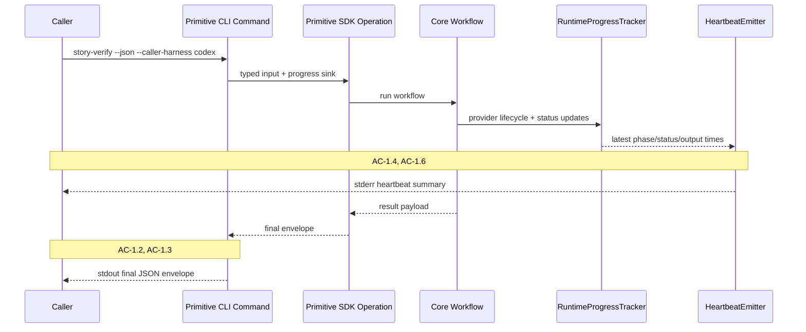
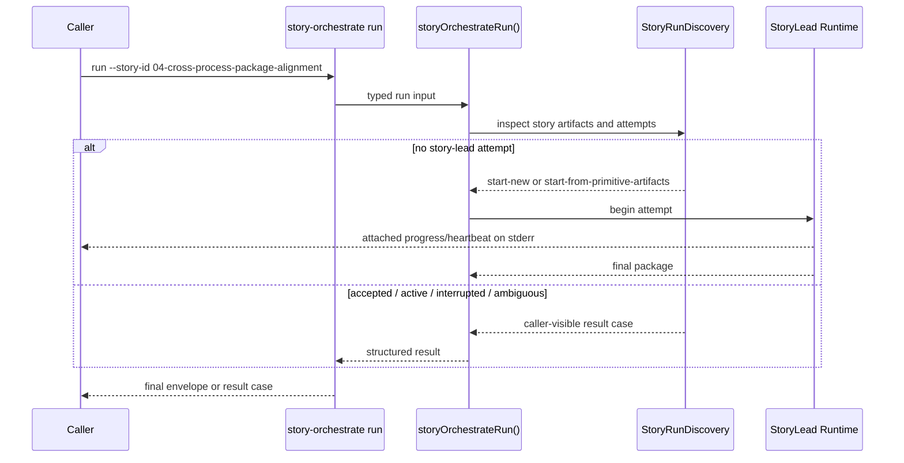
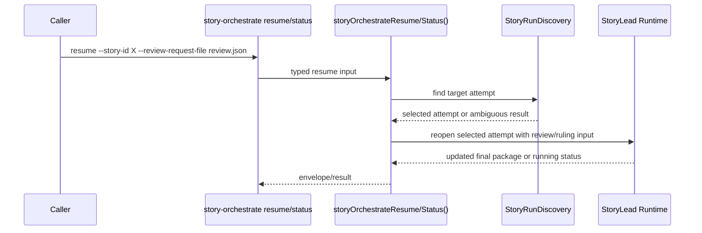

# Technical Design: Orchestration Enhancements — Invocation Surface

## Purpose

This companion carries the detailed design for the caller-facing side of orchestration enhancements:

- primitive heartbeat behavior
- caller harness and cadence configuration
- `story-orchestrate` CLI/SDK entry points
- caller-visible result shapes
- attached progress output behavior

The index document covers the whole-system map. This file focuses on the Invocation Surface top-tier boundary.

---

## Context

The current package already has the split this design wants to preserve: CLI wrappers in `src/cli/commands/` do argument parsing and output rendering, SDK operations in `src/sdk/operations/` validate typed inputs and finalize envelopes, and the core workflows in `src/core/` do the real work. The orchestration feature should fit into that shape rather than bypassing it.

The new caller-facing behavior is conceptually simple but operationally sensitive. Primitive commands need to keep exact final JSON stdout while also coaching long-running callers not to final too early. `story-orchestrate` needs to add a long-running entry point without forcing the rest of the CLI to adopt a different output model or a different idea of what a command envelope means.

The design therefore keeps one rule: attached progress belongs to the live caller path, and final envelopes remain the durable machine-readable result. For existing primitives, that means progress on `stderr` and final exact JSON on `stdout` when `--json` is used. For `story-orchestrate`, the same rule applies in v1. The progress stream is attached and caller-readable; the final envelope remains the only exact JSON document on `stdout`.

---

## Module Architecture

### Invocation Surface File Tree

```text
src/
├── bin/
│   └── lbuild-impl.ts                        # MODIFIED: register story-orchestrate group, update root help
├── cli/
│   ├── commands/
│   │   ├── shared.ts                        # MODIFIED: caller harness flags, heartbeat sink wiring
│   │   ├── story-orchestrate.ts             # NEW: run/resume/status CLI group
│   │   ├── story-implement.ts               # MODIFIED: heartbeat-capable provider options
│   │   ├── story-continue.ts                # MODIFIED
│   │   ├── story-self-review.ts             # MODIFIED
│   │   ├── story-verify.ts                  # MODIFIED
│   │   ├── quick-fix.ts                     # MODIFIED
│   │   ├── epic-cleanup.ts                  # MODIFIED
│   │   ├── epic-verify.ts                   # MODIFIED
│   │   └── epic-synthesize.ts               # MODIFIED
│   ├── envelope.ts                          # MODIFIED: story-orchestrate result render + exit code map
│   └── output.ts                            # MODIFIED: stderr progress output helpers
├── sdk/
│   ├── contracts/
│   │   ├── operations.ts                    # MODIFIED: caller harness / heartbeat inputs
│   │   ├── story-orchestrate.ts             # NEW: public story-orchestrate schemas and result unions
│   │   └── index.ts                         # MODIFIED
│   ├── operations/
│   │   ├── story-orchestrate.ts             # NEW: run/resume/status SDK entry points
│   │   └── shared.ts                        # MODIFIED: story-orchestrate envelope helpers
│   └── index.ts                             # MODIFIED: public export surface
└── core/
    ├── heartbeat.ts                         # NEW: heartbeat scheduler + formatter
    ├── caller-guidance.ts                   # NEW: harness-specific guidance text
    └── runtime-progress.ts                  # MODIFIED: expose current status to heartbeat emitter
```

### Invocation Surface Responsibility Matrix

| Module | Status | Responsibility | Dependencies | ACs Covered |
|--------|--------|----------------|--------------|-------------|
| `src/bin/lbuild-impl.ts` | MODIFIED | Register `story-orchestrate` group and update root help text | CLI command modules | AC-2.1, rollout obligations |
| `src/cli/commands/shared.ts` | MODIFIED | Parse caller harness/heartbeat flags, create progress sinks, preserve JSON stdout contract | `output.ts`, SDK contracts, heartbeat formatter | AC-1.1-1.7 |
| `src/cli/commands/story-orchestrate.ts` | NEW | CLI subcommands for run/resume/status | SDK story-orchestrate ops, shared CLI helpers | AC-2.1-2.8 |
| `src/sdk/contracts/operations.ts` | MODIFIED | Add caller-harness/cadence/disable/progress-listener inputs to provider-backed operations | Zod, shared contracts | AC-1.4-1.5 |
| `src/sdk/contracts/story-orchestrate.ts` | NEW | Public request and result schemas for `run`, `resume`, and `status` | core story-orchestrate contracts | AC-2.1-2.10 |
| `src/sdk/operations/story-orchestrate.ts` | NEW | Invocation-surface bridge from typed input to story runtime | story runtime, envelope helpers | AC-2.1-2.10 |
| `src/core/heartbeat.ts` | NEW | Emit fixed-cadence heartbeat messages from primitive or story state | caller guidance, runtime progress, timers | AC-1.1-1.7, AC-2.7 |
| `src/core/caller-guidance.ts` | NEW | Map caller harness to concrete polling language | none | AC-1.4, AC-4.2-4.3 |

---

## Flow-by-Flow Design

### Flow 1: Primitive Heartbeat Emission

**Covers:** AC-1.1 through AC-1.7

Primitive commands already reserve artifact, stream, and progress paths before calling SDK operations. The missing behavior is caller coaching. This flow adds a caller-facing heartbeat sink without changing the final envelope path. That lets primitive commands remain structurally thin while making their long-running behavior visible to the live caller.

The heartbeat scheduler does not subscribe to raw provider output lines. It reads the latest command state and emits one summary per cadence window. That keeps output bounded and stable across providers.



**Skeleton Requirements**

| What | Where | Stub Signature |
|------|-------|----------------|
| Caller harness parser | `src/cli/commands/shared.ts` | `export function resolveCallerHeartbeatOptions(input: { callerHarness?: CallerHarness; heartbeatCadenceMinutes?: number; disableHeartbeats?: boolean; config?: CallerHarnessConfigRecord; operationKind: "primitive" \| "story"; }): ResolvedCallerHarnessConfig \| null { throw new NotImplementedError("resolveCallerHeartbeatOptions"); }` |
| Heartbeat emitter | `src/core/heartbeat.ts` | `export function createHeartbeatEmitter(input: { command: string; callerHarness: CallerHarness; cadenceMinutes: number; readSnapshot: () => RuntimeStatus \| StoryRunCurrentSnapshot; writeAttachedOutput: (event: AttachedProgressEvent) => void; }): { start(): void; stop(): void } { throw new NotImplementedError("createHeartbeatEmitter"); }` |
| Caller guidance formatter | `src/core/caller-guidance.ts` | `export function renderCallerGuidance(input: { callerHarness: CallerHarness; command: string; cadenceMinutes: number; }): string { throw new NotImplementedError("renderCallerGuidance"); }` |

**TC Mapping for this Flow**

| TC | Tests | Module | Setup | Assert |
|----|-------|--------|-------|--------|
| TC-1.1a | `tests/unit/cli/primitive-heartbeats.test.ts` | CLI shared + heartbeat emitter | Fake long-running operation with heartbeat timer | One heartbeat summary emitted |
| TC-1.2a | `tests/package/cli/primitive-json-output.test.ts` | CLI command | Invoke with `--json` and mocked provider runtime | Final JSON only on stdout; heartbeat on stderr |
| TC-1.4a | `tests/unit/core/caller-guidance.test.ts` | caller guidance | Caller harness `codex` | Guidance mentions polling same exec session |
| TC-1.5a-d | `tests/unit/sdk/heartbeat-options.test.ts` | SDK contracts + CLI shared | Vary CLI/SDK/config defaults | Precedence and cadence resolved correctly |
| TC-1.6a-b | `tests/unit/core/heartbeat-emitter.test.ts` | heartbeat emitter | Frequent output vs silence | Fixed-cadence summary, not event flood |
| TC-1.7a | `tests/unit/cli/primitive-heartbeats.test.ts` | CLI shared | Disable heartbeat flag | No heartbeat emitted |

### Flow 2: `story-orchestrate run`

**Covers:** AC-2.1 through AC-2.5, AC-2.7, AC-2.8

The `run` entry point has one caller promise: “orient from disk, then either start a new story-lead attempt or tell me exactly what I should do next.” It never silently continues an existing story-lead attempt. That means the invocation layer needs a deterministic selection pass before the story runtime begins.

This is not a workflow FSM. It is a request classifier. The result cases are finite because the caller needs stable behavior, but the story runtime remains agentic once `run` has crossed into a new story-lead attempt.



**Skeleton Requirements**

| What | Where | Stub Signature |
|------|-------|----------------|
| CLI command group | `src/cli/commands/story-orchestrate.ts` | `export default defineCommand({ meta: { name: "story-orchestrate" }, subCommands: { run: defineCommand({}), resume: defineCommand({}), status: defineCommand({}) } })` |
| SDK run op | `src/sdk/operations/story-orchestrate.ts` | `export async function storyOrchestrateRun(input: StoryOrchestrateRunInput): Promise<CliResultEnvelope<StoryOrchestrateRunResult>> { throw new NotImplementedError("storyOrchestrateRun"); }` |
| Run discovery | `src/core/story-run-discovery.ts` | `export async function discoverStoryRunState(input: { specPackRoot: string; storyId: string; storyRunId?: string; }): Promise<StoryRunSelection> { throw new NotImplementedError("discoverStoryRunState"); }` |

**TC Mapping for this Flow**

| TC | Tests | Module | Setup | Assert |
|----|-------|--------|-------|--------|
| TC-2.1a-c | `tests/package/cli/story-orchestrate-help.test.ts` | CLI group | Build CLI | run/resume/status help text present |
| TC-2.2a-b | `tests/unit/core/story-run-discovery.test.ts` | discovery | Valid and invalid story ids | Accept valid; reject invalid without mutation |
| TC-2.3a-e | `tests/package/cli/story-orchestrate-run.test.ts` | CLI + SDK run | Fixture directories for none/primitive-only/accepted/interrupted/ambiguous | Correct result case per setup |
| TC-2.5a-c | `tests/unit/sdk/story-orchestrate-status.test.ts` | SDK status | Omit story run id | Single-attempt select or ambiguous result |
| TC-2.7a-b | `tests/unit/core/story-heartbeat-emitter.test.ts` | story heartbeat emitter | Running story state | 10-minute default and formatted output |
| TC-2.8a-b | `tests/package/cli/story-orchestrate-run.test.ts` | CLI run | Terminal and interrupted runs | Completion marker vs incomplete state |

### Flow 3: `story-orchestrate resume` and `status`

**Covers:** AC-2.6, AC-2.10

`resume` is where caller authority re-enters the runtime. It is the only entry point allowed to continue or reopen an existing story-lead attempt, and it must thread review requests or caller rulings into the story runtime without mutating prior attempt history.

`status` is read-only. It exists so callers can recover after losing the story run id, after compaction, or after interruption. It should share discovery logic with `run` and `resume`, not invent a parallel path.



**TC Mapping for this Flow**

| TC | Tests | Module | Setup | Assert |
|----|-------|--------|-------|--------|
| TC-2.6a-c | `tests/package/cli/story-orchestrate-resume.test.ts` | CLI resume + SDK | Valid/invalid review request files | Review accepted and recorded, or invalid result returned |
| TC-2.10a-b | `tests/unit/core/story-run-ledger.test.ts` | ledger | Interrupted/context-window-failed snapshots | Discoverable latest checkpoint and failure metadata |

---

## Interface Definitions

### Caller Harness and Heartbeat Options

```ts
export type CallerHarness = "generic" | "codex" | "claude-code";

export interface CallerHarnessConfigRecord {
  harness: CallerHarness;
  primitive_heartbeat_cadence_minutes?: number;
  story_heartbeat_cadence_minutes?: number;
}

export interface ResolvedCallerHarnessConfig {
  harness: CallerHarness;
  primitiveHeartbeatCadenceMinutes: number;
  storyHeartbeatCadenceMinutes: number;
}

export interface HeartbeatOptions {
  callerHarness?: CallerHarness;
  heartbeatCadenceMinutes?: number;
  disableHeartbeats?: boolean;
  progressListener?: (event: AttachedProgressEvent) => void;
}

export interface AttachedProgressEvent {
  type: "progress" | "heartbeat" | "terminal";
  command: string;
  phase: string;
  summary: string;
  callerHarness: CallerHarness;
  storyId?: string;
  storyRunId?: string;
  elapsedTime?: string;
  lastOutputAt?: string | null;
  statusArtifact?: string;
  nextPollRecommendation?: string | { afterMinutes: number; action: string };
  finalPackagePath?: string;
}
```

`progressListener` is the SDK seam that keeps the heartbeat feature out of stdout. CLI commands satisfy it by writing human-readable progress and heartbeat lines to `stderr`. Story-lead composition satisfies it by routing child updates into the story-run event log and attached caller output. If the listener is absent, operations still write durable progress files and return final envelopes.

`CallerHarnessConfigRecord` is the new persisted run-config block and follows the current snake_case config style. `ResolvedCallerHarnessConfig` is the in-memory normalized form. Primitive commands default to `primitiveHeartbeatCadenceMinutes`; story orchestration defaults to `storyHeartbeatCadenceMinutes`. CLI flags and SDK inputs override the persisted block without mutating it.

### CLI Flags and Config Keys

| Surface | Key / Flag | Meaning |
|---------|------------|---------|
| CLI | `--caller-harness <generic|codex|claude-code>` | Caller host reading attached output |
| CLI | `--heartbeat-cadence-minutes <n>` | Override cadence for the invoked operation |
| CLI | `--disable-heartbeats` | Disable attached heartbeat output |
| CLI | `--review-request-file <path>` | Resume-only CLI flag; file parsed into `ImplLeadReviewRequest` before SDK call |
| CLI | `--ruling-file <path>` | Resume-only CLI flag; file parsed into `CallerRulingResponse` before SDK call |
| Run config | `caller_harness.harness` | Default caller harness |
| Run config | `caller_harness.primitive_heartbeat_cadence_minutes` | Default primitive heartbeat cadence |
| Run config | `caller_harness.story_heartbeat_cadence_minutes` | Default story-orchestrate heartbeat cadence |
| Run config | `story_lead_provider` | Canonical story-lead role assignment using the current role-assignment schema (`story_lead` remains a deprecated compatibility alias) |

```ts
export const callerHarnessConfigRecordSchema = z
  .object({
    harness: z.enum(["generic", "codex", "claude-code"]),
    primitive_heartbeat_cadence_minutes: z.number().int().positive().optional(),
    story_heartbeat_cadence_minutes: z.number().int().positive().optional(),
  })
  .strict();
```

### Invocation Input Contracts

```ts
export interface StoryOrchestrateRunInput extends OperationInputBase, HeartbeatOptions {
  storyId: string;
}

export interface StoryOrchestrateResumeInput extends OperationInputBase, HeartbeatOptions {
  storyId: string;
  storyRunId?: string;
  reviewRequest?: ImplLeadReviewRequest;
  ruling?: CallerRulingResponse;
}

export interface StoryOrchestrateStatusInput extends OperationInputBase {
  storyId: string;
  storyRunId?: string;
}
```

CLI file-path flags are invocation-surface concerns only. The CLI resolves them into typed payload objects before calling the SDK. Invalid story ids, ambiguous attempts, invalid review requests, and invalid rulings are modeled as typed result cases, not thrown SDK errors.

### Caller-Visible Result Union

```ts
export type StoryOrchestrateRunResult =
  | {
      case: "completed";
      outcome: StoryLeadFinalPackage["outcome"];
      storyId: string;
      storyRunId: string;
      currentSnapshotPath: string;
      eventHistoryPath: string;
      finalPackagePath: string;
      finalPackage: StoryLeadFinalPackage;
      startedFromPrimitiveArtifacts?: string[];
    }
  | {
      case: "interrupted";
      outcome: "interrupted";
      storyId: string;
      storyRunId: string;
      currentSnapshotPath: string;
      eventHistoryPath: string;
      latestEventSequence: number;
      storyLeadSession?: StoryLeadSessionRef;
    }
  | { case: "existing-accepted-attempt"; storyId: string; storyRunId: string; finalPackagePath: string; suggestedNext: "status" | "resume"; }
  | { case: "resume-required"; storyId: string; storyRunId: string; currentSnapshotPath: string; suggestedCommand: string; }
  | { case: "active-attempt-exists"; storyId: string; storyRunId: string; currentSnapshotPath: string; }
  | { case: "ambiguous-story-run"; storyId: string; candidates: StoryRunCandidate[]; }
  | { case: "invalid-story-id"; storyId: string; };

export type StoryOrchestrateResumeResult =
  | {
      case: "completed";
      outcome: StoryLeadFinalPackage["outcome"];
      storyId: string;
      storyRunId: string;
      currentSnapshotPath: string;
      eventHistoryPath: string;
      finalPackagePath: string;
      finalPackage: StoryLeadFinalPackage;
      acceptedReviewRequestId?: string;
      acceptedReviewRequestArtifact?: ArtifactRef;
      acceptedRulingRequestId?: string;
      acceptedRulingArtifact?: ArtifactRef;
    }
  | {
      case: "interrupted";
      outcome: "interrupted";
      storyId: string;
      storyRunId: string;
      currentSnapshotPath: string;
      eventHistoryPath: string;
      latestEventSequence: number;
      storyLeadSession?: StoryLeadSessionRef;
      acceptedReviewRequestArtifact?: ArtifactRef;
      acceptedRulingArtifact?: ArtifactRef;
    }
  | { case: "invalid-review-request"; storyId: string; }
  | { case: "invalid-ruling"; storyId: string; }
  | { case: "invalid-story-run-id"; storyId: string; storyRunId: string; }
  | { case: "ambiguous-story-run"; storyId: string; candidates: StoryRunCandidate[]; }
  | { case: "invalid-story-id"; storyId: string; };

export type StoryOrchestrateStatusResult =
  | {
      case: "single-attempt";
      storyId: string;
      storyRunId: string;
      currentSnapshotPath: string;
      currentSnapshot: StoryRunCurrentSnapshot;
      currentStatus: StoryRunCurrentSnapshot["status"];
      latestEventSequence: number;
      finalPackagePath?: string;
      finalPackage?: StoryLeadFinalPackage;
    }
  | { case: "ambiguous-story-run"; storyId: string; candidates: StoryRunCandidate[]; }
  | { case: "invalid-story-id"; storyId: string; }
  | { case: "invalid-story-run-id"; storyId: string; storyRunId: string; };
```

`run` and `resume` are long-running awaited operations. They emit attached progress and heartbeat events while active, then resolve to either a terminal runtime result (`completed` or `interrupted`) or an immediate selection result (`existing-accepted-attempt`, `resume-required`, `active-attempt-exists`, `ambiguous-story-run`, `invalid-story-run-id`, `invalid-story-id`). The CLI envelope wraps these unions.

### Envelope Mapping

`story-orchestrate` keeps using `CliResultEnvelope`. The new result unions become the typed `result` payload, while envelope `status`, `outcome`, and CLI exit code stay aligned with the package's existing `ok` / `needs-user-decision` / `blocked` / `error` model.

| Result Case | Envelope `status` | Envelope `outcome` | Exit Code |
|-------------|-------------------|--------------------|-----------|
| `completed` + `accepted` | `ok` | `accepted` | `0` |
| `completed` + `needs-ruling` | `needs-user-decision` | `needs-ruling` | `2` |
| `completed` + `blocked` | `blocked` | `blocked` | `3` |
| `completed` + `failed` | `error` | `failed` | `1` |
| `interrupted` | `needs-user-decision` | `interrupted` | `2` |
| `existing-accepted-attempt` | `needs-user-decision` | `existing-accepted-attempt` | `2` |
| `resume-required` | `needs-user-decision` | `resume-required` | `2` |
| `active-attempt-exists` | `needs-user-decision` | `active-attempt-exists` | `2` |
| `ambiguous-story-run` | `needs-user-decision` | `ambiguous-story-run` | `2` |
| `invalid-story-id` | `error` | `invalid-story-id` | `1` |
| `invalid-review-request` | `error` | `invalid-review-request` | `1` |
| `invalid-ruling` | `error` | `invalid-ruling` | `1` |
| `single-attempt` (`status`) | `ok` | `single-attempt` | `0` |

This mapping should land in one explicit helper inside the invocation surface, rather than being inferred ad hoc across commands.

### Runtime Progress Integration

```ts
export interface RuntimeProgressReadable {
  getSnapshot(): RuntimeStatus;
}
```

Primitive workflows keep using `RuntimeProgressTracker` for progress persistence. The modification in this epic is the addition of a lightweight `getSnapshot()` accessor so the heartbeat emitter can read the latest state on a fixed cadence without subscribing to raw provider stdout/stderr lines. Heartbeats are attached-output only in v1; they do not add new event types to the existing primitive `progress.jsonl` schema.

### CLI Output Mode

```ts
export interface CliOutputMode {
  json: boolean;
  human: boolean;
}
```

No new `--jsonl` mode exists in v1. This design keeps output families small:

- default mode: human summary on `stdout`, attached progress/heartbeats on `stderr`
- `--json`: final exact JSON envelope on `stdout`, attached progress/heartbeats on `stderr`

Structured polling stays on disk through `status`.

---

## Testing Strategy

The Invocation Surface is tested primarily through command handlers and SDK entry points. The `story-orchestrate` command group, the heartbeat-emitter path, and the caller-guidance layer should be exercised as integrated public surfaces. Internal helpers such as message-formatting functions may have small pure tests, but they are not the main confidence layer.

What gets mocked:

| Boundary | Mock? | Why |
|----------|-------|-----|
| Provider subprocesses | Yes | External CLI behavior and timing control |
| Filesystem edge cases | Yes, selectively | Invalid review requests, missing files, path errors |
| Internal SDK/core modules | No | We want to catch integration bugs between parsing, progress, heartbeats, and envelope rendering |

The primary new command-level files should be:

- `tests/package/cli/story-orchestrate-help.test.ts`
- `tests/package/cli/story-orchestrate-run.test.ts`
- `tests/package/cli/story-orchestrate-resume.test.ts`
- `tests/package/cli/primitive-json-output.test.ts`
- `tests/unit/cli/primitive-heartbeats.test.ts`
- `tests/unit/core/caller-guidance.test.ts`
- `tests/unit/core/heartbeat-emitter.test.ts`
- `tests/unit/core/story-heartbeat-emitter.test.ts`
- `tests/unit/sdk/heartbeat-options.test.ts`
- `tests/unit/sdk/story-orchestrate-status.test.ts`

---

## Related Documentation

- Index: [tech-design.md](/Users/leemoore/code/lspec-core/docs/spec-build/epics/03-orchestration-enhancements/tech-design.md)
- Story Runtime Companion: [tech-design-story-runtime.md](/Users/leemoore/code/lspec-core/docs/spec-build/epics/03-orchestration-enhancements/tech-design-story-runtime.md)
- Test Plan: [test-plan.md](/Users/leemoore/code/lspec-core/docs/spec-build/epics/03-orchestration-enhancements/test-plan.md)
