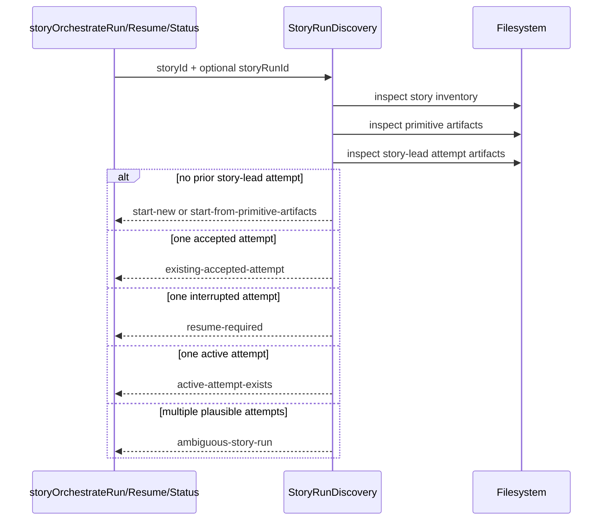
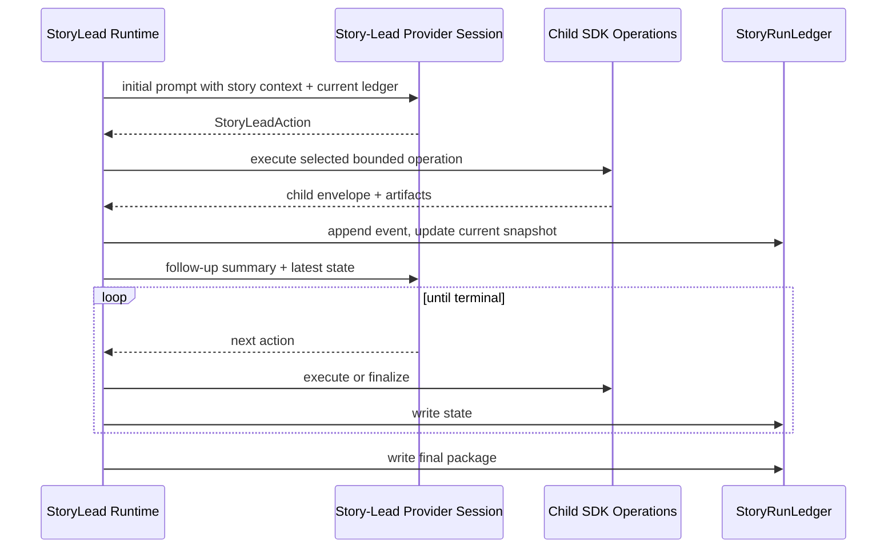
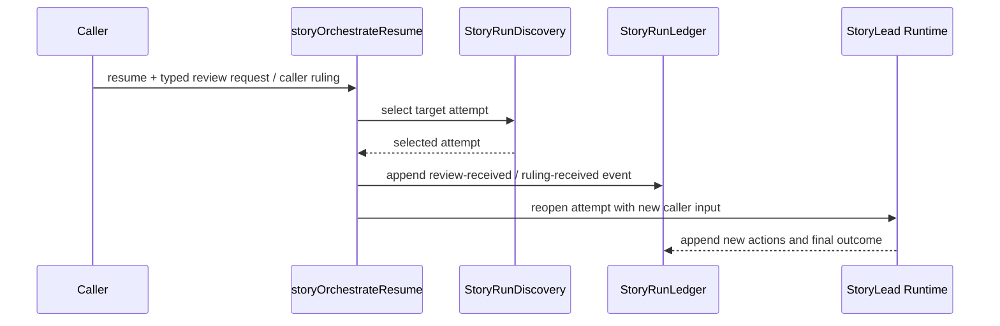
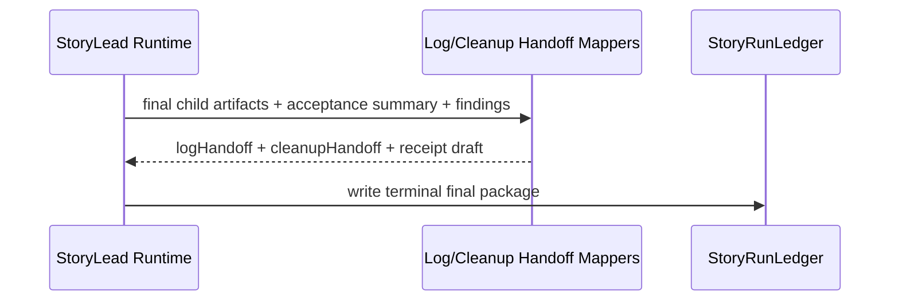

# Technical Design: Orchestration Enhancements — Story Runtime

## Purpose

This companion carries the detailed design for the story-level runtime:

- attempt discovery and selection
- durable story-run ledger
- story-lead coordinator loop
- review/ruling incorporation
- final package, log handoff, and cleanup handoff
- replay-boundary and interruption recovery

The index document defines the whole-system map. This file focuses on the Story Runtime top-tier surface.

---

## Context

The current runtime already knows how to run bounded story operations: implementation, continuation, self-review, verification, and quick-fix. What it does not know is how to sequence those as one coherent story-owned unit while preserving the caller/impl-lead hierarchy. The story runtime is that missing layer.

The user pushed hard against turning this into a deterministic workflow state machine, and the design keeps that boundary. The runtime will absolutely have deterministic pieces: attempt discovery, durable ledger writes, schema validation, output/result shaping, and child artifact reservation. But the story-lead still decides how to progress within its authority, when to request a caller ruling, and when to accept or block the story.

This leads to a split in responsibilities. The story runtime is responsible for the loop mechanics and durable evidence. The story-lead provider session is responsible for selecting the next bounded action from the small runtime tool surface. The impl-lead remains responsible for applying `logHandoff`, accepting or rejecting story output, updating `team-impl-log.md`, committing if needed, and deciding whether to reopen the story.

The final design choice that matters here is recovery shape. V1 keeps a long-running retained story-lead session when possible, but the ledger is deliberately rich enough to support future fresh-turn rehydration. That means every child operation result, review/ruling input, and acceptance decision has to be persisted as if the story-lead might disappear immediately afterward.

---

## Module Architecture

### Story Runtime File Tree

```text
src/
├── core/
│   ├── not-implemented.ts                   # NEW: shared skeleton-phase NotImplementedError helper
│   ├── story-orchestrate-contracts.ts        # NEW: canonical story-run schemas
│   ├── story-run-discovery.ts                # NEW: attempt discovery and selection
│   ├── story-run-ledger.ts                   # NEW: current/events/final artifact read-write
│   ├── story-lead.ts                         # NEW: coordinator loop
│   ├── story-lead-prompt.ts                  # NEW: prompt assembly and follow-up summaries
│   ├── log-handoff.ts                        # NEW: final-package -> run-log update payload
│   ├── cleanup-handoff.ts                    # NEW: final-package -> cleanup payload
│   ├── result-contracts.ts                   # MODIFIED: story-orchestrate exports and primitive compatibility
│   ├── config-schema.ts                      # MODIFIED: caller_harness and story_lead_provider config
│   ├── log-template.ts                       # MODIFIED: preserve headings/semantics, add labels if needed
│   ├── artifact-writer.ts                    # MODIFIED: story-lead grouped artifact helpers
│   ├── runtime-progress.ts                   # MODIFIED: expose primitive status to heartbeat system
│   ├── prompt-assets.ts                      # MODIFIED: register story-lead prompt assets
│   ├── prompt-assembly.ts                    # MODIFIED: assemble story-lead prompt via existing asset path
│   ├── story-implementor.ts                  # EXISTING: child op
│   ├── story-verifier.ts                     # EXISTING: child op
│   └── quick-fix.ts                          # EXISTING: child op
├── sdk/
│   ├── operations/story-orchestrate.ts       # NEW: bridge into story runtime
│   └── contracts/story-orchestrate.ts        # NEW: public story-run/result schemas
└── prompts/
    ├── base/story-lead.md                    # NEW: story-lead charter
    └── snippets/
        ├── story-lead-action-protocol.md     # NEW
        ├── story-lead-acceptance-rubric.md   # NEW
        └── story-lead-ruling-boundaries.md   # NEW
```

### Story Runtime Responsibility Matrix

| Module | Status | Responsibility | Dependencies | ACs Covered |
|--------|--------|----------------|--------------|-------------|
| `src/core/story-orchestrate-contracts.ts` | NEW | Canonical schemas for story-run snapshot, events, final package, review/ruling payloads, and result unions | Zod | AC-2.4-2.10, AC-3.1-3.11 |
| `src/core/story-run-discovery.ts` | NEW | Find prior attempts for a story, classify them, and choose caller-visible result cases | filesystem, story contracts | AC-2.3-2.6, AC-2.10 |
| `src/core/story-run-ledger.ts` | NEW | Persist current snapshot, append-only event history, and terminal final package | artifact writer, atomic writes | AC-2.4, AC-2.8, AC-2.10, AC-3.1, AC-3.9, AC-3.11 |
| `src/core/story-lead.ts` | NEW | Story-lead loop, action execution, review/ruling incorporation, final-package assembly | story-run ledger, prompt assembly, child SDK ops, provider adapters | AC-2.7-2.10, AC-3.3-3.11 |
| `src/core/story-lead-prompt.ts` | NEW | Build initial and follow-up prompts from epic, design, test plan, story artifacts, and ledger state | prompt assembly, prompt assets, contract schemas | AC-3.3, AC-3.4 |
| `src/core/log-handoff.ts` | NEW | Convert final package into run-log update payload without mutating the log | log template, final package | AC-3.6-3.8 |
| `src/core/cleanup-handoff.ts` | NEW | Extract defer/accepted-risk items for cleanup batch planning | final package | AC-3.10 |
| `src/core/config-schema.ts` | MODIFIED | Add caller harness block and story-lead role assignment | existing role schemas | AC-1.5, AC-2.9 |
| `src/core/log-template.ts` | MODIFIED | Keep current recovery headings stable and minimally extend persistent run-config labels only where needed | fs utils | AC-3.6-3.7, AC-4.6 |
| `src/core/prompt-assets.ts` + `src/core/prompt-assembly.ts` | MODIFIED | Register story-lead base prompt/snippets and route story-lead prompt assembly through the existing prompt asset registry | embedded prompt assets, prompt assembly | AC-3.3-3.4, AC-4.1-4.7 |

---

### Skeleton Requirements

Chunk 0 should create copy-paste-ready stubs for the new runtime files. Because the current repo does not already define a reusable `NotImplementedError`, Chunk 0 also adds one small helper and uses it consistently in new skeleton files.

| What | Where | Stub Signature |
|------|-------|----------------|
| NotImplemented helper | `src/core/not-implemented.ts` | `export class NotImplementedError extends Error { constructor(name: string) { super(\`\${name} not implemented\`); this.name = "NotImplementedError"; } }` |
| Story-run discovery | `src/core/story-run-discovery.ts` | `export async function discoverStoryRunState(input: { specPackRoot: string; storyId: string; storyRunId?: string; }): Promise<StoryRunSelection> { throw new NotImplementedError("discoverStoryRunState"); }` |
| Story-run ledger | `src/core/story-run-ledger.ts` | `export function createStoryRunLedger(input: { specPackRoot: string; storyId: string; }): StoryRunLedger { throw new NotImplementedError("createStoryRunLedger"); }` |
| Story-lead runtime | `src/core/story-lead.ts` | `export async function runStoryLead(input: StoryLeadRuntimeInput): Promise<StoryLeadRuntimeResult> { throw new NotImplementedError("runStoryLead"); }` |
| Story-lead prompt | `src/core/story-lead-prompt.ts` | `export async function assembleStoryLeadPrompt(input: StoryLeadPromptContext): Promise<string> { throw new NotImplementedError("assembleStoryLeadPrompt"); }` |
| Log handoff mapper | `src/core/log-handoff.ts` | `export async function buildLogHandoff(input: StoryLeadFinalPackage): Promise<LogHandoff> { throw new NotImplementedError("buildLogHandoff"); }` |
| Cleanup handoff mapper | `src/core/cleanup-handoff.ts` | `export function buildCleanupHandoff(input: StoryLeadFinalPackage): CleanupHandoff { throw new NotImplementedError("buildCleanupHandoff"); }` |

---

## Flow-by-Flow Design

### Flow 1: Attempt Discovery and Selection

**Covers:** AC-2.2 through AC-2.6, AC-2.10

Attempt discovery is deterministic and read-only. It is the part of the story runtime that behaves most like a classifier rather than an agent loop. Given `spec-pack-root + story-id`, it inspects primitive artifacts, story-lead attempt artifacts, and final packages to determine which caller-visible case applies.

This is intentionally not a workflow FSM. Discovery does not decide what story-lead should do next in general. It only decides whether the caller is allowed to start a new story-lead attempt, must use `resume`, is blocked by ambiguity, or can only inspect a previously accepted result.



**Design Decision**

The discovery module computes one of these states:

```ts
type StoryRunSelection =
  | { case: "start-new" }
  | { case: "start-from-primitive-artifacts"; sourceArtifactPaths: string[] }
  | { case: "existing-accepted-attempt"; storyRunId: string; finalPackagePath: string }
  | { case: "resume-required"; storyRunId: string; currentSnapshotPath: string }
  | { case: "active-attempt-exists"; storyRunId: string; currentSnapshotPath: string }
  | { case: "ambiguous-story-run"; candidates: StoryRunCandidate[] }
  | { case: "invalid-story-id" };
```

This selection result is converted directly into the caller-visible result union in the Invocation Surface.

### Flow 2: Story-Lead Coordinator Loop

**Covers:** AC-2.7-2.10, AC-3.3-3.5, AC-3.8-3.11

Once a new or resumed story-lead attempt begins, the coordinator loop runs until the attempt returns a terminal outcome. The loop is provider-backed and retained when possible, and the story-lead provider session reference is persisted in the current snapshot after startup so resume can reuse it later. The runtime writes ledger state after every material step so the loop can recover later even when the retained session goes stale.

The key design here is the bounded action protocol. The story-lead is not allowed arbitrary shell control. It chooses from a small set of runtime actions. This is not a coded workflow engine deciding which phase is legal. It is a runtime tool surface that keeps the story-lead in bounds while preserving agent judgment.



**Action Protocol**

```ts
type StoryLeadAction =
  | { type: "run-story-implement"; rationale: string }
  | { type: "run-story-continue"; continuationHandleRef: string; request: string; rationale: string }
  | { type: "run-story-self-review"; continuationHandleRef: string; passes: number; rationale: string }
  | { type: "run-story-verify-initial"; provider?: "claude-code" | "codex" | "copilot"; orchestratorContext?: string; rationale: string }
  | { type: "run-story-verify-followup"; verifierContinuationHandleRef: string; responseArtifactRef?: string; responseText?: string; orchestratorContext?: string; rationale: string }
  | { type: "run-quick-fix"; request: string; workingDirectory?: string; rationale: string }
  | { type: "request-ruling"; request: CallerRulingRequest; rationale: string }
  | { type: "accept-story"; acceptance: StoryLeadAcceptanceSummary; rationale: string }
  | { type: "block-story"; reason: string; detail?: string };
```

The runtime validates only shape, referenced handles/artifacts, and required fields. It does not enforce a hard phase legality table. For verifier follow-up, the runtime additionally requires either `responseArtifactRef` or `responseText`, and it resolves the referenced retained verifier continuation handle into the current `story-verify` follow-up SDK input shape.

**Story-lead provider contract**

```ts
export const storyLeadActionSchema = z.discriminatedUnion("type", [
  z.object({ type: z.literal("run-story-implement"), rationale: z.string().min(1) }),
  z.object({ type: z.literal("run-story-continue"), continuationHandleRef: z.string().min(1), request: z.string().min(1), rationale: z.string().min(1) }),
  z.object({ type: z.literal("run-story-self-review"), continuationHandleRef: z.string().min(1), passes: z.number().int().positive(), rationale: z.string().min(1) }),
  z.object({ type: z.literal("run-story-verify-initial"), provider: providerIdSchema.optional(), orchestratorContext: z.string().min(1).optional(), rationale: z.string().min(1) }),
  z.object({ type: z.literal("run-story-verify-followup"), verifierContinuationHandleRef: z.string().min(1), responseArtifactRef: z.string().min(1).optional(), responseText: z.string().min(1).optional(), orchestratorContext: z.string().min(1).optional(), rationale: z.string().min(1) }),
  z.object({ type: z.literal("run-quick-fix"), request: z.string().min(1), workingDirectory: z.string().min(1).optional(), rationale: z.string().min(1) }),
  z.object({ type: z.literal("request-ruling"), request: callerRulingRequestSchema, rationale: z.string().min(1) }),
  z.object({ type: z.literal("accept-story"), acceptance: storyLeadAcceptanceSummarySchema, rationale: z.string().min(1) }),
  z.object({ type: z.literal("block-story"), reason: z.string().min(1), detail: z.string().min(1).optional() }),
]);
```

The story-lead provider adapter uses the same structured-output validation path as other provider-backed roles. Each turn must parse to exactly one `StoryLeadAction`. If parsing fails, the runtime appends a `provider-output-invalid` event, preserves the current snapshot, records the retained story-lead session when available, and returns `interrupted` with a replay boundary rather than guessing. No hidden retry loop exists at this layer in v1.

### Flow 3: Review, Ruling, and Reopen

**Covers:** AC-2.6, AC-3.4, AC-3.9

Reopen behavior is story-owned but caller-authorized. A resume with a typed review request or caller ruling does not create a second side channel. It becomes new input into the same story-run ledger and then the same story-lead loop continues from updated durable state.



**Design Decision**

`resume` supports three reopen cases:

1. continue an interrupted attempt with no new caller input
2. reopen an accepted attempt with an impl-lead review request
3. continue a `needs-ruling` attempt with a caller ruling response

All three cases stay on the same story-run attempt history. New accepted results do not erase prior accepted attempts.

### Flow 4: Final Package, Log Handoff, and Cleanup Handoff

**Covers:** AC-3.1-3.3, AC-3.6-3.10

The story runtime must assemble a final package that is rich enough for the impl-lead to accept, reject, reopen, update the run log, and plan cleanup. This is the point where the runtime stops and hands authority back outward.

The runtime does not write `team-impl-log.md` directly in v1. It computes `logHandoff` and `cleanupHandoff` as first-class payloads, because preserving impl-lead authority is part of the design boundary.



**Log Template Decision**

The current `team-impl-log.md` headings remain the recovery source of truth. The design allows minimal template extension only where it clarifies persistent run configuration and story-runtime semantics:

- `Story Lead` line in Run Configuration

Everything else preserves current heading meaning:

- `State`
- `Current Story`
- `Current Phase`
- `Current Continuation Handles`
- `Story Receipts`
- `Cumulative Baselines`
- `Cleanup / Epic Verification`
- `Open Risks / Accepted Risks`

The existing `src/commands/*` files remain no-touch re-export shims during this epic. All implementation work lands in `src/cli/commands/*`, `src/sdk/*`, and `src/core/*`; the shim layer should remain a thin forwarding surface only.

### Flow 5: Interruption and Replay-Boundary Recovery

**Covers:** AC-2.10, AC-3.11

Interruption recovery and replay-boundary recovery are related but different:

- discoverability: can the caller find the interrupted attempt?
- replay guidance: once found, does the ledger say what the smallest safe next step is?

The runtime handles both by writing recovery hints into the current snapshot or final package whenever a failure boundary occurs.

Deterministic recovery responsibilities:

- mark interrupted attempt discoverable by story id
- record latest successful child operation artifact refs
- record latest continuation handles
- record last accepted/running phase
- derive smallest safe replay step when valid child artifacts already exist

Judgment responsibilities left to story-lead or impl-lead:

- whether to request a ruling
- whether a verifier blocker is already satisfied by evidence
- whether to use quick-fix or return to story implementation
- whether to reopen with the same retained provider session or a fresh one when the ledger leaves ambiguity

---

## Interface Definitions

### Story-Run Artifact Layout

The concrete artifact layout chosen for v1 is:

```text
artifacts/<story-id>/
├── 001-implementor.json                 # existing primitive sibling artifacts
├── 002-self-review-batch.json
├── 003-verifier.json
└── story-lead/
    ├── 001-current.json
    ├── 001-events.jsonl
    ├── 001-final-package.json
    ├── progress/
    │   ├── 001-story-lead.status.json
    │   └── 001-story-lead.progress.jsonl
    └── streams/
        ├── 001-story-lead.stdout.log
        └── 001-story-lead.stderr.log
```

This keeps child operation artifacts where they already live while giving story-lead one dedicated subspace.

Artifact indexing is independent inside `artifacts/<story-id>/story-lead/`. The design extends the existing artifact allocator by introducing one story-lead-specific grouped path helper rooted at `join(specPackRoot, "artifacts", storyId, "story-lead")`. Within that subdirectory, the existing scan-and-reserve semantics apply over the root plus its `progress/` and `streams/` subdirectories. Primitive artifact numbering under `artifacts/<story-id>/` is unaffected.

### Canonical Story Runtime Types

```ts
export interface StoryLeadSessionRef {
  provider: "claude-code" | "codex" | "copilot";
  sessionId: string;
  model: string;
  reasoningEffort: "low" | "medium" | "high" | "xhigh" | "max";
}

export interface ArtifactRef {
  kind: string;
  path: string;
}

export interface StoryRunCandidate {
  storyRunId: string;
  status: "running" | "accepted" | "needs-ruling" | "blocked" | "interrupted" | "failed";
  updatedAt: string;
  currentSnapshotPath: string;
  finalPackagePath?: string;
}

export interface CurrentChildOperation {
  command: string;
  artifactPath?: string;
  continuationHandleRef?: string;
}

export interface StoryRunNextIntent {
  actionType: string;
  summary: string;
  artifactRef?: string;
  continuationHandleRef?: string;
}

export interface StoryRunCurrentSnapshot {
  storyRunId: string;
  storyId: string;
  attempt: number;
  status: "running" | "accepted" | "needs-ruling" | "blocked" | "interrupted" | "failed";
  currentSummary: string;
  currentPhase: string;
  currentChildOperation: CurrentChildOperation | null;
  latestArtifacts: ArtifactRef[];
  latestContinuationHandles: Record<string, { provider: string; sessionId: string; storyId: string }>;
  storyLeadSession?: StoryLeadSessionRef;
  latestEventSequence: number;
  nextIntent: StoryRunNextIntent | null;
  updatedAt: string;
}

export interface StoryRunEvent {
  storyRunId: string;
  sequence: number;
  timestamp: string;
  type: string;
  summary: string;
  artifact?: string;
  data?: Record<string, unknown>;
}

export interface ImplLeadReviewRequest {
  source: string;
  decision: "reject" | "reopen" | "revise" | "ask-ruling" | "stop";
  summary: string;
  items: ImplLeadReviewItem[];
  evidence?: string[];
}

export interface ImplLeadReviewItem {
  id: string;
  severity: "blocker" | "major" | "minor" | "note";
  concern: string;
  requiredResponse: string;
  evidence?: string[];
}

export interface CallerRulingRequest {
  id: string;
  decisionType: string;
  question: string;
  defaultRecommendation: string;
  evidence: string[];
  allowedResponses: string[];
}

export interface CallerRulingResponse {
  rulingRequestId: string;
  decision: string;
  rationale: string;
  source: string;
}

export interface AcceptanceCheckItem {
  name: string;
  status: "pass" | "fail" | "unknown";
  evidence: string[];
  reasoning: string;
}

export interface RiskOrDeviationItem {
  description: string;
  reasoning: string;
  evidence: string[];
  approvalStatus: "not-required" | "approved" | "needs-ruling" | "rejected";
  approvalSource: string | null;
}

export interface StoryLeadSummary {
  storyTitle: string;
  implementedScope: string;
  acceptanceRationale: string;
}

export interface GateRunSummary {
  command: string;
  result: "pass" | "fail" | "not-run";
}

export interface VerificationFindingDisposition {
  id: string;
  status: "fixed" | "accepted-risk" | "defer" | "unresolved";
  evidence: string[];
}

export interface StoryLeadVerification {
  finalVerifierOutcome: "pass" | "revise" | "block" | "not-run";
  findings: VerificationFindingDisposition[];
}

export interface ChangedFileReview {
  path: string;
  reason: string;
}

export interface DiffReview {
  changedFiles: ChangedFileReview[];
  storyScopedAssessment: string;
}

export interface StoryLeadEvidence {
  implementorArtifacts: ArtifactRef[];
  selfReviewArtifacts: ArtifactRef[];
  verifierArtifacts: ArtifactRef[];
  quickFixArtifacts: ArtifactRef[];
  gateRuns: GateRunSummary[];
}

export interface StoryLeadAcceptanceSummary {
  acceptanceChecks: AcceptanceCheckItem[];
  recommendedImplLeadAction: "accept" | "reject" | "reopen" | "ask-ruling";
}

export interface StoryReceiptDraft {
  storyId: string;
  storyTitle: string;
  implementorEvidenceRefs: string[];
  verifierEvidenceRefs: string[];
  gateCommand: string;
  gateResult: "pass" | "fail";
  dispositions: VerificationFindingDisposition[];
  baselineBeforeStory: number | null;
  baselineAfterStory: number | null;
  openRisks: string[];
}

export interface CumulativeBaseline {
  baselineBeforeCurrentStory: number | null;
  expectedAfterCurrentStory: number | null;
  latestActualTotal: number | null;
}

export interface CommitReadiness {
  state: "committed" | "ready-for-impl-lead-commit" | "not-ready";
  commitSha?: string;
  reason?: string;
}

export interface LogHandoff {
  recommendedState: string;
  recommendedCurrentStory: string | null;
  recommendedCurrentPhase: string | null;
  continuationHandles: Record<string, { provider: string; sessionId: string; storyId: string }>;
  storyReceiptDraft: StoryReceiptDraft;
  cumulativeBaseline: CumulativeBaseline;
  commitReadiness: CommitReadiness;
  openRisks: string[];
}

export interface CleanupHandoff {
  acceptedRiskItems: RiskOrDeviationItem[];
  deferredItems: RiskOrDeviationItem[];
  cleanupRequired: boolean;
}

export interface StoryLeadFinalPackage {
  outcome: "accepted" | "needs-ruling" | "blocked" | "failed" | "interrupted";
  storyRunId: string;
  storyId: string;
  attempt: number;
  summary: StoryLeadSummary;
  evidence: StoryLeadEvidence;
  verification: StoryLeadVerification;
  riskAndDeviationReview: {
    specDeviations: RiskOrDeviationItem[];
    assumedRisks: RiskOrDeviationItem[];
    scopeChanges: RiskOrDeviationItem[];
    shimMockFallbackDecisions: RiskOrDeviationItem[];
  };
  diffReview: DiffReview;
  acceptanceChecks: AcceptanceCheckItem[];
  logHandoff: LogHandoff;
  cleanupHandoff: CleanupHandoff;
  rulingRequest: CallerRulingRequest | null;
  recommendedImplLeadAction: "accept" | "reject" | "reopen" | "ask-ruling";
}

export interface StoryRunAttemptSummary extends StoryRunCandidate {}

export interface WriteCurrentSnapshotInput {
  storyId: string;
  storyRunId: string;
  snapshot: StoryRunCurrentSnapshot;
}

export interface AppendStoryRunEventInput {
  storyId: string;
  storyRunId: string;
  event: StoryRunEvent;
}

export interface WriteFinalPackageInput {
  storyId: string;
  storyRunId: string;
  finalPackage: StoryLeadFinalPackage;
}
```

Each interface above has a same-named canonical Zod schema in `story-orchestrate-contracts.ts`. The action-schema snippet in Flow 2 relies on those canonical schemas rather than redefining payload shapes ad hoc inside the coordinator.

### Story-Run Ledger Interfaces

```ts
export interface StoryRunLedger {
  readCurrent(storyId: string, storyRunId: string): Promise<StoryRunCurrentSnapshot | undefined>;
  writeCurrent(input: WriteCurrentSnapshotInput): Promise<void>;
  appendEvent(input: AppendStoryRunEventInput): Promise<void>;
  writeFinalPackage(input: WriteFinalPackageInput): Promise<void>;
  readFinalPackage(storyId: string, storyRunId: string): Promise<StoryLeadFinalPackage | undefined>;
  listAttempts(storyId: string): Promise<StoryRunAttemptSummary[]>;
}
```

Sequence assignment is ledger-owned and monotonic per attempt. `writeCurrent` persists `latestEventSequence`; `appendEvent` increments from the current snapshot inside the ledger write chain before appending the event. Resume/reopen continues numbering from the last persisted sequence for that attempt.

Atomicity rules:

- `current.json` uses `writeAtomic`
- `final-package.json` uses `writeAtomic`
- `events.jsonl` uses serialized `appendFile` through the ledger write chain

### Story-Lead Assignment Schema

```ts
export const storyLeadAssignmentSchema = roleAssignmentSchema;
```

The canonical top-level run-config key is `story_lead_provider`, and it reuses the current role-assignment schema for compatibility. The deprecated `story_lead` alias may still parse for older packs. The inherited `secondary_harness` name is awkward for the primary story-lead role, but the design keeps it in v1 to avoid a larger config migration. In docs and code comments, spell out that `secondary_harness: "none"` means Claude Code.

### Story-Lead Runtime Interface

```ts
export interface StoryLeadAssignment {
  secondary_harness: "codex" | "copilot" | "none";
  model: string;
  reasoning_effort: "low" | "medium" | "high" | "xhigh" | "max";
}

export interface StoryLeadRuntimeInput extends HeartbeatOptions {
  specPackRoot: string;
  storyId: string;
  storyRunId: string;
  mode: "run" | "resume";
  reviewRequest?: ImplLeadReviewRequest;
  ruling?: CallerRulingResponse;
  storyLeadAssignment: StoryLeadAssignment;
}

export type StoryLeadRuntimeResult =
  | {
      case: "completed";
      outcome: "accepted" | "needs-ruling" | "blocked" | "failed";
      finalPackagePath: string;
      finalPackage: StoryLeadFinalPackage;
      currentSnapshotPath: string;
      eventHistoryPath: string;
      storyLeadSession?: StoryLeadSessionRef;
    }
  | {
      case: "interrupted";
      outcome: "interrupted";
      currentSnapshotPath: string;
      eventHistoryPath: string;
      latestEventSequence: number;
      storyLeadSession?: StoryLeadSessionRef;
    };
```

`StoryLeadAssignment` reuses the current role-assignment pattern used elsewhere in `impl-run.config.json`: `secondary_harness: "none"` means Claude Code, while `codex` and `copilot` select those adapters explicitly. The canonical top-level run-config key is `story_lead_provider`, while deprecated `story_lead` input remains available as a compatibility alias.

### Story-Lead Prompt Contract

```ts
export interface StoryLeadPromptContext {
  story: { id: string; title: string; path: string };
  specPackPaths: { epicPath: string; techDesignPath: string; techDesignCompanionPaths: string[]; testPlanPath: string };
  currentSnapshot?: StoryRunCurrentSnapshot;
  latestEvents: StoryRunEvent[];
  priorChildArtifacts: string[];
  reviewRequest?: ImplLeadReviewRequest;
  ruling?: CallerRulingResponse;
}
```

The prompt always includes:

- story charter
- impl-lead versus story-lead authority boundary
- bounded action protocol
- acceptance rubric
- ruling-required categories
- latest durable state summary

### Prompt Asset Registry Integration

`story-lead-prompt.ts` does not bypass the current prompt-asset system. It extends it.

- `src/core/prompt-assets.ts` registers `story-lead.md` as a new base prompt id and adds the new story-lead snippet ids to the required asset list
- `src/core/prompt-assembly.ts` adds a `story_lead` role and assembles its prompt through the same embedded-asset + public-insert path as existing roles
- `preflight` prompt-asset checks therefore cover story-lead assets automatically

### Handoff Mappers

```ts
export interface LogHandoffMapper {
  fromFinalPackage(input: StoryLeadFinalPackage): Promise<LogHandoff>;
}

export interface CleanupHandoffMapper {
  fromFinalPackage(input: StoryLeadFinalPackage): CleanupHandoff;
}
```

---

## Testing Strategy

The Story Runtime Surface is tested in three layers:

1. **Service-mock unit/package tests**
   - hit `story-orchestrate` command and SDK entry points
   - mock provider subprocesses and selected filesystem failure cases
   - keep ledger/discovery/orchestrator integration real

2. **Mocked-provider story-lead fixtures**
   - Claude Code story-lead action sequences
   - Codex story-lead action sequences
   - review-request reopen path
   - `needs-ruling` path
   - context-window failure path

3. **Integration and gorilla evidence**
   - package-level smoke against configured story-lead providers
   - fresh-agent heartbeat-following and story-id recovery evidence

What does **not** get mocked:

- story-lead coordinator internals
- ledger write/read integration
- handoff mappers
- acceptance package assembly

The main story-runtime test files should be:

- `tests/unit/core/story-run-discovery.test.ts`
- `tests/unit/core/story-run-ledger.test.ts`
- `tests/unit/core/story-lead-loop.test.ts`
- `tests/unit/core/story-final-package.test.ts`
- `tests/unit/core/review-ruling-contracts.test.ts`
- `tests/unit/core/log-handoff.test.ts`
- `tests/unit/core/cleanup-handoff.test.ts`
- `tests/package/cli/story-orchestrate-run.test.ts`
- `tests/package/cli/story-orchestrate-resume.test.ts`
- `tests/integration/story-lead-provider-smoke.test.ts`

---

## Related Documentation

- Index: [tech-design.md](/Users/leemoore/code/lspec-core/docs/spec-build/epics/03-orchestration-enhancements/tech-design.md)
- Invocation Surface Companion: [tech-design-invocation-surface.md](/Users/leemoore/code/lspec-core/docs/spec-build/epics/03-orchestration-enhancements/tech-design-invocation-surface.md)
- Test Plan: [test-plan.md](/Users/leemoore/code/lspec-core/docs/spec-build/epics/03-orchestration-enhancements/test-plan.md)
