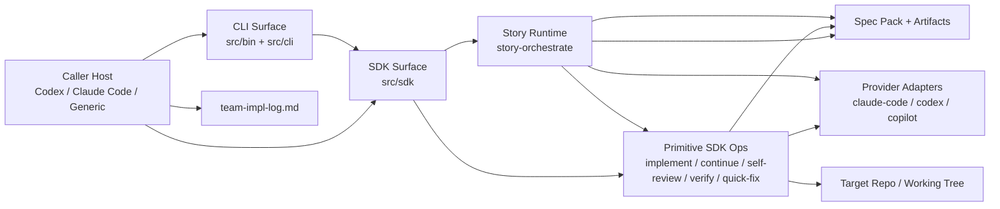

# Technical Design: Orchestration Enhancements

## Purpose

This document translates the orchestration-enhancements epic into implementable architecture for `lbuild-impl`. It serves three audiences:

| Audience | Value |
|----------|-------|
| Reviewers | Validate the design before runtime changes land |
| Developers | Clear blueprint for implementing heartbeats, story orchestration, and handoff contracts |
| Story Tech Sections | Source of story-scoped technical targets, interface definitions, and test mappings |

**Prerequisite:** The orchestration-enhancements epic is complete with five flows, 39 ACs, 98 TCs, and 12 Tech Design Questions. This design is the downstream consumer of that epic and treats its boundary contracts as the source of truth unless an issue is documented below.

**Output structure:** Config B.

| Document | Role |
|----------|------|
| `tech-design.md` | Index: validation, decisions, system view, module architecture overview, work breakdown |
| `tech-design-invocation-surface.md` | Detailed design for caller/runtime surfaces: heartbeats, CLI/SDK entry points, result contracts, config precedence |
| `tech-design-story-runtime.md` | Detailed design for story-lead runtime: attempt discovery, ledger, orchestration loop, acceptance package, log handoff, cleanup handoff |
| `test-plan.md` | TC→test mapping, mock strategy, fixture catalog, chunk test counts, and reconciliation |

The epic is intentionally large, and the design follows the epic's own separation note: preserve the heartbeat/caller surface as one chunked domain and the story-lead runtime as the other.

---

## Spec Validation

The epic is ready for Tech Design. It is unusually large for an epic, but the size is now an explicit design decision rather than an accident. The functional boundaries are clear: primitive command heartbeat behavior, story-lead lifecycle, story-lead acceptance and impl-lead handoff, targeted skill alignment, and validation requirements.

The main design risk is not missing requirements. It is letting implementation detail sprawl across too many layers. The epic deliberately carries more boundary detail than a typical epic because this feature is mostly a public CLI/SDK/runtime contract surface. The design below keeps that detail where it is contract-defining and moves implementation choices such as file layout, coordinator shape, and provider-loop mechanics into this phase.

**Validation Checklist:**
- [x] Every AC maps to implementable work
- [x] Data contracts are complete enough to design against
- [x] Edge cases and failure cases have TCs
- [x] No blocking technical constraints are missing from the epic
- [x] Flows make sense from the current codebase perspective

**Issues Found**

| Issue | Spec Location | Resolution | Status |
|-------|---------------|------------|--------|
| The epic is intentionally over the normal size threshold | Epic size note, Story Breakdown | Keep one epic. Preserve the heartbeat/story-runtime split in chunks, companion docs, and story publication. | Resolved — clarified |
| The Data Contracts section is heavier than a normal epic | Epic Data Contracts | Treat those tables as public boundary contracts. Keep internal implementation details in this tech design. | Resolved — clarified |
| `run` vs `resume` needed one final caller-facing interpretation | Flow 2 | `run` never silently continues an existing story-lead attempt. It either starts a new attempt or reports the required follow-up command. `resume` continues or reopens an existing attempt. | Resolved — clarified |
| Primitive and story-level ruling vocabulary must coexist | Outcome Vocabulary Compatibility | Primitive operations keep their current outcome/status language. `story-orchestrate` introduces `needs-ruling` only for the composed story-lead contract. | Resolved — clarified |
| `team-impl-log.md` remains the recovery source of truth, but story-lead now produces rich handoff artifacts | AC-3.6, AC-3.7, Recoverability NFRs | Story-lead does not auto-mutate the run log in v1. It produces `logHandoff`, `storyReceiptDraft`, and `cleanupHandoff` objects that impl-lead applies to the existing log contract. | Resolved — clarified |
| No technical architecture document exists | Project docs | Derive top-tier surfaces locally from the codebase and keep them modest: Invocation Surface and Story Runtime Surface. | Resolved — clarified |
| README and release-note work remains in scope but is not runtime behavior | Flow 5 | Keep them as rollout obligations tied to Story 4, not as independent runtime functionality. | Resolved — clarified |

---

## Context

`lbuild-impl` already exposes ten bounded implementation operations through both CLI and SDK surfaces. The codebase already has the shape this feature needs: CLI wrappers in `src/cli/commands/`, SDK operations in `src/sdk/operations/`, workflow logic in `src/core/`, provider adapters in `src/core/provider-adapters/`, runtime progress tracking in `src/core/runtime-progress.ts`, artifact reservation/writing in `src/core/artifact-writer.ts`, and a run-log bootstrap in `src/core/log-template.ts`. The new work is not a rewrite. It is a higher-order orchestration layer plus a caller-facing monitoring surface.

The current failure mode is operational, not foundational. Long-running primitive commands already write progress and status artifacts, but the live caller still has to remember to keep polling, to not final while work is active, to decide which primitive to run next, and to keep `team-impl-log.md` aligned with what actually happened. Recent implementation logs showed three recurrent pressure points: callers forgetting to poll, retained provider sessions running into invalid output or context-window failures, and story receipts/log state drifting from the true artifact state.

The design therefore has two jobs that must remain distinct. First, make existing provider-backed commands coach the caller while they run. Second, add a story-lead runtime that owns one story loop end-to-end without turning the whole CLI into a global hidden orchestrator. That second job must preserve the current hierarchy: impl-lead stays outside the runtime and still decides outer acceptance, reopens rejected work, updates the run log, and controls progression across stories.

The most important constraint is state containment. The CLI may host one long-running story operation that accumulates state while it runs, but the package as a whole must still be restartable from disk. That pushes the design toward a durable story ledger and away from any global daemon, in-memory registry, or package-wide workflow brain. It also explains why the epic's data contracts are richer than the first release strictly needs: the future fresh-turn story-lead loop should be able to rehydrate from the same durable artifacts without redesigning the contract.

---

## Tech Design Question Answers

| Question | Decision | Primary Design Location |
|----------|----------|-------------------------|
| Q1. Attached output mode for `story-orchestrate` | Use the same family as existing commands: human summaries and attached progress on `stderr`; exact final envelope on `stdout` when `--json` is used. No `--jsonl` in v1. Structured polling remains available through `status`. | [tech-design-invocation-surface.md](/Users/leemoore/code/lspec-core/docs/spec-build/epics/03-orchestration-enhancements/tech-design-invocation-surface.md) |
| Q2. Story-lead artifact names and layout | Use a concrete story-lead subdirectory under each story artifact group with indexed `current`, `events`, and `final-package` artifacts plus normal `progress/` and `streams/` siblings. | [tech-design-story-runtime.md](/Users/leemoore/code/lspec-core/docs/spec-build/epics/03-orchestration-enhancements/tech-design-story-runtime.md) |
| Q3. Child operation artifact placement | Keep child implementor/verifier/self-review/quick-fix artifacts as sibling story artifacts in v1; story-lead ledger references them instead of copying them. | [tech-design-story-runtime.md](/Users/leemoore/code/lspec-core/docs/spec-build/epics/03-orchestration-enhancements/tech-design-story-runtime.md) |
| Q4. Heartbeat scheduling integration | Add a reusable heartbeat emitter above `runtime-progress`; primitive commands feed it current progress/status state, and story-lead feeds it story-run snapshot state. | [tech-design-invocation-surface.md](/Users/leemoore/code/lspec-core/docs/spec-build/epics/03-orchestration-enhancements/tech-design-invocation-surface.md) |
| Q5. Minimal typed schema set | Create a dedicated story-orchestrate contract module for caller harness, run results, ledger snapshots/events, review/ruling payloads, and final packages. | [tech-design-story-runtime.md](/Users/leemoore/code/lspec-core/docs/spec-build/epics/03-orchestration-enhancements/tech-design-story-runtime.md) |
| Q6. Distinguishing attempts by story id | Introduce deterministic attempt discovery and selection over the story-lead artifact directory. | [tech-design-story-runtime.md](/Users/leemoore/code/lspec-core/docs/spec-build/epics/03-orchestration-enhancements/tech-design-story-runtime.md) |
| Q7. Exact result shape when prior attempts exist | Model caller-visible `run`/`resume`/`status` results as discriminated unions keyed by case rather than message text. | [tech-design-invocation-surface.md](/Users/leemoore/code/lspec-core/docs/spec-build/epics/03-orchestration-enhancements/tech-design-invocation-surface.md) |
| Q8. Story-lead invoking existing SDK operations | Story-lead calls SDK/library functions directly and pre-reserves child artifact paths; it does not shell out to `lbuild-impl`. | [tech-design-story-runtime.md](/Users/leemoore/code/lspec-core/docs/spec-build/epics/03-orchestration-enhancements/tech-design-story-runtime.md) |
| Q9. Mocked-provider fixtures for story-lead | Reuse current provider-fixture approach for child operations and add story-lead action-sequence fixtures for Claude Code and Codex. | [test-plan.md](/Users/leemoore/code/lspec-core/docs/spec-build/epics/03-orchestration-enhancements/test-plan.md) |
| Q10. Deterministic vs judgment recovery | Keep selection, validation, artifact writes, replay-boundary derivation, and result shaping deterministic; leave action selection, ruling requests, and acceptance judgment to story-lead or impl-lead. | [tech-design-story-runtime.md](/Users/leemoore/code/lspec-core/docs/spec-build/epics/03-orchestration-enhancements/tech-design-story-runtime.md) |
| Q11. Mapping final packages to `team-impl-log.md` | Add one explicit log-handoff mapper module and keep log mutation outside story-lead in v1. | [tech-design-story-runtime.md](/Users/leemoore/code/lspec-core/docs/spec-build/epics/03-orchestration-enhancements/tech-design-story-runtime.md) |
| Q12. Docs/files updated in the same stories | Update README, root help text, changelog/release notes, and the targeted `ls-impl` files in Story 4. | [tech-design-invocation-surface.md](/Users/leemoore/code/lspec-core/docs/spec-build/epics/03-orchestration-enhancements/tech-design-invocation-surface.md), [tech-design-story-runtime.md](/Users/leemoore/code/lspec-core/docs/spec-build/epics/03-orchestration-enhancements/tech-design-story-runtime.md) |

---

## System View

### External Systems

| System | Boundary | Why It Matters |
|--------|----------|----------------|
| Caller host (`codex`, `claude-code`, generic) | Reads attached output, invokes CLI or SDK | Heartbeat wording and progress visibility are caller-facing |
| Spec-pack filesystem | Reads epic, tech design, test plan, stories, run config, and writes artifacts | Stable recovery anchor is `spec-pack-root + story-id` |
| Target git repo / working tree | Child operations mutate code and run gates there | Quick-fix and story implementation work operate against the repo, not the spec pack |
| Provider CLIs (`claude`, `codex`, `copilot`) | External subprocess boundary | Story-lead and child operations rely on them for model work |
| npm package/install surface | Distribution boundary | README/help/release notes must match shipped command surfaces |

### Entry Points

| Entry | Kind | Purpose |
|-------|------|---------|
| Existing primitive commands and SDK ops | CLI + SDK | Continue to provide bounded implementation/verification/fix work |
| `story-orchestrate run` | CLI + SDK | Start a story-lead attempt or report the required follow-up for an existing attempt |
| `story-orchestrate resume` | CLI + SDK | Continue or reopen a specific story-lead attempt |
| `story-orchestrate status` | CLI + SDK | Read durable story-lead state by story id or story run id |
| `lbuild-impl skill ls-impl` | CLI-delivered docs | Expose updated orchestration guidance to callers |

### Data Flow Overview

Caller-host input enters through CLI flags or SDK input objects. Invocation-surface code resolves caller harness and heartbeat options, parses story/run inputs, and either calls a primitive SDK operation or enters the story-lead runtime. The story runtime reads spec-pack artifacts and current run configuration, discovers or creates a story-run attempt, prompts the story-lead provider, executes child SDK operations, writes durable ledger artifacts, and returns caller-visible status and final envelopes. The impl-lead remains outside that loop and uses the final package to update `team-impl-log.md`.



---

## Top-Tier Surfaces

No standalone tech-architecture document exists for this repo, so the top-tier surfaces below are locally derived from the current codebase.

| Surface | Source | This Epic's Role |
|---------|--------|------------------|
| Invocation Surface | Locally derived from `src/bin`, `src/cli`, `src/sdk/contracts`, `src/sdk/errors`, and command help/output code | Adds caller harness config, primitive heartbeat behavior, `story-orchestrate` entry points, and caller-visible result contracts |
| Story Runtime Surface | Locally derived from `src/sdk/operations`, `src/core`, provider adapters, artifact writer, runtime progress, and log-template integration | Adds story-lead lifecycle, durable ledger, attempt discovery, review/ruling incorporation, acceptance package assembly, and log/cleanup handoff |

These surfaces are intentionally not “CLI” and “core.” The design boundary is about who consumes the behavior: callers consume the Invocation Surface, and the Invocation Surface delegates to the Story Runtime Surface.

---

## Module Architecture Overview

```text
src/
├── bin/
│   └── lbuild-impl.ts                         # MODIFIED: register story-orchestrate group, update help text
├── cli/
│   ├── commands/
│   │   ├── shared.ts                         # MODIFIED: caller harness parsing, heartbeat sink wiring
│   │   ├── story-orchestrate.ts              # NEW: run/resume/status command group
│   │   └── story-implement.ts etc.           # MODIFIED: heartbeat-capable provider options
│   ├── envelope.ts                           # MODIFIED: story-orchestrate result rendering/exit codes
│   └── output.ts                             # MODIFIED: stderr progress/heartbeat writers
├── sdk/
│   ├── contracts/
│   │   ├── operations.ts                     # MODIFIED: caller harness, heartbeat, progress listener options
│   │   ├── story-orchestrate.ts              # NEW: public story-run result/contract types
│   │   └── index.ts                          # MODIFIED
│   ├── operations/
│   │   ├── story-orchestrate.ts              # NEW: run/resume/status SDK entry points
│   │   └── shared.ts                         # MODIFIED: artifact path, typed union finalization helpers
│   └── index.ts                              # MODIFIED: public exports
├── core/
│   ├── story-orchestrate-contracts.ts        # NEW: canonical story-run schemas
│   ├── story-run-ledger.ts                   # NEW: current/events/final read-write surface
│   ├── story-run-discovery.ts                # NEW: attempt discovery and selection
│   ├── story-lead.ts                         # NEW: coordinator loop
│   ├── story-lead-prompt.ts                  # NEW: prompt assembly + loop summaries
│   ├── heartbeat.ts                          # NEW: cadence timers + caller guidance formatting
│   ├── caller-guidance.ts                    # NEW: codex / claude-code / generic messaging
│   ├── log-handoff.ts                        # NEW: map final package into run-log update payload
│   ├── cleanup-handoff.ts                    # NEW: derive defer/accepted-risk carry-forward
│   ├── result-contracts.ts                   # MODIFIED: primitive compatibility + references to new contracts
│   ├── config-schema.ts                      # MODIFIED: caller_harness + story_lead config
│   ├── log-template.ts                       # MODIFIED: preserve headings, add caller/story-lead labels if needed
│   ├── runtime-progress.ts                   # MODIFIED: expose state to heartbeat emitter
│   └── artifact-writer.ts                    # MODIFIED: story-lead grouped paths
├── prompts/
│   ├── base/
│   │   └── story-lead.md                     # NEW: story-lead charter prompt
│   └── snippets/
│       ├── story-lead-action-protocol.md     # NEW
│       ├── story-lead-acceptance-rubric.md   # NEW
│       └── story-lead-ruling-boundaries.md   # NEW
└── tests/
    ├── unit/
    ├── package/
    └── integration/
```

### Module Responsibility Matrix

| Module / Surface | Status | Responsibility | Dependencies | ACs Covered |
|------------------|--------|----------------|--------------|-------------|
| `src/cli/commands/shared.ts` | MODIFIED | Parse caller harness / cadence options, create attached-output sink, preserve primitive JSON stdout contract | `src/cli/output.ts`, `src/sdk/contracts`, `src/core/heartbeat.ts` | AC-1.1-1.7 |
| `src/cli/commands/story-orchestrate.ts` | NEW | `run` / `resume` / `status` CLI entry points | SDK story-orchestrate ops, CLI shared helpers | AC-2.1-2.8 |
| `src/sdk/contracts/story-orchestrate.ts` | NEW | Public typed schemas and results for story-lead lifecycle | core story-orchestrate contracts | AC-2.1-2.10, AC-3.1-3.11 |
| `src/sdk/operations/story-orchestrate.ts` | NEW | SDK run/resume/status orchestration entry points | story runtime, shared envelope finalization | AC-2.1-2.10 |
| `src/core/heartbeat.ts` | NEW | Fixed-cadence heartbeat scheduling and formatting for primitives and story runs | caller guidance, runtime progress, story-run snapshot | AC-1.1-1.7, AC-2.7 |
| `src/core/story-run-discovery.ts` | NEW | Find attempts by story id, classify candidate states, produce caller-visible selection results | filesystem, story-run ledger contracts | AC-2.3-2.6, AC-2.10 |
| `src/core/story-run-ledger.ts` | NEW | Write/read current snapshot, append-only events, final package | artifact writer, atomic fs | AC-2.4-2.10, AC-3.1-3.11 |
| `src/core/story-lead.ts` | NEW | Long-running story-lead loop over provider session and child SDK operations | discovery, ledger, prompt assembly, SDK ops, provider adapters | AC-2.7-2.10, AC-3.3-3.11 |
| `src/core/log-handoff.ts` | NEW | Build `logHandoff` payload against current run-log semantics | log template, final package, current log headings | AC-3.6-3.8 |
| `src/core/cleanup-handoff.ts` | NEW | Collect `defer` / `accepted-risk` outputs for cleanup | final package, verifier dispositions | AC-3.10 |
| `src/prompts/base/story-lead.md` + snippets | NEW | Define story-lead charter, action protocol, acceptance rubric, and ruling boundaries | prompt assembly, epic/test-plan/story artifacts | AC-3.3-3.4, AC-3.7-3.11 |
| `src/skills/ls-impl/**/*` | MODIFIED | Reflect caller/provider distinction, heartbeat monitoring, recovery, and log/cleanup preservation | embedded skill asset pipeline | AC-4.1-4.7 |
| `tests/**/*` + `docs/spec-build/epics/03-orchestration-enhancements/gorilla/*` | MODIFIED / NEW | Validation surface for heartbeat/runtime contracts, provider smoke, and fresh-agent evidence | Vitest projects, mocked providers, maintainer evidence runs | AC-5.1-5.4 |

---

## Dependency and Version Grounding

No new npm package dependencies are required for this epic.

| Package | Version Source | Purpose in This Design | Research Confirmed |
|---------|----------------|------------------------|--------------------|
| `citty` | Existing `package.json` | Nested command groups and flag parsing | No new addition required |
| `c12` | Existing `package.json` | Run-config loading and normalization | No new addition required |
| `zod` | Existing `package.json` | Public and internal contract schemas | No new addition required |
| `vitest` | Existing `package.json` | Unit/package/integration test projects | No new addition required |
| `tsup` | Existing `package.json` | Build + `.d.ts` emission | No new addition required |

Packages considered and rejected:

| Package | Reason Rejected |
|---------|-----------------|
| Dedicated workflow/state-machine library | Violates the bounded-agentic design; story-lead loop should be a thin coordinator over existing runtime surfaces |
| Event-stream/JSONL helper package | Existing stderr/progress writing plus Zod contracts are sufficient in v1 |
| Persistent DB/state-store package | Out of scope; story-ledger remains file-backed in v1 |

---

## Verification Scripts

The project already defines the four required verification tiers in `package.json`, and this epic keeps them:

| Script | Current Composition | Epic 03 Impact |
|--------|---------------------|----------------|
| `red-verify` | `format:check` → `lint` → `typecheck` → `capture:test-baseline` | No change; new story-orchestrate types and schemas must compile cleanly before tests |
| `verify` | `red-verify` → `test` | Unit tests gain heartbeat and story-runtime coverage |
| `green-verify` | `verify` → `guard:no-test-changes` | No change; runtime implementation stays within the TDD contract |
| `verify-all` | `verify` → `test:package` → `test:integration` | Package and integration projects gain story-lead smoke coverage |

There is no new `test:gorilla` script in v1. Gorilla evidence remains a story/release artifact under the epic directory because it is partly manual/agent-driven rather than deterministic CI.

---

## Work Breakdown Summary

| Chunk | Scope | Stories | Primary Sections | Estimated Tests |
|-------|-------|---------|------------------|-----------------|
| Chunk 0 | Contract and config foundation | Story 0 | Index, Invocation Surface §Interface Definitions, Story Runtime §Canonical Story Runtime Types | 12-18 |
| Chunk 1 | Primitive heartbeat runtime surface | Story 1 | Invocation Surface §Flow 1: Primitive Heartbeat Emission, §Interface Definitions, Test Plan §Chunk 1 | 14-20 |
| Chunk 2 | Story-lead run/resume/status and durable ledger | Story 2 | Invocation Surface §Flow 2: `story-orchestrate run`, §Flow 3: `story-orchestrate resume` and `status`; Story Runtime §Flow 1: Attempt Discovery and Selection | 18-26 |
| Chunk 3 | Story-lead acceptance package, ruling/review, log/cleanup handoff | Story 3 | Story Runtime §Flow 2: Story-Lead Coordinator Loop, §Flow 3: Review, Ruling, and Reopen, §Flow 4: Final Package, Log Handoff, and Cleanup Handoff | 18-28 |
| Chunk 4 | Provider composition, skill alignment, rollout evidence | Story 4 | Story Runtime §Flow 2: Story-Lead Coordinator Loop; Invocation Surface §Testing Strategy; Test Plan §Chunk 4 | 8-14 + gorilla evidence |

Chunk dependencies:

```text
Chunk 0 → Chunk 1 → Chunk 2 → Chunk 3 → Chunk 4
```

Chunk 2 may not begin before Chunk 1 because story-orchestrate reuses the same caller-harness and heartbeat surface. Chunk 4 deliberately lands last because it depends on the stable command surface and final package contracts.

---

## Open Questions

| # | Question | Owner | Blocks | Resolution |
|---|----------|-------|--------|------------|
| Q1 | Should `story-orchestrate` support structured `--jsonl` attached output after v1, in addition to the chosen stderr-progress + final-JSON mode? | Maintainer | Future enhancement only | Deferred |
| Q2 | Should `team-impl-log.md` eventually be auto-mutated from `logHandoff`, or remain impl-lead-applied? | Maintainer | Future automation | Deferred |

---

## Deferred Items

| Item | Related AC | Reason Deferred | Future Work |
|------|------------|-----------------|-------------|
| Detached `start/status/watch/cancel` process lifecycle | Out of Scope | Adds daemon/process-supervision complexity before story-lead loop is proven | Future epic |
| Fresh-turn story-lead loop with no retained conversation history | Epic Scope note | V1 contracts should support it, but the runtime loop remains single-session in this epic | Future orchestration epic |
| Copilot story-lead provider parity | AC-2.9, AC-5.4 | Epic requires Claude Code and Codex story-lead coverage only | Future parity story |
| Automatic `team-impl-log.md` mutation | AC-3.6 | Preserve outer impl-lead authority and existing recovery discipline in v1 | Future automation story |

---

## Related Documentation

- Epic: [epic.md](/Users/leemoore/code/lspec-core/docs/spec-build/epics/03-orchestration-enhancements/epic.md)
- Companion: [tech-design-invocation-surface.md](/Users/leemoore/code/lspec-core/docs/spec-build/epics/03-orchestration-enhancements/tech-design-invocation-surface.md)
- Companion: [tech-design-story-runtime.md](/Users/leemoore/code/lspec-core/docs/spec-build/epics/03-orchestration-enhancements/tech-design-story-runtime.md)
- Test Plan: [test-plan.md](/Users/leemoore/code/lspec-core/docs/spec-build/epics/03-orchestration-enhancements/test-plan.md)
- Current runtime map: [current-state-code-map.md](/Users/leemoore/code/lspec-core/docs/current-state-code-map.md)
